<properties
	pageTitle="Create a plan in Azure Stack | Microsoft Azure"
	description="As a service administrator, create a plan that lets subscribers provision virtual machines."
	services="azure-stack"
	documentationCenter=""
	authors="ErikjeMS"
	manager="byronr"
	editor=""/>

<tags
	ms.service="azure-stack"
	ms.workload="na"
	ms.tgt_pltfrm="na"
	ms.devlang="na"
	ms.topic="get-started-article"
	ms.date="03/02/2016"
	ms.author="erikje"/>

# Create a plan in Azure Stack

[Plans](azure-stack-key-features.md#services-plans-offers-and-subscriptions) are groupings of one or more services. As a provider, you can create plans to offer to your tenants. In turn, your tenants subscribe to your offers to use the plans and services they include. In this example, you will create a plan that includes the compute, network, and storage resource providers. This will give subscribers to the plan the ability to provision virtual machines.

1.  In an internet browser, navigate to https://portal.azurestack.local.

2.  [Sign in](azure-stack-connect-azure-stack.md#log-in-as-a-service-administrator) to the Azure Stack Portal as a service administrator and enter your service administrator credentials (this is the account created during step 5 of the [Run the PowerShell script](azure-stack-run-powershell-script.md) section), and then click **Sign in**.

    Service administrators can create offers and plans, and manage users.

3.  To create a plan and offer that tenants can subscribe to, click **New** > **Tenant Offers + Plans** > **Plan**.

    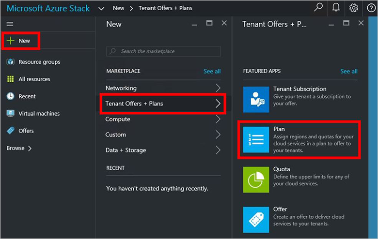

4.  In the **New Plan** blade, fill in **Display Name** and **Resource Name**. The Display Name is the plan's friendly name. Only the admin can see the Resource Name. It's the name that admins  use to work with the plan as an Azure Resource Manager resource.

    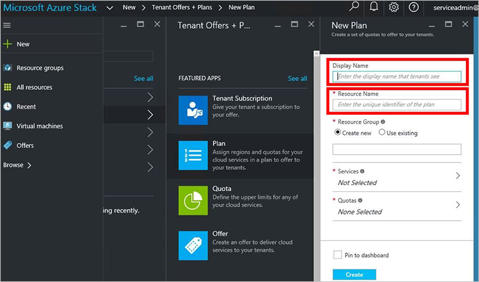

5.  Create a new **Resource Group**, or select an existing one, as a container for the plan. By default, all plans and offers will go into a resource group called OffersAndPlans.

    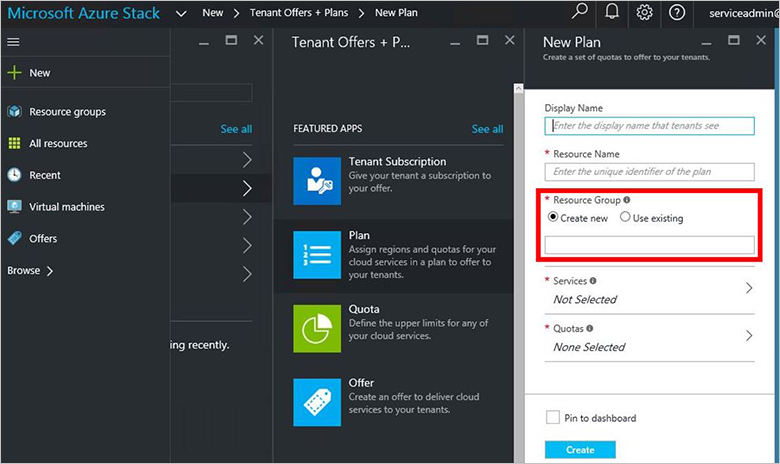

6.  Click **Services**, use the Shift key to multi-select all three providers (**Compute Provider Admin**, **Storage Provider Admin**, and **Network Provider Admin**) and then click **Select**.

    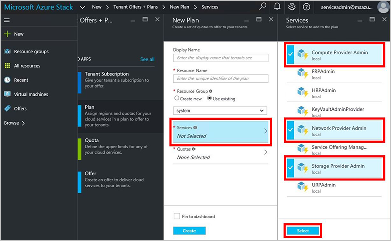

7.  Click **Quotas**, click **Quota for Storage Provider Admin**, and then click **Create new quota**.

	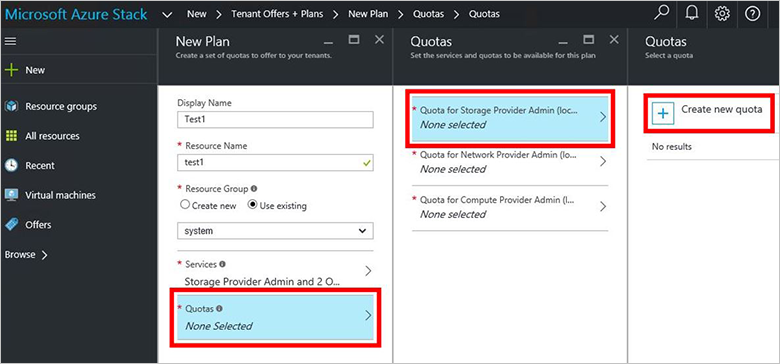

8.  Type a name for the quota, click **Quota Settings**, keep all the default values and click **OK**, and then click **Create**.

    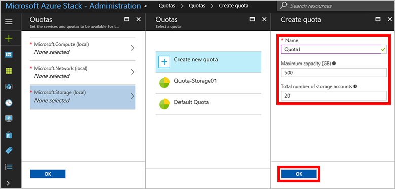

9. Click **Quota for Network Provider Admin**, click **Create new quota**, and then type a name for the quota.

	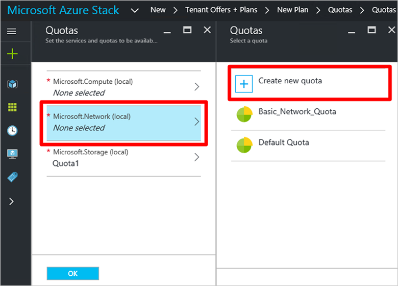

10. Click **Quota Settings**, keep all the default values and click **OK**, and then click **Create**.

	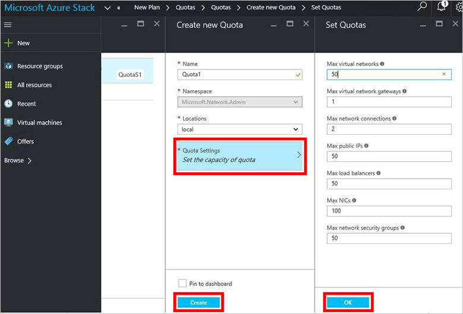
	
11. Click **Quota for Compute Provider Admin**, click **Create new quota**, and then type a name for the quota.

	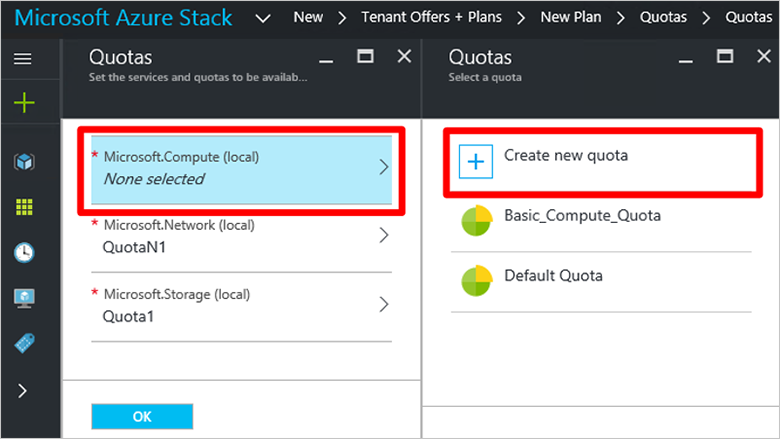

12. Click **Quota Settings**, keep all the default values and click **OK**, and then click **Create**.

	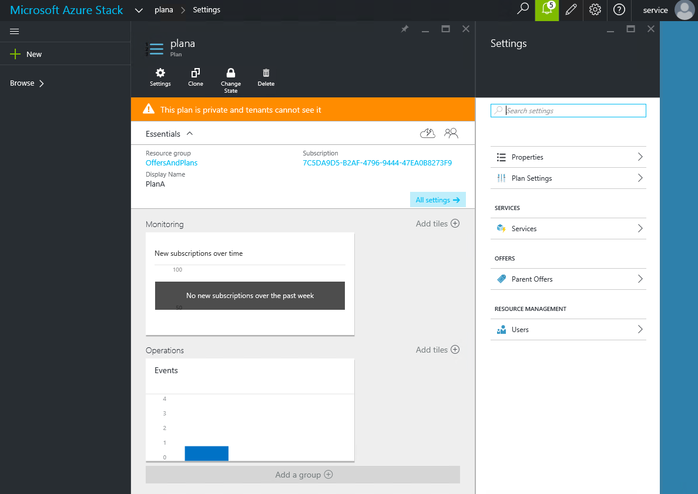
	
12. In the **Quotas** blade, click **OK**, and then in the **New Plan** blade, click **Create** to create the plan.

	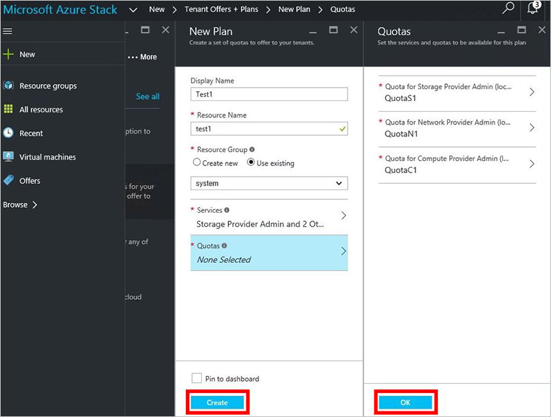

13. To see your new plan, click **All resources**, then search for the plan and click its name.

    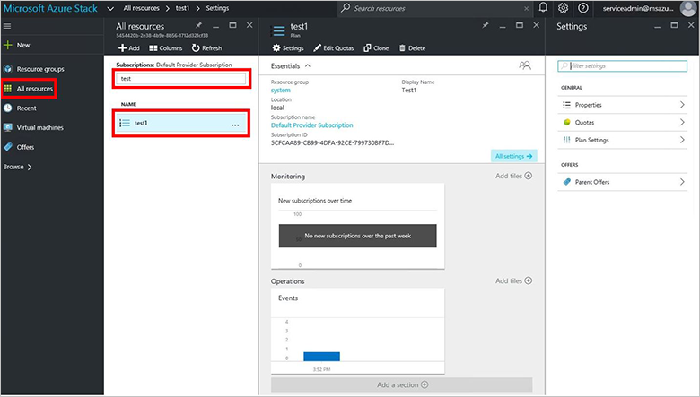

## Next steps

[Create an offer](azure-stack-create-offer.md)
