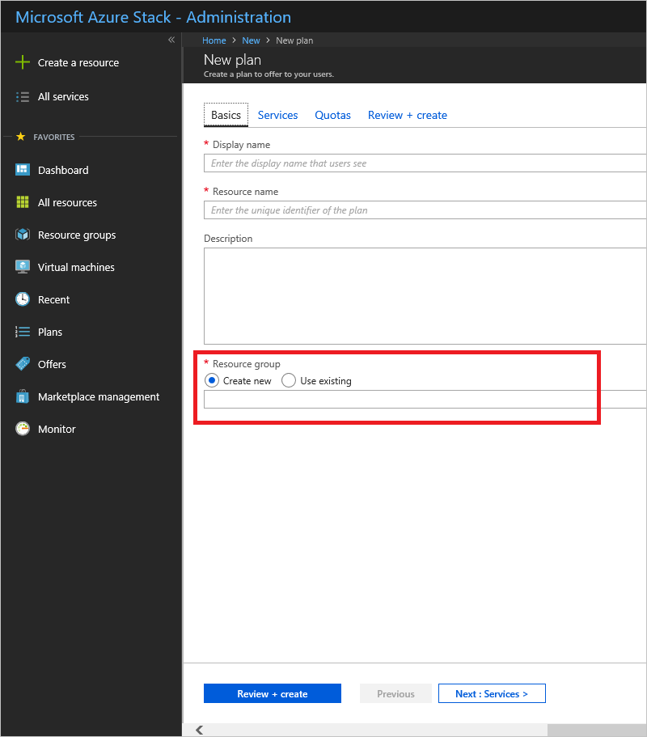
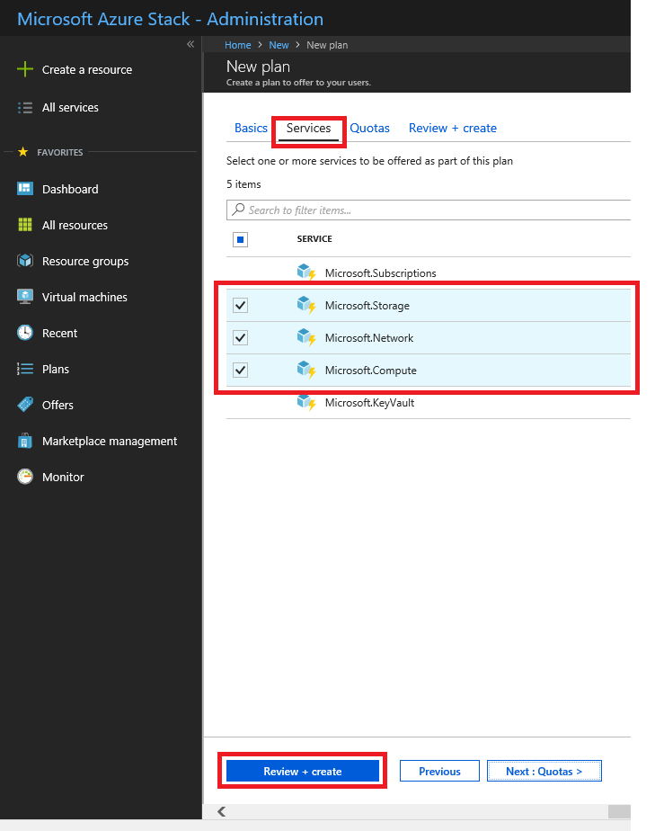
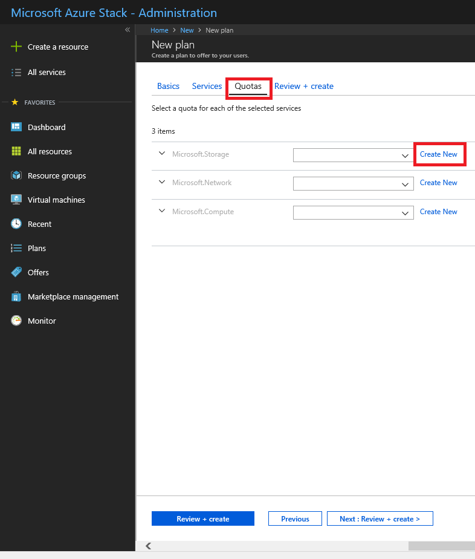
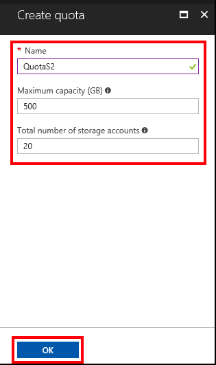
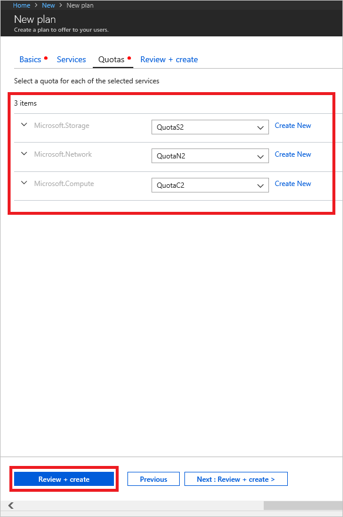
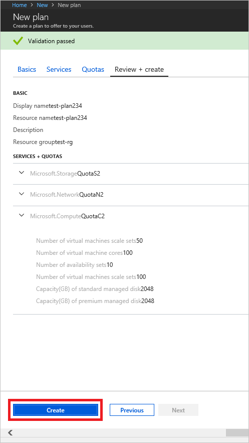

# Create a plan in Azure Stack

*Applies to: Azure Stack integrated systems and Azure Stack Development Kit*

[Plans](azure-stack-key-features.md) are groupings of one or more services. As a provider, you can create plans to offer to your users. In turn, your users subscribe to your offers to use the plans and services they include. This example shows you how to create a plan that includes the compute, network, and storage resource providers. This plan gives subscribers the ability to provision virtual machines.

1. Sign in to the Azure Stack administrator portal (https://adminportal.local.azurestack.external).

2. To create a plan and offer that users can subscribe to, select **New** > **Offers + Plans** > **Plan**.  
   

3. In the **New plan** pane, fill in **Display name** and **Resource name**. The Display name is the plan's friendly name that users see. Only the admin can see the Resource name, which is the name that admins use to work with the plan as an Azure Resource Manager resource.  
   

4. Create a new **Resource Group**, or select an existing one, as a container for the plan.  
   

5. select **Services** and then select the checkbox for **Microsoft.Compute**, **Microsoft.Network**, and **Microsoft.Storage**. Next, choose **Select** to save the configuration. Checkboxes appear when the mouse hovers over each option.  
   

6. Select **Quotas**, **Microsoft.Storage (local)**, and then choose either the default quota or select **Create new quota** to customize the quota.  
   

7. If you're creating a new quota, enter a **Name** for the quota > specify the quota values > select **OK**. The **Create quota** pane closes.
   

   You then select the new quota you created. Selecting the quota assigns it and closes the selection pane.  
   

8. Repeat steps 6 and 7 to create and assign quotas for **Microsoft.Network (local)** and **Microsoft.Compute (local)**.  When all three services have quotas assigned, they appear similar to the following image.  
   

9. In the **Quotas** pane, choose **OK**, and then in the **New plan** pane, choose **Create** to create the plan.  
    
10. To see your new plan, select **All resources**, then search for the plan and select its name. If your list of resources is long, use **Search** to locate your plan by name.  
   

### Next steps
[Create an offer](azure-stack-create-offer.md)
