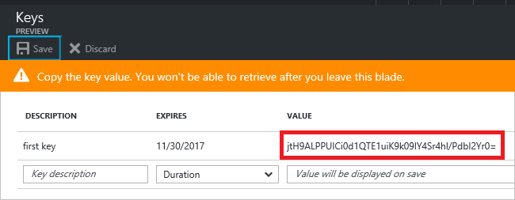
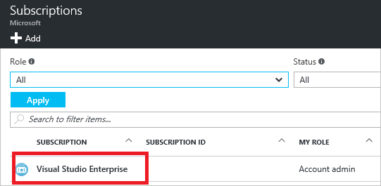

# Provide applications access to Azure Stack

*Applies to: Azure Stack integrated systems and Azure Stack Development Kit*

When an application needs access to deploy or configure resources through Azure Resource Manager in Azure Stack, you create a service principal, which is a credential for your application. You can then delegate only the necessary permissions to that service principal.  

As an example, you may have a configuration management tool that uses Azure Resource Manager to inventory Azure resources. In this scenario, you can create a service principal, grant the reader role to that service principal, and limit the configuration management tool to read-only access. 

Service principals are preferable to running the app under your own credentials because:

* You can assign permissions to the service principal that are different than your own account permissions. Typically, these permissions are restricted to exactly what the app needs to do.
* You do not have to change the app's credentials if your responsibilities change.
* You can use a certificate to automate authentication when executing an unattended script.  

## Getting started

Depending on how you have deployed Azure Stack, you start by creating a service principal. This document describes creating a service principal for both [Azure Active Directory (Azure AD)](#create-service-principal-for-azure-ad) and [Active Directory Federation Services(AD FS)](#create-service-principal-for-ad-fs). Once you've created the service principal, a set of steps common to both AD FS and Azure Active Directory are used to [delegate permissions](#assign-role-to-service-principal) to the role.     

## Create service principal for Azure AD

If you've deployed Azure Stack using Azure AD as the identity store, you can create service principals just like you do for Azure. This section shows you how to perform the steps through the portal. Check that you have the [required Azure AD permissions](../azure-resource-manager/resource-group-create-service-principal-portal.md#required-permissions) before beginning.

### Create service principal
In this section, you create an application (service principal) in Azure AD that represents your application.

1. Sign in to your Azure Account through the [Azure portal](https://portal.azure.com).
2. Select **Azure Active Directory** > **App registrations** > **New application registration**   
3. Provide a name and URL for the application. Select either **Web app / API** or **Native** for the type of application you want to create. After setting the values, select **Create**.

You have created a service principal for your application.

### Get credentials
When programmatically logging in, you use the ID for your application, and for a Web app / API, an authentication key. To get those values, use the following steps:

1. From **App registrations** in Active Directory, select your application.

2. Copy the **Application ID** and store it in your application code. The applications in the [sample applications](#sample-applications) section refer to this value as the client ID.

     
3. To generate an authentication key for a Web app / API, select **Settings** > **Keys**. 

4. Provide a description of the key, and a duration for the key. When done, select **Save**.

After saving the key, the value of the key is displayed. Copy this value to Notepad or some other temporary location, because you cannot retrieve the key later. You provide the key value with the application ID to sign as the application. Store the key value in a place where your application can retrieve it.



Once complete, proceed to [assigning your application a role](#assign-role-to-service-principal).

## Create service principal for AD FS
If you have deployed Azure Stack with AD FS, you can use PowerShell to create a service principal, assign a role for access, and sign in from PowerShell using that identity.

The script is run from the privileged endpoint on an ERCS virtual machine.

Requirements:
- A certificate is required.

#### Parameters

The following information is required as input for the automation parameters:


|Parameter|Description|Example|
|---------|---------|---------|
|Name|Name for the SPN account|MyAPP|
|ClientCertificates|Array of certificate objects|X509 certificate|
|ClientRedirectUris<br>(Optional)|Application redirect URI|-|

#### Example

1. Open an elevated Windows PowerShell session, and run the following commands:

   > [!NOTE]
   > This example creates a self-signed certificate. When you run these commands in a production deployment, use [Get-Certificate](/powershell/module/pkiclient/get-certificate) to retrieve the certificate object for the certificate you want to use.

   ```PowerShell  
    # Credential for accessing the ERCS PrivilegedEndpoint, typically domain\cloudadmin
    $creds = Get-Credential

    # Creating a PSSession to the ERCS PrivilegedEndpoint
    $session = New-PSSession -ComputerName <ERCS IP> -ConfigurationName PrivilegedEndpoint -Credential $creds

    # This produces a self signed cert for testing purposes. It is prefered to use a managed certificate for this.
    $cert = New-SelfSignedCertificate -CertStoreLocation "cert:\CurrentUser\My" -Subject "CN=<yourappname>" -KeySpec KeyExchange

    $ServicePrincipal = Invoke-Command -Session $session -ScriptBlock { New-GraphApplication -Name '<yourappname>' -ClientCertificates $using:cert}
    $AzureStackInfo = Invoke-Command -Session $session -ScriptBlock { get-azurestackstampinformation }
    $session|remove-pssession

    # For Azure Stack development kit, this value is set to https://management.local.azurestack.external. This is read from the AzureStackStampInformation output of the ERCS VM.
    $ArmEndpoint = $AzureStackInfo.TenantExternalEndpoints.TenantResourceManager

    # For Azure Stack development kit, this value is set to https://graph.local.azurestack.external/. This is read from the AzureStackStampInformation output of the ERCS VM.
    $GraphAudience = "https://graph." + $AzureStackInfo.ExternalDomainFQDN + "/"

    # TenantID for the stamp. This is read from the AzureStackStampInformation output of the ERCS VM.
    $TenantID = $AzureStackInfo.AADTenantID

    # Register an AzureRM environment that targets your Azure Stack instance
    Add-AzureRMEnvironment `
    -Name "AzureStackUser" `
    -ArmEndpoint $ArmEndpoint

    # Set the GraphEndpointResourceId value
    Set-AzureRmEnvironment `
    -Name "AzureStackUser" `
    -GraphAudience $GraphAudience `
    -EnableAdfsAuthentication:$true

    Add-AzureRmAccount -EnvironmentName "azurestackuser" `
    -ServicePrincipal `
    -CertificateThumbprint $ServicePrincipal.Thumbprint `
    -ApplicationId $ServicePrincipal.ClientId `
    -TenantId $TenantID

    # Output the SPN details
    $ServicePrincipal

   ```

2. After the automation finishes, it displays the required details to use the SPN. 

   For example:

   ```shell
   ApplicationIdentifier : S-1-5-21-1512385356-3796245103-1243299919-1356
   ClientId              : 3c87e710-9f91-420b-b009-31fa9e430145
   Thumbprint            : 30202C11BE6864437B64CE36C8D988442082A0F1
   ApplicationName       : Azurestack-MyApp-c30febe7-1311-4fd8-9077-3d869db28342
   PSComputerName        : azs-ercs01
   RunspaceId            : a78c76bb-8cae-4db4-a45a-c1420613e01b
   ```

### Assign a role
Once the Service Principal is created, you must [assign it to a role](#assign-role-to-service-principal).

### Sign in through PowerShell
Once you've assigned a role, you can sign in to Azure Stack using the service principal with the following command:

```powershell
Add-AzureRmAccount -EnvironmentName "<AzureStackEnvironmentName>" `
 -ServicePrincipal `
 -CertificateThumbprint $servicePrincipal.Thumbprint `
 -ApplicationId $servicePrincipal.ClientId ` 
 -TenantId $directoryTenantId
```

## Assign role to service principal
To access resources in your subscription, you must assign the application to a role. Decide which role represents the right permissions for the application. To learn about the available roles, see [RBAC: Built in Roles](../role-based-access-control/built-in-roles.md).

You can set the scope at the level of the subscription, resource group, or resource. Permissions are inherited to lower levels of scope. For example, adding an application to the Reader role for a resource group means it can read the resource group and any resources it contains.

1. In the Azure Stack portal, navigate to the level of scope you wish to assign the application to. For example, to assign a role at the subscription scope, select **Subscriptions**. You could instead select a resource group or resource.

2. Select the particular subscription (resource group or resource) to assign the application to.

     

3. Select **Access Control (IAM)**.

     

4. Select **Add**.

5. Select the role you wish to assign to the application.

6. Search for your application, and select it.

7. Select **OK** to finish assigning the role. You see your application in the list of users assigned to a role for that scope.

Now that you've created a service principal and assigned a role, you can begin using this within your application to access Azure Stack resources.  

## Next steps

[Add users for ADFS](azure-stack-add-users-adfs.md)
[Manage user permissions](azure-stack-manage-permissions.md)
