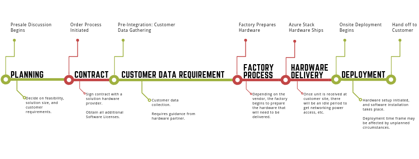

 
# Azure Stack datacenter integration

This article describes the end-to-end Azure Stack customer experience from purchasing an integrated system through to a successful on-site deployment by a solution provider. Use this information to ease your journey and to help set expectations for you, an Azure Stack customer.

As an Azure Stack customer, you should anticipate the following phases:

|     |Planning phase|Order process|Pre-deployment|Factory process|Hardware delivery|Onsite deployment|
|-----|-----|-----|-----|-----|-----|-----|
|**Microsoft**|Engage with partner to provide presales support.|Prepare software licensing and contracts as needed.|Provide required tooling to collect datacenter integration requirements and documentation to customer.|Provide the latest baseline builds and tool chain updates on a monthly cadence.|N/A|Microsoft support engineers assist with any deployment issues.|
|**Partner**|Recommend solution options based on customer requirements.  Propose proof of concept (POC) if necessary.  Establish business relationship.  Decide on level of support.|Prepare necessary contracts with the customer.  Create customer purchase order.  Decide on delivery timeline.  Connect customer with Microsoft if necessary.|Provide customer with necessary training to ensure understanding of all deployment prerequisites and datacenter integration options.  Assist the customer with validation of collected data to ensure completeness and accuracy.|Apply the last validated baseline build.  Apply the required Microsoft deployment toolkit.|Ship hardware to customer site.|Deployment handled by an onsite engineer.  Rack and stack.  Hardware lifecycle host (HLH) deployment.  Azure Stack deployment.  Hand off to customer.|
|**Customer**|Describe intended use cases and specify requirements.|Determine the billing model to use, review and approve contracts.|Complete the deployment worksheet, and ensure all deployment prerequisites are met and ready for deployment.|N/A|Prepare datacenter by ensuring all required power and cooling, border connectivity, and other required datacenter integration requirement are in place.|Be available during deployment to provide subscription credentials and support if there are questions on the provided data.|
| | | | | | | |

## Planning phase
The planning phase is when Microsoft, or the Azure Stack solution partner, will work with you to evaluate and understand your needs to determine if Azure Stack is the right solution for you:

They will help you decide on the following:

-   Is Azure Stack the right solution for your organization?

-   What size solution will you need?

-   What type of billing and licensing model will work for your organization?

-   What are the power and cooling requirements?

To ensure that the hardware solution will best fit your needs, the [Azure Stack Capacity Planner](https://gallery.technet.microsoft.com/Azure-Stack-Capacity-24ccd822) can be used to assist in pre-purchase planning to determine the appropriate capacity and configuration for your Azure Stack hardware solution.

The spreadsheet is *not* intended to be used as a substitute for your own investigation and analysis of hardware solutions that best suit your needs. When planning for an Azure Stack deployment, you should also review the [general datacenter integration considerations](azure-stack-datacenter-integration.md) for Azure Stack integrated systems.

## Order process phase
At this stage, many of your questions with regards to feasibility would have been answered. Now that you are ready to commit to purchasing Azure Stack, and after signing all the required contracts and purchase orders, you will be asked to provide the integration requirements data to your solution provider.

## Pre-deployment phase
During this phase, you will need to decide how you want to integrate Azure Stack into your datacenter. To ease this process, Microsoft, in collaboration with the solution providers, put together a requirements template to help you gather the necessary information to plan for an integrated system deployment within your environment.

The [general datacenter integration considerations](azure-stack-datacenter-integration.md) article provides information that helps you complete the template, known as the Deployment Worksheet. 

> [!IMPORTANT]
> During this stage it is important that all pre-requisite information is investigated and decided on prior to ordering the solution. Be aware that this step is time consuming and requires coordination and data gathering from multiple disciplines within your organization. Incorrect or incomplete information can result in a longer deployment. 

In the pre-deployment phase you will need to decide on the following:

- **Azure Stack connection model and identity provider**. You can choose to deploy Azure Stack either [connected to the internet (and to Azure) or disconnected](azure-stack-connection-models.md). To get the most benefit from Azure Stack, including hybrid scenarios, you'd want to deploy connected to Azure. Choosing Active Directory Federation Services (AD FS) or Azure Active Directory (Azure AD) is a one-time decision that you must make at deployment time. **You can’t change this later without redeploying the entire system**.

- **Licensing model**. The licensing model options for you to choose from depend on the kind of deployment you will have. Your identity provider choice has no bearing on tenant virtual machines or the identity system and accounts they use.
    - Customers that are in a [disconnected deployment](azure-stack-disconnected-deployment.md) have only one option: capacity-based billing.

    - Customers that are in a [connected deployment](azure-stack-connected-deployment.md) can choose between capacity-based billing and pay-as-you-use. Capacity-based billing will require an Enterprise Agreement (EA) Azure Subscription for registration. This is needed for registration, which provides for the availability of items in the Marketplace through an Azure Subscription.

- **Network integration**. [Network integration](azure-stack-network.md) is crucial for deployment, operation, and management of Azure Stack systems. There are several considerations that go into ensuring the Azure Stack solution is resilient and has a highly available physical infrastructure to support its operations.

- **Firewall integration**. It is recommended that you [use a firewall](azure-stack-firewall.md) to help secure Azure Stack. Firewalls can help prevent DDOS attacks, intrusion detection, and content inspection. However, it should be noted that it can become a throughput bottleneck for Azure storage services.

- **Certificate requirements**. It is critical that all [required certificates](azure-stack-pki-certs.md) are available *prior* to an onsite engineer arriving at your datacenter for deployment.

Once all the pre-requisite information is gathered through the deployment worksheet, the solution provider will kick off the factory process based on the data collected to ensure a successful integration of Azure Stack into your datacenter.

## Hardware delivery phase
Your solution provider will work with you on scheduling when the solution will arrive to your facility. Once received and put in place, you will need to schedule time with the solution provider to have an engineer come onsite to perform the Azure Stack deployment.

It is **crucial** that all pre-requisite data is locked and available *before the onsite engineer arrives to deploy the solution*.

-   All certificates must be purchased and ready.

-   Region name must be decided on.

-   All network integration parameters are finalized and match with what you have shared with your solution provider.

> [!TIP]
> If any of this information has changed, make sure to communicate the change with the solution provider before you schedule the actual deployment.

## Onsite deployment phase
To deploy Azure Stack, an onsite engineer from your hardware solution provider will need to be present to kick off the deployment. To ensure a successful deployment, ensure that all information provided through the deployment worksheet has not changed. 

The following is what you should expect from the onsite engineer during the deployment experience:

- Check all the cabling and border connectivity to ensure the solution is properly put together and meets your requirements.
- Configure the solution HLH (Hardware Lifecycle Host), if present.
- Check to make sure all BMC, BIOS, and Network settings are correct.
- Make sure the firmware of all components is at the latest approved version by the solution.
- Start the deployment.

> [!NOTE]
> A deployment procedure by the onsite engineer might take about one business week to complete.

## Post-deployment phase
Several steps must be performed by the partner before the solution is handed off to the customer in the post-integration phase. In this phase, validation is important to ensure the system is deployed and performing correctly. 

Actions that should be taken by the OEM Partner are:

- [Run test-azurestack](azure-stack-diagnostic-test.md#run-validation-tool-to-test-system-readiness-before-installing-update-or-hotfix)

- [Registration with Azure](azure-stack-registration.md)

- [Marketplace Syndication](azure-stack-download-azure-marketplace-item.md#use-the-marketplace-syndication-tool-to-download-marketplace-items)

- Backup Switch Configuration and HLH Configuration files

- Remove DVM

- Prepare a customer summary for deployment

- [Check updates to make sure the solution software is updated to the latest version](./azure-stack-updates.md)

There are several steps that are required or optional depending on the installation type.

- If deployment was completed using [AD FS](azure-stack-integrate-identity.md), then the Azure Stack stamp will need to be integrated with customer's own AD FS.

  > [!NOTE]
  > This step is the responsibility of the customer, although the partner may optionally choose to offer services to do this.

- Integration with an existing monitoring system from the respective partner.

  -   [System Center Operations Manager Integration](azure-stack-integrate-monitor.md) also supports fleet management capabilities.

  -   [Nagios Integration](azure-stack-integrate-monitor.md#integrate-with-nagios)

## Overall timeline

## Support
Azure Stack enables an Azure-consistent, integrated support experience that covers the full system lifecycle. To fully support Azure Stack integrated systems, customers need two support contracts; one with Microsoft (or their Cloud Solution Provider) for Azure services support and one with the hardware provider for system support. The integrated support experience provides coordinated escalation and resolution, so that customers get a consistent support experience no matter whom they call first. For customers who already have Premier, Azure -Standard / ProDirect or Partner support with Microsoft, Azure Stack software support is included.

The integrated support experience makes use of a Case Exchange mechanism for bi-directional transfer of support cases and case updates between Microsoft and the hardware partner. Microsoft Azure Stack will follow the [Modern Lifecycle policy](https://support.microsoft.com/help/30881).

## Next steps
Learn more about [general datacenter integration considerations](azure-stack-datacenter-integration.md).
