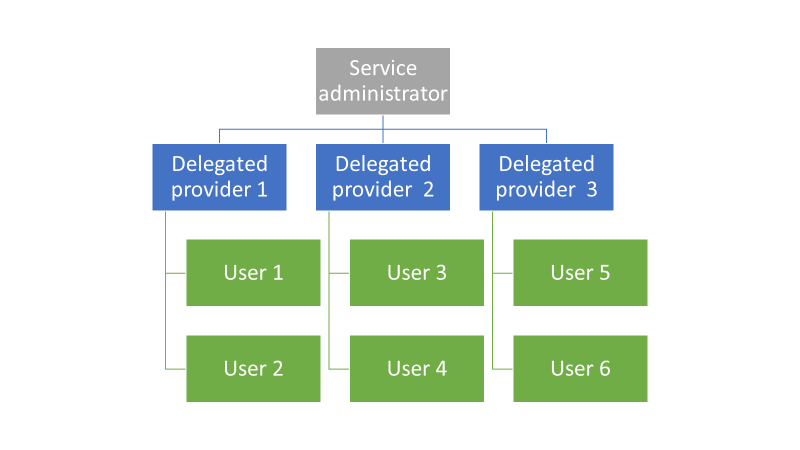
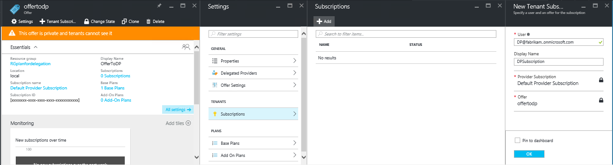
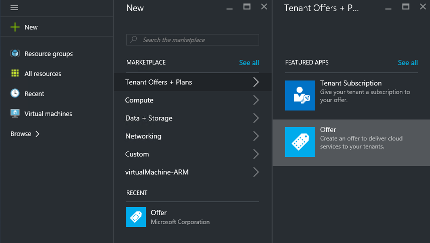
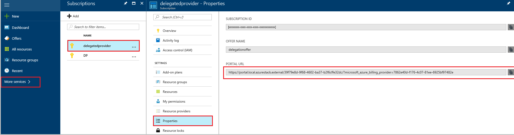

# Delegate offers in Azure Stack

*Applies to: Azure Stack integrated systems and Azure Stack Development Kit*

As the Azure Stack operator, you often want to put other people in charge of signing up users and creating subscriptions. For example, if you're a service provider, you might want resellers to sign up customers and manage them on your behalf. Or, if you're part of a central IT group in an enterprise, you might want to delegate user sign up to other IT staff.

Delegation makes it easier to reach and manage more users that you can do by yourself, as shown in the following illustration. 

With delegation, the delegated provider manages an offer (delegated offer) and end customers obtain subscriptions under that offer without involvement from the system administrator. 

## Understand delegation roles and steps

### Delegation roles

The following roles are part of delegation:

* The *Azure Stack operator* manages the Azure Stack
  infrastructure and creates an offer template. The operator delegates others to provide offers to their tenant.

* The delegated Azure Stack operators are users with *Owner* or *Contributor* rights in the subscriptions called *delegated providers*. They can belong to other organizations, such as other Azure Active Directory (Azure AD) tenants.

* *Users* sign up for the offers and use them for managing their workloads, creating VMs, storing data, and so on.

### Delegation steps

There are two basic steps to setting up delegation:

1. *Create a Delegated Provider Subscription* by subscribing a user to an offer containing only the subscriptions service. Users who subscribe to this offer can then extend the delegated offers to other users by signing them up for those offers.

2. *Delegate an offer to the delegated provider*. This offer enables the delegated provider to create subscriptions or to extend the offer to their users. The delegated provider can now take the offer and offer it to other users.

The next graphic shows the steps for setting up delegation.

**Delegated provider requirements**

To act as a delegated provider, a user needs to establish a relationship with the main provider by creating a subscription. This subscription identifies the delegated provider as having the right to present the delegated offers on behalf of the main provider.

After this relationship is established, the Azure Stack operator can delegate an offer to the delegated provider. The delegated provider can take the offer, rename it (but not change its substance), and offer it to its customers.

## Delegation walkthrough

The following sections provide a hands-on walkthrough for setting up a delegated provider, delegating an offer, and verifying that users can sign up for the delegated offer.

### Set up roles

To use this walkthrough, you need two Azure AD accounts in addition to your Azure Stack operator account. If you don't have these two accounts, you need to create them. The accounts can belong to any Azure AD user and are referred to as the delegated provider and the user.

| **Role** | **Organizational rights** |
| --- | --- |
| Delegated provider |User |
| User |User |

### Identify the delegated provider

1. Sign in to the administrator portal as an Azure Stack operator.

1. To create an offer that enables a user to become
   a delegated provider:

   a.  [Create a plan](azure-stack-create-plan.md).
       This plan should include only the subscriptions service. This article uses a plan named **PlanForDelegation** as an example.

   b.  [Create an offer](azure-stack-create-offer.md) based on this plan. This article uses an offer named **OfferToDP** as an example.

   c.  Add the delegated provider as a subscriber to this offer by selecting **Subscriptions** > **Add** > **New Tenant Subscription**.

   

   > [!NOTE]
   > As with all Azure Stack offers, you have the option of making the offer public and letting users sign up for it, or keeping it private and letting the Azure Stack operator manage the sign-up. Delegated providers are usually a small group. You want to control who is admitted to it, so keeping this offer private makes sense in most cases.

### Azure Stack operator creates the delegated offer

The next step is to create the plan and offer that you're going to delegate, and that your users will use. It's a good idea to define this offer exactly as you want users to see it because the delegated provider can't change the plans and quotas it includes.

1. As an Azure Stack operator, [create a plan](azure-stack-create-plan.md) and [an offer](azure-stack-create-offer.md) based on the plan. This article uses an offer named **DelegatedOffer** as an example.

   > [!NOTE]
   > This offer doesn't have to be public, but you can make it public if you want to. However, in most cases you only want delegated providers to have access to the offer. After you delegate a private offer as described in the following steps, the delegated provider has access to it.

1. Delegate the offer. Go to **DelegatedOffer**. Under **Settings**, select **Delegated Providers** > **Add**.

1. Select the subscription for the delegated provider from the drop-down list and then select **Delegate**.

   

### Delegated provider customizes the offer

Sign in to the user portal as the delegated provider and then create a new offer by using the delegated offer as a template.

1. Select **+ Create a resource** > **Tenant Offers + Plans** > **Offer**.

    

1. Assign a name to the offer. This article uses **ResellerOffer** as an example. Select the delegated offer on which to base it, and then select **Create**.

   

   >[!IMPORTANT]
   >It’s important to understand that delegated providers can only choose offers that are delegated to them. They can't make changes to those offers. Only an Azure Stack operator can change these offers, for example, changing their plans and quotas,. A delegated provider doesn’t construct an offer from base plans and add-on plans. 

3. The delegated provider can make these offers public through their own portal URL. To make the offer public, select **Browse**, and then **Offers**. Select the offer, and then select **Change State**.

4. The public delegated offers are now visible only through the delegated portal. To find and change this URL:

    a.  Select **Browse** > **All services**, and then under the **GENERAL** category, select **Subscriptions**. Select the Delegated Provider Subscription. For example, **DPSubscription** > **Properties**.

    b.  Copy the portal URL to a separate location, such as Notepad.

      

   You've finished creating a delegated offer as a delegated provider. Sign out as the delegated provider and close the browser window you're using.

### Sign up for the offer

1. In a new browser window, go to the delegated portal URL that you saved in the previous step. Sign in to the portal as a user.

   >[!NOTE]
   >The delegated offers are not visible unless you use the delegated portal.

1. In the dashboard, select **Get a subscription**. You'll see that only the delegated offers that were created by the delegated provider are presented to the user.

   

The process of delegating an offer is finished. Now a user can sign up for this offer by getting a subscription for it.

## Move subscriptions between delegated providers

If needed, a subscription can be moved between new or existing delegated provider subscriptions that belong to the same Directory tenant. This is by using the PowerShell cmdlet [Move-AzsSubscription](https://docs.microsoft.com/powershell/module/azs.subscriptions.admin).

This is useful when:
- You onboard a new team member that will take on the delegated provider role and you want to assign to this team member user-subscriptions that were previously created in the Default Provider Subscription.
- You have multiple delegated providers subscriptions in the same Directory-tenant (Azure Active Directory) and need to move user-subscriptions between them. This could be the case where a team member moves between teams and their subscription needs to be allocated to the new team.

## Next steps

[Provision a VM](azure-stack-provision-vm.md)