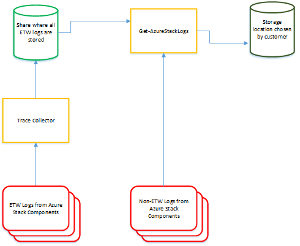

# Azure Stack diagnostics tools
 
Azure Stack is a large collection of components working together and interacting with each other. All these components  generate their own unique logs, which means that diagnosing issues can quickly become a challenging task, especially for errors coming from multiple interacting Azure Stack components. 

Our diagnostics tools help make sure the log collection mechanism is easy and efficient. The following diagram shows how log collection tools in Azure Stack work:


 
 
## Trace Collector
 
The Trace Collector is enabled by default. It continuously runs in the background and collects all Event Tracing for Windows (ETW) logs from component services on Azure Stack and stores them on a common local share. 

The following are important things to know about the Trace Collector:
 
* The Trace Collector runs continuously with default size limits. The default maximum size allowed for each file (200 MB) is **not** a cutoff size. A size check occurs periodically (currently every 10 minutes) and if the current file is >= 200 MB, it is saved and a new file is generated. There is also an 8 GB (configurable) limit on the total file size generated per event session. Once this limit is reached, the oldest files are deleted as new ones are created.
* There is a 5-day age limit on the logs. This limit is also configurable. 
* Each component defines the trace configuration properties through a JSON file. The JSON files are stored in `C:\TraceCollector\Configuration`. If necessary, these files can be edited to change the age and size limits of the collected logs. Changes to these files require a restart of the *Microsoft Azure Stack Trace Collector* service for the changes to take effect.
* The following example is a trace configuration JSON file for FabricRingServices Operations from the XRP VM: 

```
{
    "LogFile": 
    {
        "SessionName": "FabricRingServicesOperationsLogSession",
        "FileName": "\\\\SU1FileServer\\SU1_ManagementLibrary_1\\Diagnostics\\FabricRingServices\\Operations\\AzureStack.Common.Infrastructure.Operations.etl",
        "RollTimeStamp": "00:00:00",
        "MaxDaysOfFiles": "5",
        "MaxSizeInMB": "200",
        "TotalSizeInMB": "5120"
    },
    "EventSources":
    [
        {"Name": "Microsoft-AzureStack-Common-Infrastructure-ResourceManager" },
        {"Name": "Microsoft-OperationManager-EventSource" },
        {"Name": "Microsoft-Operation-EventSource" }
    ]
}
```

* **MaxDaysOfFiles**

    This parameter controls the age of files to keep. Older log files are deleted.
* **MaxSizeInMB**

    This parameter controls the size threshold for a single file. If the size is reached, a new .etl file is created.
* **TotalSizeInMB**

    This parameter controls the total size of the .etl files generated from an event session. If the total file size is greater than this parameter value, older files are deleted.
  
## Log collection tool
 
The PowerShell command `Get-AzureStackLog` can be used to collect logs from all the components  in an Azure Stack environment. It saves them in zip files in a user defined location. If our technical support team needs your logs to help troubleshoot an issue, they may ask you to run this tool.

> [!CAUTION]
> These log files may contain personally identifiable information (PII). Take this into account before you publicly post any log files.
 
We currently collect the following log types:
*   **Azure Stack deployment logs**
*	**Windows event logs**
*	**Panther logs**

     To troubleshoot VM creation issues.
*	**Cluster logs**
*	**Storage diagnostic logs**
*	**ETW logs**

    These are collected by the Trace Collector and stored in a share from where `Get-AzureStackLog` retrieves them.
 
To identify all the logs that get collected from all the components, refer to the `<Logs>` tags in the customer configuration file located at `C:\EceStore\<Guid>\<GuidWithMaxFileSize>`.
 
### To run Get-AzureStackLog
1.	Log in as AzureStack\AzureStackAdmin on the host.
2.	Open a PowerShell window as an administrator.
3.	Run the following commands to import the PowerShell modules:

    -	`cd C:\CloudDeployment\AzureStackDiagnostics\Microsoft.AzureStack.Diagnostics.DataCollection`

    -	`Import-Module .\Microsoft.AzureStack.Diagnostics.DataCollection.psd1`

4.	Run `Get-AzureStackLog`.  

    **Examples**

    - Collect all logs for all roles:

        `Get-AzureStackLog -OutputPath C:\AzureStackLogs`

    - Collect logs from VirtualMachines and BareMetal roles:

        `Get-AzureStackLog -OutputPath C:\AzureStackLogs -FilterByRole VirtualMachines,BareMetal`

    - Collect logs from VirtualMachines and BareMetal roles, with date filtering for log files for the past 8 hours:

        `Get-AzureStackLog -OutputPath C:\AzureStackLogs -FilterByRole VirtualMachines,BareMetal -FromDate (Get-Date).AddHours(-8) -ToDate (Get-Date)`

If the `FromDate` and `ToDate` parameters are not specified, logs are collected for the past 4 hours by default.

Currently, you can use the `FilterByRole` parameter to filter log collection by the following roles:

|   |   |   |
| - | - | - |
| `ACSMigrationService`     | `ACSMonitoringService`   | `ACSSettingsService` |
| `ACS`                     | `ACSFabric`              | `ACSFrontEnd`        |
| `ACSTableMaster`          | `ACSTableServer`         | `ACSWac`             |
| `ADFS`                    | `ASAppGateway`           | `BareMetal`          |
| `BRP`                     | `CA`                     | `CPI`                |
| `CRP`                     | `DeploymentMachine`      | `DHCP`               |
|`Domain`                   | `ECE`                    | `ECESeedRing`        |        
| `FabricRing`              | `FabricRingServices`     | `FRP`                |
|` Gateway`                 | `HealthMonitoring`       | `HRP`                |               
| `IBC`                     | `InfraServiceController` | `KeyVaultAdminResourceProvider`|
| `KeyVaultControlPlane`    | `KeyVaultDataPlane`      | `NC`                 |            
| `NonPrivilegedAppGateway` | `NRP`                    | `SeedRing`           |
| `SeedRingServices`        | `SLB`                    | `SQL`                |     
| `SRP`                     | `Storage`                | `StorageController`  |
| `URP`                     | `UsageBridge`            | `VirtualMachines`    |  
| `WAS`                     | `WASPUBLIC`              | `WDS`                |


A few things to note:

* This command takes some time for log collection based on which role logs are collected. Contributing factors include the time duration specified for log collection, and the numbers of nodes in the Azure Stack environment.
* After log collection completes, check the new folder created in the `-OutputPath` parameter specified in the command.
* A file called `Get-AzureStackLog_Output.log` is created in the folder containing the zip files and includes the command output, which can be used for troubleshooting any failures in log collection.
* Each role has its logs inside an individual zip file. 
* To investigate a specific failure, logs may be needed from more than one component.
    -	System and Event logs for all infrastructure VMs are collected in the *VirtualMachines* role.
    -	System and Event logs for all hosts are collected in the *BareMetal* role.
    -	Failover Cluster and Hyper-V event logs are collected in the *Storage* role.
    -	ACS logs are collected in the *Storage* and *ACS* roles.
* For more details, you can refer to the customer configuration file. Investigate the `<Logs>` tags for the different roles.

> [!NOTE]
> We are enforcing size and age limits to the logs collected as it is essential to ensure efficient utilization of your storage space to make sure it doesn't get flooded with logs. Having said that, when diagnosing a problem you will often need logs that might not exist anymore due to these limits being enforced. Hence, it is **highly recommended** that you offload your logs to an external storage space (a storage account in public Azure, an additional on-prem storage device etc.) every 8 to 12 hours and keep them there for 1 - 3 months depending on your requirements.


## Next steps
[Microsoft Azure Stack troubleshooting](azure-stack-troubleshooting.md)
