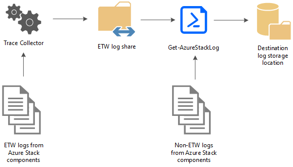

# Azure Stack diagnostics tools

*Applies to: Azure Stack integrated systems and Azure Stack Development Kit*
 
Azure Stack is a large collection of components working together and interacting with each other. All these components  generate their own unique logs. This can make diagnosing issues a challenging task, especially for errors coming from multiple, interacting Azure Stack components. 

Our diagnostics tools help ensure the log collection mechanism is easy and efficient. The following diagram shows how log collection tools in Azure Stack work:


 
 
## Trace Collector
 
The Trace Collector is enabled by default and runs continuously in the background to collect all Event Tracing for Windows (ETW) logs from Azure Stack component services. ETW logs are stored in a common local share with a five day age limit. Once this limit is reached, the oldest files are deleted as new ones are created. The default maximum size allowed for each file  is 200 MB. A size check occurs every 2 minutes, and if the current file is >= 200 MB, it is saved and a new file is generated. There is also an 8 GB limit on the total file size generated per event session. 

## Log collection tool
 
The PowerShell cmdlet **Get-AzureStackLog** can be used to collect logs from all the components  in an Azure Stack environment. It saves them in zip files in a user-defined location. If the Azure Stack technical support team needs your logs to help troubleshoot an issue, they may ask you to run this tool.

> [!CAUTION]
> These log files may contain personally identifiable information (PII). Take this into account before you publicly post any log files.
 
The following are some example log types that are collected:
*   **Azure Stack deployment logs**
*	**Windows event logs**
*	**Panther logs**
*	**Cluster logs**
*	**Storage diagnostic logs**
*	**ETW logs**

These files are collected and saved in a share by Trace Collector. The  **Get-AzureStackLog** PowerShell cmdlet can then be used to collect them when necessary.
 
### To run Get-AzureStackLog on an Azure Stack Development Kit (ASDK) system
1. Log in as **AzureStack\CloudAdmin** on the host.
2. Open a PowerShell window as an administrator.
3. Run the **Get-AzureStackLog** PowerShell cmdlet.

**Examples:**

  Collect all logs for all roles:

  ```powershell
  Get-AzureStackLog -OutputPath C:\AzureStackLogs
  ```

  Collect logs from VirtualMachines and BareMetal roles:

  ```powershell
  Get-AzureStackLog -OutputPath C:\AzureStackLogs -FilterByRole VirtualMachines,BareMetal
  ```

  Collect logs from VirtualMachines and BareMetal roles, with date filtering for log files for the past 8 hours:
    
  ```powershell
  Get-AzureStackLog -OutputPath C:\AzureStackLogs -FilterByRole VirtualMachines,BareMetal -FromDate (Get-Date).AddHours(-8)
  ```

  Collect logs from VirtualMachines and BareMetal roles, with date filtering for log files for the time period between 8 hours ago and 2 hours ago:

  ```powershell
  Get-AzureStackLog -OutputPath C:\AzureStackLogs -FilterByRole VirtualMachines,BareMetal -FromDate (Get-Date).AddHours(-8) -ToDate (Get-Date).AddHours(-2)
  ```

### To run Get-AzureStackLog on an Azure Stack integrated system

To run the log collection tool on an integrated system, you need to have access to the Privileged End Point (PEP). Here is an example script you can run using the PEP to collect logs on an integrated system:

```powershell
$ip = "<IP ADDRESS OF THE PEP VM>" # You can also use the machine name instead of IP here.
 
$pwd= ConvertTo-SecureString "<CLOUD ADMIN PASSWORD>" -AsPlainText -Force
$cred = New-Object System.Management.Automation.PSCredential ("<DOMAIN NAME>\CloudAdmin", $pwd)
 
$shareCred = Get-Credential
 
$s = New-PSSession -ComputerName $ip -ConfigurationName PrivilegedEndpoint -Credential $cred

$fromDate = (Get-Date).AddHours(-8)
$toDate = (Get-Date).AddHours(-2)  #provide the time that includes the period for your issue
 
Invoke-Command -Session $s {    Get-AzureStackLog -OutputPath "\\<HLH MACHINE ADDRESS>\c$\logs" -OutputSharePath "<EXTERNAL SHARE ADDRESS>" -OutputShareCredential $using:shareCred  -FilterByRole Storage -FromDate $using:fromDate -ToDate $using:toDate}

if($s)
{
    Remove-PSSession $s
}
```

- When you collect logs from the PEP, specify the **OutputPath** parameter to be a location on the Hardware Lifecycle Host (HLH) machine. Also ensure that the location is encrypted.
- The parameters **OutputSharePath** and **OutputShareCredential** are optional and are used when you upload logs to an external shared folder. Use these parameters *in addition* to **OutputPath**. If **OutputPath** is not specified, the log collection tool uses the system drive of the PEP VM for storage. This might cause the script to fail because  the drive space is limited.
- As shown in the previous example, the **FromDate** and **ToDate** parameters can be used to collect logs for a particular time period. This can come in handy for scenarios like collecting logs after applying an update package on an integrated system.

### Parameter considerations for both ASDK and integrated systems

- If the **FromDate** and **ToDate** parameters are not specified, logs are collected for the past four hours by default.
- You can use the **TimeOutInMinutes** parameter to set the timeout for log collection. It is set to 150 (2.5 hours) by default.

- Currently, you can use the **FilterByRole** parameter to filter log collection by the following roles:

   |   |   |   |
   | - | - | - |
   | ACSMigrationService     | ACSMonitoringService   | ACSSettingsService |
   | ACS                     | ACSFabric              | ACSFrontEnd        |
   | ACSTableMaster          | ACSTableServer         | ACSWac             |
   | ADFS                    | ASAppGateway           | BareMetal          |
   | BRP                     | CA                     | CPI                |
   | CRP                     | DeploymentMachine      | DHCP               |
   | Domain                  | ECE                    | ECESeedRing        | 
   | FabricRing              | FabricRingServices     | FRP                |
   | Gateway                 | HealthMonitoring       | HRP                |   
   | IBC                     | InfraServiceController | KeyVaultAdminResourceProvider|
   | KeyVaultControlPlane    | KeyVaultDataPlane      | NC                 |   
   | NonPrivilegedAppGateway | NRP                    | SeedRing           |
   | SeedRingServices        | SLB                    | SQL                |   
   | SRP                     | Storage                | StorageController  |
   | URP                     | UsageBridge            | VirtualMachines    |  
   | WAS                     | WASPUBLIC              | WDS                |


### <a name="bkmk_gui"></a>Collect logs using a graphical user interface
Rather than providing the required parameters for the Get-AzureStackLog cmdlet to retrieve Azure Stack logs, you can also leverage the available open source Azure Stack tools located in the main Azure Stack tools GitHub tools repository at http://aka.ms/AzureStackTools.

The **ERCS_AzureStackLogs.ps1** PowerShell script is stored in the GitHub tools repository and is updated on a regular basis. To ensure that you have the latest version available, you should download it directly from http://aka.ms/ERCS. Started from an administrative PowerShell session, the script connects to the privileged endpoint and runs Get-AzureStackLog with supplied parameters. If no parameters are supplied, the script defaults to prompting for parameters via a graphical user interface.

To learn more about the ERCS_AzureStackLogs.ps1 PowerShell script, you can watch [a short video](https://www.youtube.com/watch?v=Utt7pLsXEBc) or view the script’s [readme file](https://github.com/Azure/AzureStack-Tools/blob/master/Support/ERCS_Logs/ReadMe.md) located in the Azure Stack tools GitHub repository. 

### Additional considerations

* The command takes some time to run based on which role(s) the logs are collecting. Contributing factors also include the time duration specified for log collection, and the numbers of nodes in the Azure Stack environment.
* After log collection completes, check the new folder created in the **OutputPath** parameter specified in the command.
* Each role has its logs inside individual zip files. Depending on the size of the collected logs, a role may have its logs split in to multiple zip files. For such a role, if you want to have all the log files unzipped in to a single folder, use a tool that can  unzip in bulk (such as 7zip). Select all the zipped files for the role, and select **extract here**. This unzips all the log files for that role in a single merged folder.
* A file called **Get-AzureStackLog_Output.log** is also created in the folder that contains the zipped log files. This file is a log of the command output, which can be used for troubleshooting problems during log collection.
* To investigate a specific failure, logs may be needed from more than one component.
    -	System and Event logs for all infrastructure VMs are collected in the *VirtualMachines* role.
    -	System and Event logs for all hosts are collected in the *BareMetal* role.
    -	Failover Cluster and Hyper-V event logs are collected in the *Storage* role.
    -	ACS logs are collected in the *Storage* and *ACS* roles.

> [!NOTE]
> Size and age limits are enforced on the logs collected as it is essential to ensure efficient utilization of your storage space to ensure it doesn't get flooded with logs. However, when diagnosing a problem you sometimes need logs that might not exist anymore because of these limits. Thus, it is **highly recommended** that you offload your logs to an external storage space (a storage account in Azure, an additional on-prem storage device etc.) every 8 to 12 hours and keep them there for 1 - 3 months, depending on your requirements. Also, ensure this storage location is encrypted.

## Next steps
[Microsoft Azure Stack troubleshooting](azure-stack-troubleshooting.md)

