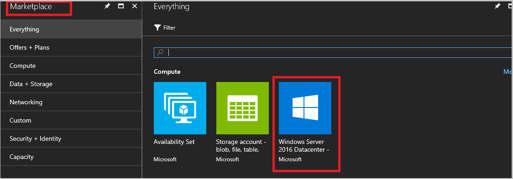

# Download marketplace items from Azure to Azure Stack

*Applies to: Azure Stack integrated systems and Azure Stack Development Kit*


As you decide what content to include in your Azure Stack marketplace, you should consider the content available from the Azure marketplace. You can download from a curated list of Azure marketplace items that have been pre-tested to run on Azure Stack. New items are frequently added to this list, so make sure to check back for new content.

## Download marketplace items in a connected scenario (with internet connectivity)

1. To download marketplace items, you must first [register Azure Stack with Azure](azure-stack-register.md).
2. Sign in to the Azure Stack administrator portal (https://portal.local.azurestack.external).
3. Some marketplace items can be large. Check to make sure you have enough space on your system by clicking **Resource Providers** > **Storage**.

    

4. Click **More Services** > **Marketplace Management**.

    

4. Click **Add from Azure** to see a list of items available for download. You can click on each item in the list to view its description and download size.

    

5. Select the item you want in the list and then click **Download**. The VM image for the item you selected starts to download. Download times vary.

    

6. After the download completes, you can deploy your new marketplace item as either an Azure Stack operator or user. Click **+New**, search among the categories for the new marketplace item, and then select the item.
7. Click **Create** to open up the creation experience for the newly downloaded item. Follow the step-by-step instructions to deploy your item.

## Download marketplace items in a disconnected or a partially connected scenario (with limited internet connectivity)

When you deploy Azure Stack in a disconnected mode (without any internet connectivity), you can’t download marketplace items by using the Azure Stack portal. However, you can use the marketplace syndication tool to download the marketplace items to a machine that has internet connectivity and then transfer them to your Azure Stack environment.

### Prerequisites
Before you can use the marketplace syndication tool, make sure that you have [registered Azure Stack with your Azure Subscription](azure-stack-register.md).  

From the machine that has internet connectivity, use the following steps to download the required marketplace items:

1. Open a PowerShell console as an administrator and [install Azure Stack specific PowerShell modules](azure-stack-powershell-install.md). Make sure that you install **PowerShell version 1.2.11 or higher**.  

2. Add the Azure account that you have used to register Azure Stack. To add the account, run the **Add-AzureRmAccount** cmdlet without any parameters. You are prompted to enter your Azure account credentials and you may have to use 2-factor authentication based on your account’s configuration.  

3. If you have multiple subscriptions, run the following command to select the one you have used for registration:  

   ```powershell
   Get-AzureRmSubscription -SubscriptionID '<Your Azure Subscription GUID>' | Select-AzureRmSubscription
   $AzureContext = Get-AzureRmContext
   ```

4. Download the latest version of marketplace syndication tool by using the following script:  

   ```PowerShell
   # Download the tools archive.
   [Net.ServicePointManager]::SecurityProtocol = [Net.SecurityProtocolType]::Tls12 
   invoke-webrequest https://github.com/Azure/AzureStack-Tools/archive/master.zip `
     -OutFile master.zip

   # Expand the downloaded files.
   expand-archive master.zip `
     -DestinationPath . `
     -Force

   # Change to the tools directory.
   cd \AzureStack-Tools-master

   ```

5. Import the syndication module and launch the tool by running the following commands:  

   ```powershell
   Import-Module .\ Syndication\AzureStack.MarketplaceSyndication.psm1

   Sync-AzSOfflineMarketplaceItem `
     -destination "<Destination folder path>" `
     -AzureTenantID $AzureContext.Tenant.TenantId `
     -AzureSubscriptionId $AzureContext.Subscription.Id  
   ```

6. When the tool runs, you are prompted to enter your Azure account credentials. Sign in to the Azure account that you have used to register Azure Stack. After the login is succeeds, you should see the following screen with the list of available marketplace items.  

   

7. Select the image that you want to download and make a note of the image version. You can select multiple images by holding the Ctrl key. You use the image version to import the image in next section.  Next, click **Ok**, and then accept the legal terms by clicking on **Yes**. You can also filter the list of images by using the **Add criteria** option. 

   The download takes a while depending on the size of the image. Once the image downloads, it's available in the destination path that you provided earlier. The download contains the VHD file and gallery items in the Azpkg format.

### Import the image and publish it to Azure Stack marketplace

1. After you download the image and gallery package, save them and the contents in AzureStack-Tools-master folder to a removable disk drive and copy it to the Azure Stack environment (you can copy it locally to any location such as: "C:\MarketplaceImages").     

2. Before importing the image, you must connect to the Azure Stack operator’s environment by using the steps described in [configure Azure Stack operator’s PowerShell environment](azure-stack-powershell-configure-admin.md).  

3. Import the image to Azure Stack by using the Add-AzsVMImage cmdlet. When using this cmdlet, make sure to replace the *publisher*, *offer*, and other parameter values with the values of the image that you are importing. You can get the *publisher*, *offer*, and *sku* values of the image from the imageReference object of the Azpkg file that you downloaded earlier and the *version* value from step 6 in the previous section.

   ```json
   "imageReference": {
      "publisher": "MicrosoftWindowsServer",
      "offer": "WindowsServer",
      "sku": "2016-Datacenter-Server-Core"
    }
   ```

   Replace the parameter values and run the following command:

   ```powershell
   Import-Module .\ComputeAdmin\AzureStack.ComputeAdmin.psm1

   Add-AzsVMImage `
    -publisher "MicrosoftWindowsServer" `
    -offer "WindowsServer" `
    -sku "2016-Datacenter-Server-Core" `
    -osType Windows `
    -Version "2016.127.20171215" `
    -OsDiskLocalPath "C:\AzureStack-Tools-master\Syndication\Windows-Server-2016-DatacenterCore-20171215-en.us-127GB.vhd" `
    -CreateGalleryItem $False `
    -Location Local
   ```

4. Use portal to upload your Marketplace item (.Azpkg) to Azure Stack Blob storage. You can upload to local Azure Stack storage or upload to Azure Storage. (It's a temporary location for the package.) Make sure that the blob is publicly accessible and note the URI.  

5. Publish the marketplace item to Azure Stack by using the **Add-AzsGalleryItem**. For example:

   ```powershell
   Add-AzsGalleryItem `
     -GalleryItemUri "https://mystorageaccount.blob.local.azurestack.external/cont1/Microsoft.WindowsServer2016DatacenterServerCore-ARM.1.0.2.azpkg" `
     –Verbose
   ```

6. After the gallery item is published, you can view it from the **New** > **Marketplace** pane.  

   

## Next steps

[Create and publish a Marketplace item](azure-stack-create-and-publish-marketplace-item.md)
