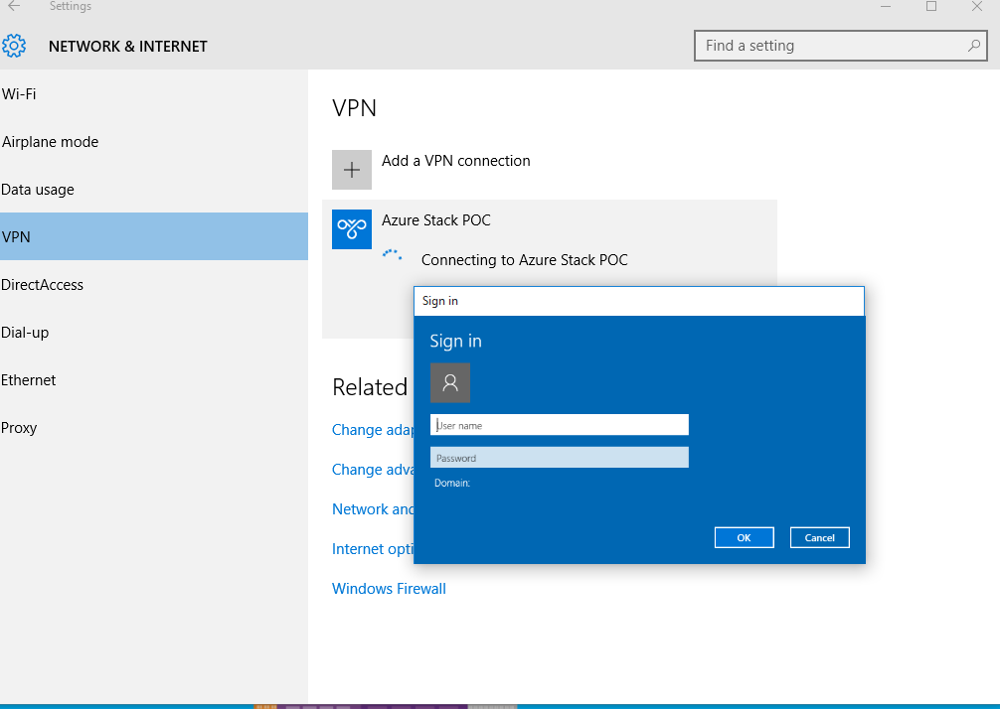
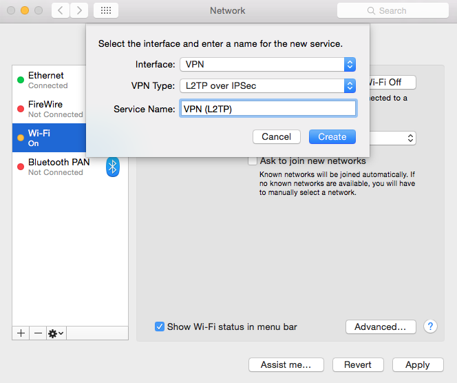
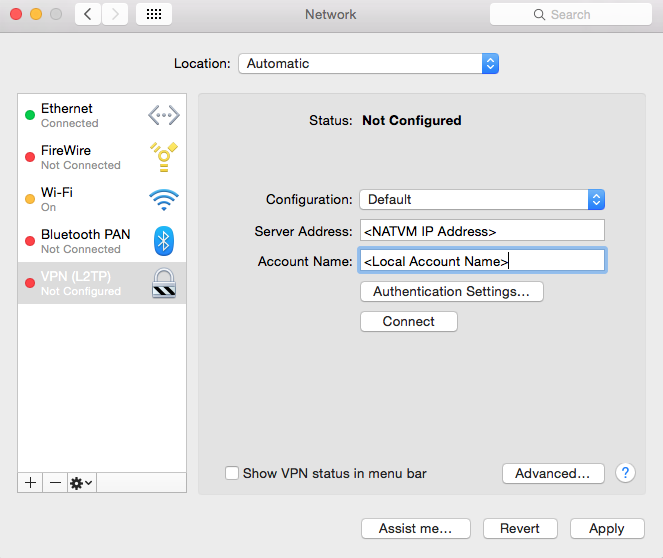
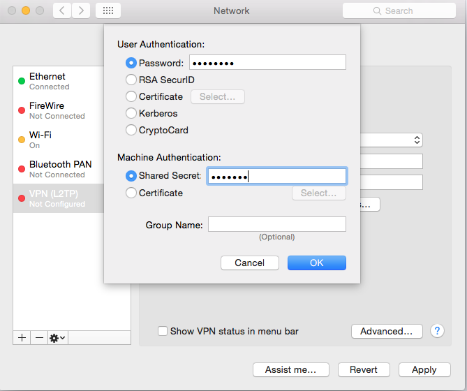
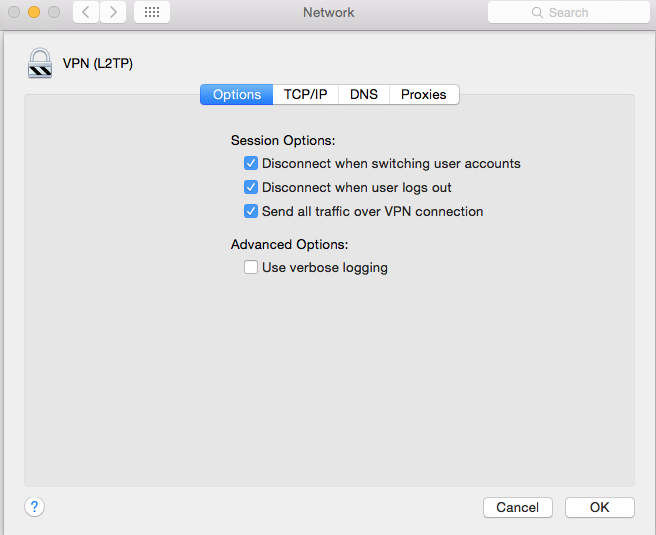
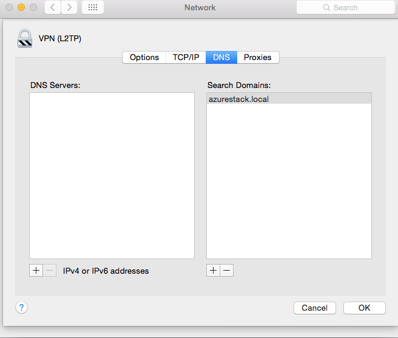
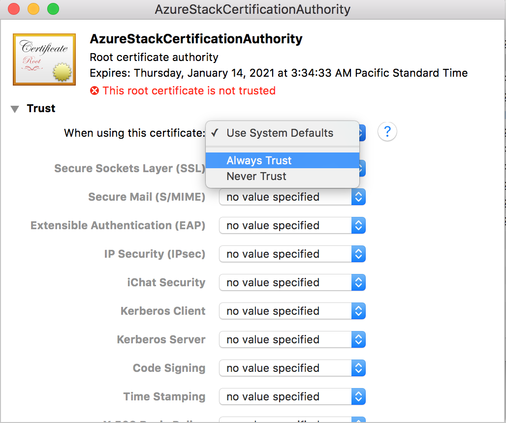

<properties
	pageTitle="Enable multiple concurrent user connections in Azure Stack | Microsoft Azure"
	description="To configure external Windows or Mac machines to connect to the Azure Stack POC, follow these steps."
	services="azure-stack"
	documentationCenter=""
	authors="ErikjeMS"
	manager="byronr"
	editor=""/>

<tags
	ms.service="azure-stack"
	ms.workload="na"
	ms.tgt_pltfrm="na"
	ms.devlang="na"
	ms.topic="article"
	ms.date="08/01/2016"
	ms.author="erikje"/>

# Enable multiple concurrent user connections in Azure Stack

Now that you've [deployed](azure-stack-run-powershell-script.md) your Azure Stack POC, you'll probably want to share it with developers in your organization so they can begin testing and deploying templates.

You can configure external Windows or Mac machines to connect to the Azure Stack POC.

1.  Connect to the NATVM (which was created by the deployment script).

2.  Configure the VPN.

3.  Export the certificate.

4.  Configure the clients.

After completing these steps, the configured machines will be able to access the Azure Stack POC using the portal and PowerShell without using a remote desktop connection into the POC host and then into the ClientVM.

These steps assume that you have completed the Azure Stack POC deployment process. This set of instructions will allow you to access the Microsoft Azure Stack POC externally via the portal and PowerShell without having to remote into the POC host and then into the ClientVM.

## Connect to the NATVM

The NATVM is accessible on the same network that the Azure Stack POC host is connected to. Use one of the following three ways to connect:

-   Using RDP, connect to the Azure Stack POC host and the enter a remote PowerShell session with the following cmdlet:

		Enter-PSSession -ComputerName 192.168.200.1 -Credential Administrator

-   Using RDP, connect to the Azure Stack POC host and then connect via RDP into the internal IP of the NATVM at 192.168.200.1.

-   Use the console/RDP to find the non-internal IP (not 192.168.200.1) of the NATVM and then connect via RDP directly to that IP from the client.

The username is the local administrator account and the password is the same as the one you elected for the admin password during the deployment process.

## Configure the VPN

This step explains how to configure a point to site VPN connection into the Azure Stack POC. This VPN connection will use the Layer Two Tunneling Protocol (L2TP) over IPSec. The script will configure the VPN to use addresses 192.168.200.200 to 192.168.200.230 on the Transit network within the Azure Stack POC.

1.  On the NATVM, run the following script in PowerShell. Replace \<SharedKey\> with the shared key you wish to use for this connection.

		Install-RemoteAccess –RoleType vpn –Legacy –IPAddressRange 192.168.200.201,192.168.200.230
		Install-RemoteAccess –RoleType vpnS2S –Legacy
		net stop remoteaccess
		net start remoteaccess
		Set-VpnAuthProtocol –TunnelAuthProtocolsAdvertised PreSharedKey –SharedSecret <SharedKey>
		Netsh ras set type ipv4rtrtype = lananddd ipv6rtrtype = none rastype = ipv4
		net stop remoteaccess
		net start remoteaccess
		$internalNic = Get-NetIPConfiguration | ? { [string]$_.IPv4Address -eq "192.168.200.1" }
		$internalNicName = $internalNic.InterfaceAlias
		$externalNic = Get-NetIPConfiguration | ? { [string]$_.IPv4Address -ne "192.168.200.1" }
		$externalNicName = $externalNic.InterfaceAlias
		$externalNicIp = [string]$externalNic.IPv4Address
		Netsh ras ip se pre $internalNicName
		Netsh rou ip nat se in $externalNicName full
		netsh nps se np name="Connections to Microsoft Routing and Remote Access server" state="enable" profileid="0x100f" profiledata="true"
		Write-host "VM external IP is $externalNicIp"

	>[AZURE.NOTE] These commands produce some output including **The following helper DLL cannot be loaded: WCNNETSH.DLL.** You may ignore this.

2.  For the VPN users, you must set up a local user account on the NATVM. On the NATVM, open **Control Panel**, click **User Accounts,** click **User Accounts,** click **User Accounts** again**,** click **Manage another account**, and then click **Add a user account**.

    **Important**: You may have to add additional accounts to increase the amount of concurrent users.

	

  Before exiting the NATVM, take note of the VM external IP address outputted by the script. This is the address you will use to connect via VPN.

## Export the certificate

On the Azure Stack POC host, execute the following cmdlets in PowerShell:

	$cert = Get-Childitem cert:\currentuser\root | where-object {$_.Subject –eq "CN=AzureStackCertificationAuthority, DC=AzureStack, DC=local"}

	Export-Certificate -Cert $cert -FilePath c:\CA.cer

This exports the Azure Stack certificate to the C:/ drive. Copy it from this location onto your client.

### Configure the clients

You can configure Windows and Mac machines to connect to the Microsoft Azure Stack POC.

### Configure a Windows client

1.  Copy the Microsoft Azure Stack certificate onto your client machine.

2.  Execute the following command in PowerShell. This command will import the Microsoft Azure Stack certificate into your root store. Replace “\<PathToCert\>” with the path to your certificate.

		Get-ChildItem -Path <PathToCert>| Import-Certificate -CertStoreLocation cert:\CurrentUser\Root

3.  To create the VPN connection without using split-tunneling, enter the following command in PowerShell as an Administrator. Replace `<SharedSecret>` and `<NATVMAddress>` with the shared secret you chose earlier and the IP address of the NATVM.

		Add-VpnConnection -Name "Azure Stack POC" -ServerAddress <NATVMAddress> -TunnelType L2tp -EncryptionLevel Required -AuthenticationMethod MSChapv2 -AllUserConnection -L2tpPsk <SharedSecret> -Force -RememberCredential –PassThru

4.  To create the VPN connection using split-tunneling, enter the following command in PowerShell as an Administrator. Replace \<SharedSecret\> and \<NATVMAddress\> with the shared secret you chose earlier and the IP address of the NATVM.

		Add-VpnConnection -Name "Azure Stack POC" -ServerAddress <NATVMAddress> -TunnelType L2tp -EncryptionLevel Required -AuthenticationMethod MSChapv2 -AllUserConnection -L2tpPsk <SharedSecret> -Force -RememberCredential –PassThru –SplitTunneling
		Add-VpnConnectionRoute -ConnectionName "Azure Stack POC" -DestinationPrefix 192.168.100.0/24 -RouteMetric 2 -PassThru
		Add-VpnConnectionRoute -ConnectionName "Azure Stack POC" -DestinationPrefix 192.168.133.0/24 -RouteMetric 2 -PassThru

5.  Log in to the VPN connection with the local account you created earlier.

	

### Configure a Mac client

1.  In **System Preferences**, select **Network**, then click the plus sign to create a new connection.

2.  In the **Interface** dropdown box, select **VPN**.

3.  In the **VPN Type** dropdown box, select **L2TP over IPSec**, and type a **Service Name**.

	

4.  Click **Create**.

5.  In the **Server Address** box, enter the NATVM IP address as created on the NATVM.

	

6.  In the **Account Name** box, enter the local account name as created on the NATVM.

7.  Select **Authentication Settings.**

	

8.  For **User Authentication**, select **Password,** and enter the password of the local account as created on the NATVM.

9.  For **Machine Authentication**, select **Shared Secret,** and enter the **Shared Secret** as configured during the NATVM steps above. Click **Ok**.

10. Click **Advanced,** click the **Options** tab, and under **Session Options**, select **Send all traffic over VPN connection**.

    

11. Click the **DNS** tab, in the **Search Domains** box, add **azurestack.local,** and then click **OK**.

	

12. You are now ready to connect the VPN. Click **Connect**.

13. Copy the certificate file over to the Mac. Double click the certificate and add it to the Keychain->Login. Double click and change **Trust** to **Always Trust**. Make sure to hit the red icon in top left corner to save the trust.

	

14. You should now be able to access the Azure Stack POC externally. You should be able to access the portal at **https://portal.azurestack.local.**

## Next steps

[Add an image to the Platform Image Repository](azure-stack-add-image-pir.md)
