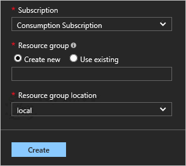

# Tutorial: Use the Azure Stack Ethereum blockchain solution template

The Ethereum solution template is designed to make it easier and quicker to deploy and configure a multi-member consortium Ethereum blockchain network with minimal Azure and Ethereum knowledge.

With a handful of user inputs and a single-click deployment through the Azure Stack tenant portal, each member can provision their network footprint. Each member's network footprint consists of a set of load-balanced transaction nodes with which an application or user can interact to submit transactions, a set of mining nodes to record transactions, and a Network Virtual Appliance (NVA). A subsequent connection step connects the NVAs to create a fully configured multi-member blockchain network.

To set this up, you will:

> [!div class="checklist"]
> * Choose a deployment architecture
> * Deploy a standalone, consortium leader or consortium member network

## Prerequisites

Download the latest items [from the Marketplace](azure-stack-download-azure-marketplace-item.md):

* Ubuntu Server 16.04 LTS
* Windows Server 2016
* Custom Script for Linux 2.0
* Custom Script Extension for Windows

For more information about blockchain scenarios, see [Ethereum proof-of-work consortium solution template](../blockchain/templates/ethereum-deployment.md).

## Deployment architecture

This solution template can deploy single or multi member Ethereum consortium network. The virtual network is connected in a chain topology using Network Virtual Appliance and connection resources. 

## Deployment use cases

The template can deploy Ethereum consortium for leader and member join in a variety of ways, here are the ones we have tested:

- On a multi-node Azure Stack, with Azure AD or AD FS, deploy lead and member using the same subscription or with different subscriptions.
- On a single-node Azure Stack (with Azure AD) deploy lead and member using the same subscription.

### Standalone and consortium leader deployment

The consortium leader template configures the first member's footprint in the network. 

1. Download the [leader template from GitHub](https://raw.githubusercontent.com/Azure/AzureStack-QuickStart-Templates/master/ethereum-consortium-blockchain/marketplace/ConsortiumLeader/mainTemplate.json)
2. In the Azure Stack Administration portal, select **+ Create a resource > Template deployment** to deploy from a custom template.
3. Select **Edit template** to edit the new custom template.
4. In the editing pane on the right, copy and paste the leader template JSON you previously downloaded.
    
    

5. Select **Save**.
6. Select **Edit parameters** and complete the template parameters for your deployment.
    
    

    Parameter Name | Description | Allowed Values | Sample value
    ---------------|-------------|----------------|-------------
    NAMEPREFIX | String used as a base for naming the deployed resources. | Alphanumeric characters with length 1 to 6 | eth
    AUTHTYPE | The method to authenticate to the virtual machine. | Password or SSH public key | Password
    ADMINUSERNAME | Administrator username of each deployed VM | 1 - 64 characters | gethadmin
    ADMINPASSWORD (Authentication type = Password)| The password for the administrator account for each of the virtual machines deployed. The password must contain 3 of the following requirements: 1 upper case character, 1 lower case character, 1 number, and 1 special character.  While all VMs initially have the same password, you can change the password after provisioning.|12 - 72 characters|
    ADMINSSHKEY (Authentication type = sshPublicKey) | The secure shell key used for remote login. | |
    GENESISBLOCK | JSON string representing custom genesis block.  Specifying a value for this parameter is optional. | |
    ETHEREUMACCOUNTPSSWD | The admin password used to secure Ethereum account. | |
    ETHEREUMACCOUNTPASSPHRASE | The passphrase used to generate private key associated with the Ethereum account. | |
    ETHEREUMNETWORKID | The network ID of the consortium. | Use any value between 5 and 999,999,999 | 72
    CONSORTIUMMEMBERID | The ID associated with each member of the consortium network.   | This ID should be unique in the network. | 0
    NUMMININGNODES | Number of mining nodes. | Between 2 and 15. | 2
    MNNODEVMSIZE | VM size of the mining nodes. | | Standard_A1
    MNSTORAGEACCOUNTTYPE | Storage performance of the mining nodes. | | Standard_LRS
    NUMTXNODES | Number of transaction nodes. | Between 1 and 5. | 1
    TXNODEVMSIZE | VM size of the transaction nodes. | | Standard_A1
    TXSTORAGEACCOUNTTYPE | Storage performance of the transaction nodes. | | Standard_LRS
    BASEURL | Base URL to get the depending templates from. | Use the default value unless you want to customize the deployment templates. | 

7. Select **OK**.
8. In **Custom deployment**, specify **Subscription**, **Resource group**, and  **Resource group location**.
    
    

    Parameter Name | Description | Allowed Values | Sample value
    ---------------|-------------|----------------|-------------
    Subscription | The subscription to which to deploy the consortium network | | Consumption Subscription
    Resource Group | The resource group to which to deploy the consortium network. | | EthereumResources
    Location | The Azure region for resource group. | | local

8. Select **Create**.

Deployment can take 20 minutes or longer to complete.

After deployment completes, you can review the deployment summary for **Microsoft. Template** in the deployment section of the resource group. The summary contains output values that can be used to join consortium members.

To verify leader’s deployment, browse leader’s admin site. You can find admin site address in the output section of **Microsoft.Template** deployment.  

### Joining consortium member deployment

1. Download the [consortium member template from GitHub](https://raw.githubusercontent.com/Azure/AzureStack-QuickStart-Templates/master/ethereum-consortium-blockchain/marketplace/JoiningMember/mainTemplate.json)
2. In the Azure Stack Administration portal, select **+ Create a resource > Template deployment** to deploy from a custom template.
3. Select **Edit template** to edit the new custom template.
4. In the editing pane on the right, copy and paste the leader template JSON you downloaded previously.
5. Select **Save**.
6. Select **Edit parameters** and complete the template parameters for your deployment.

    Parameter Name | Description | Allowed Values | Sample value
    ---------------|-------------|----------------|-------------
    NAMEPREFIX | String used as a base for naming the deployed resources. | Alphanumeric characters with length 1 to 6 | eth
    AUTHTYPE | The method to authenticate to the virtual machine. | Password or SSH public key | Password
    ADMINUSERNAME | Administrator username of each deployed VM | 1 - 64 characters | gethadmin
    ADMINPASSWORD (Authentication type = Password)| The password for the administrator account for each of the virtual machines deployed. The password must contain 3 of the following requirements: 1 upper case character, 1 lower case character, 1 number, and 1 special character.  While all VMs initially have the same password, you can change the password after provisioning.|12 - 72 characters|
    ADMINSSHKEY (Authentication type = sshPublicKey) | The secure shell key used for remote login. | |
    CONSORTIUMMEMBERID | The ID associated with each member of the consortium network.   | This ID should be unique in the network. | 0
    NUMMININGNODES | Number of mining nodes. | Between 2 and 15. | 2
    MNNODEVMSIZE | VM size of the mining nodes. | | Standard_A1
    MNSTORAGEACCOUNTTYPE | Storage performance of the mining nodes. | | Standard_LRS
    NUMTXNODES | Number of transaction nodes. | Between 1 and 5. | 1
    TXNODEVMSIZE | VM size of the transaction nodes. | | Standard_A1
    TXSTORAGEACCOUNTTYPE | Storage performance of the transaction nodes. | | Standard_LRS
    CONSORTIUMDATA | The URL pointing to the relevant consortium configuration data provided by another member’s deployment. This value can be found on Leader’s deployment output. | |
    REMOTEMEMBERVNETADDRESSSPACE | The NVA IP address of the leader. This value can be found on leader’s deployment output. | | 
    REMOTEMEMBERNVAPUBLICIP | The NVA IP address of the leader. This value can be found on leader’s deployment output. | | 
    CONNECTIONSHAREDKEY | A pre-established secret between the members of the consortium network that are establishing a connection. | |
    BASEURL | Base URL for the template. | Use the default value unless you want to customize the deployment templates. | 

7. Select **OK**.
8. In **Custom deployment**, specify **Subscription**, **Resource group**, and  **Resource group location**.

    Parameter Name | Description | Allowed Values | Sample value
    ---------------|-------------|----------------|-------------
    Subscription | The subscription to which to deploy the consortium network | | Consumption Subscription
    Resource Group | The resource group to which to deploy the consortium network. | | MemberResources
    Location | The Azure region for resource group. | | local

8. Select **Create**.

Deployment can take 20 minutes or longer to complete.

After deployment completes, you can review the deployment summary for **Microsoft.Template** in the deployment section of the resource group. The summary contains output values that can be used to connect consortium members.

To verify member’s deployment, browse member’s admin site. You can find admin site address in the output section of Microsoft.Template deployment.

As shown in the picture, member’s nodes status is **Not running**. This is because the connection between member and leader is not established. The connection between member and leader is a two-way connection. When you deploy member, template automatically creates the connection from member to the leader. To create the connection from leader to member go to the next step.

### Connect member and leader

This template creates a connection from the leader to a remote member. 

1. Download the [connect member and leader template from GitHub](https://raw.githubusercontent.com/Azure/AzureStack-QuickStart-Templates/master/ethereum-consortium-blockchain/marketplace/Connection/mainTemplate.json)
2. In the Azure Stack Administration portal, select **+ Create a resource > Template deployment** to deploy from a custom template.
3. Select **Edit template** to edit the new custom template.
4. In the editing pane on the right, copy and paste the leader template JSON you downloaded previously.
    
    

5. Select **Save**.
6. Select **Edit parameters** and complete the template parameters for your deployment.
    
    

    Parameter Name | Description | Allowed Values | Sample value
    ---------------|-------------|----------------|-------------
    MEMBERNAMEPREFIX | Leader's name prefix. This value can be found on leader's deployment output.  | Alphanumeric characters with length 1 to 6 | |
    MEMBERROUTETABLENAME | Name of the leader’s route table. This value can be found on leader’s deployment output. |  | 
    REMOTEMEMBERVNETADDRESSSPACE | Address space of the member. This value can be found on member’s deployment output. | |
    CONNECTIONSHAREDKEY | A pre-established secret between the members of the consortium network that are establishing a connection.  | |
    REMOTEMEMBERNVAPUBLICIP | The NVA IP address of the member. This value can be found on member’s deployment output. | |
    MEMBERNVAPRIVATEIP | Leader's private NVA IP address. This value can be found on leader’s deployment output. | |
    LOCATION | Location of your Azure Stack environment. | | local
    BASEURL | Base URL for the template. | Use the default value unless you want to customize the deployment templates. | 

7. Select **OK**.
8. In **Custom deployment**, specify **Subscription**, **Resource group**, and  **Resource group location**.
    
    

    Parameter Name | Description | Allowed Values | Sample value
    ---------------|-------------|----------------|-------------
    Subscription | The leader's subscription. | | Consumption Subscription
    Resource Group | The leader's resource group. | | EthereumResources
    Location | The Azure region for resource group. | | local

8. Select **Create**.

After deployment is complete, it takes few minutes for leader and member to start communication. To verify the deployment, refresh member’s admin site. Status of the member’s nodes should be running. 

## Next steps

In this tutorial, you learned how to:

> [!div class="checklist"]
> * Choose a deployment architecture
> * Deploy a standalone, consortium leader or consortium member network

To learn more about Ethereum and Azure, see:

> [!div class="nextstepaction"]
> [Blockchain Technology and Applications](https://azure.microsoft.com/solutions/blockchain/)
