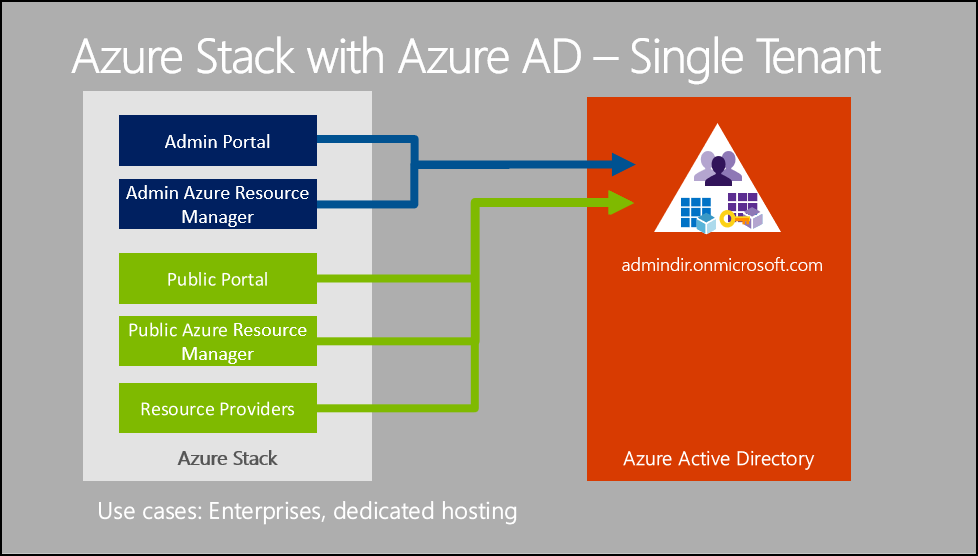
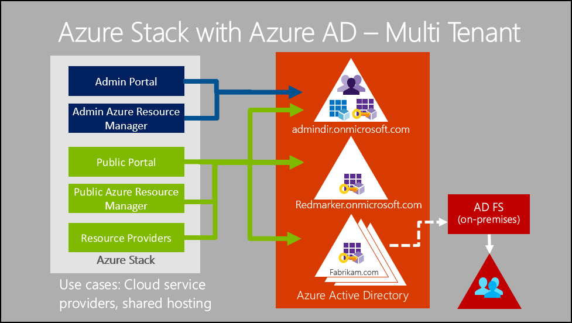
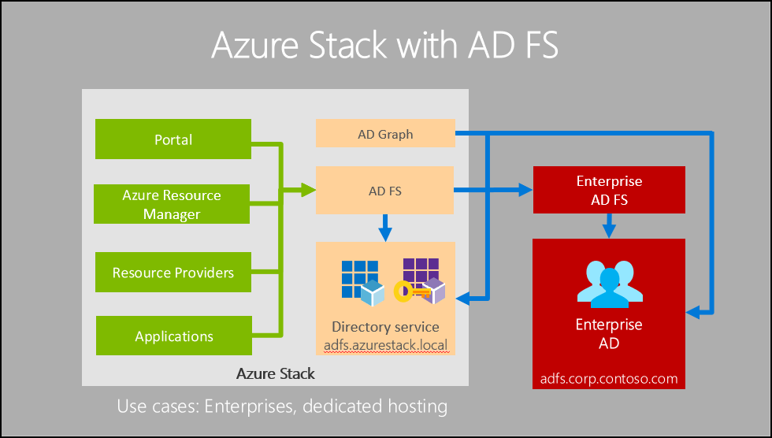

# Identity architecture for Azure Stack
Before you choose an identity provider to use with Azure Stack, understand the important differences between the options of Azure Active Directory (Azure AD) and Active Directory Federation Services (AD FS). 

## Capabilities and limitations 
The identity provider that you choose can limit your options, including support for multi-tenancy. 

  

|Capability or scenario        |Azure AD  |AD FS  |
|------------------------------|----------|-------|
|Connected to the internet     |Yes       |Optional|
|Support for multi-tenancy     |Yes       |No      |
|Offer items in the Marketplace |Yes       |Yes. Requires use of the [offline Marketplace Syndication](azure-stack-download-azure-marketplace-item.md#disconnected-or-a-partially-connected-scenario) tool.|
|Support for Active Directory Authentication Library (ADAL) |Yes |Yes|
|Support for tools such as Azure CLI, Visual Studio, and PowerShell  |Yes |Yes|
|Create service principals through the Azure portal     |Yes |No|
|Create service principals with certificates      |Yes |Yes|
|Create service principals with secrets (keys)    |Yes |No|
|Applications can use the Graph service           |Yes |No|
|Applications can use identity provider for sign-in |Yes |Yes. Requires applications to federate with on-premises AD FS instances. |

## Topologies
The following sections discus the various identity topologies that you can use.

### Azure AD: single-tenant topology 
By default, when you install Azure Stack and use Azure AD, Azure Stack uses a single-tenant topology. 

A single-tenant topology is useful when:
- All users are part of the same tenant.
- A service provider hosts an Azure Stack instance for an organization. 

This topology features the following characteristics:
- Azure Stack registers all applications and services to the same Azure AD tenant directory. 
- Azure Stack authenticates only the users and applications from that directory, including tokens. 
- Identities for administrators (cloud operators) and tenant users are in the same directory tenant. 
- To enable a user from another directory to access this Azure Stack environment, you must [invite the user as a guest](azure-stack-identity-overview.md#guest-users) to the tenant directory. 

### Azure AD: multi-tenant topology
Cloud operators can configure Azure Stack to allow access to applications by tenants from one or more organizations. Users access applications through the user portal. In this configuration, the Admin portal (used by the cloud operator) is limited to users from a single directory. 

A multi-tenant topology is useful when:
- A service provider wants to allow users from multiple organizations to access Azure Stack.

This topology features the following characteristics:
- Access to resources should be on a per-organization basis. 
- Users from one organization should be unable to grant access to resources to users who are outside their organization. 
- Identities for administrators (cloud operators) can be in a separate directory tenant from the identities for users. This separation provides account isolation at the identity provider level. 
 
### AD FS  
The AD FS topology is required when either of the following conditions is true:
- Azure Stack does not connect to the internet.
- Azure Stack can connect to the internet, but you choose to use AD FS for your identity provider.
  

This topology features the following characteristics:
- To support the use of this topology in production, you must integrate the built-in Azure Stack AD FS instance with an existing AD FS instance that's backed by Active Directory, through a federation trust. 
- You can integrate the Graph service in Azure Stack with your existing Active Directory instance. You can also use the OData-based Graph API service that supports APIs that are consistent with the Azure AD Graph API. 

  To interact with your Active Directory instance, the Graph API requires user credentials from your Active Directory instance that have read-only permissions. 
  - The built-in AD FS instance is based on Windows Server 2016. 
  - Your AD FS and Active Directory instances must be based on Windows Server 2012 or later. 
  
  Between your Active Directory instance and the built-in AD FS instance, interactions aren't restricted to OpenID Connect, and they can use any mutually supported protocol. 
  - User accounts are created and managed in your on-premises Active Directory instance.
  - Service principals and registrations for applications are managed in the built-in Active Directory instance.

## Next steps
- [Identity overview](azure-stack-identity-overview.md)   
- [Datacenter integration - identity](azure-stack-integrate-identity.md)
