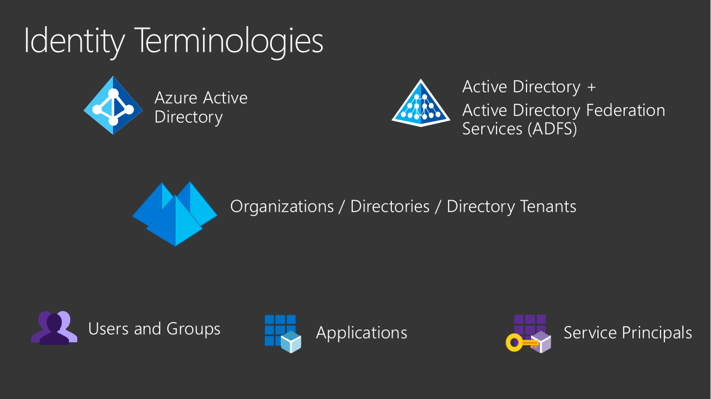
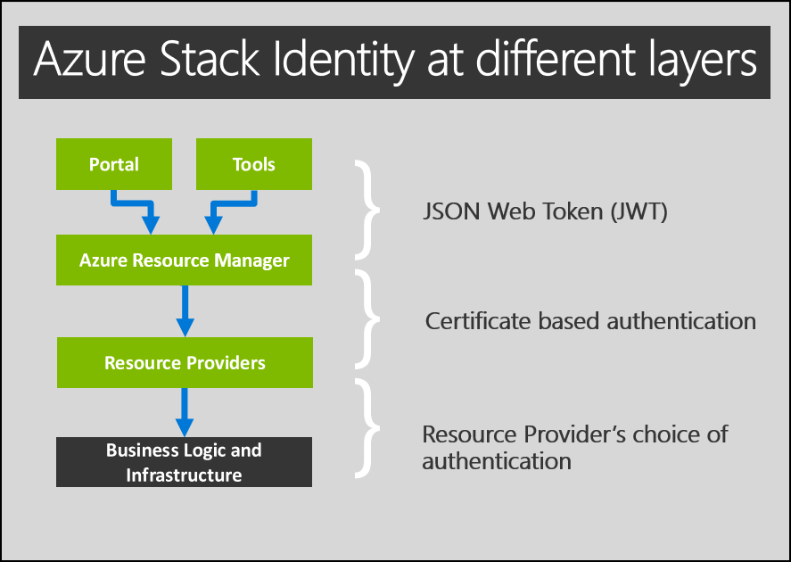
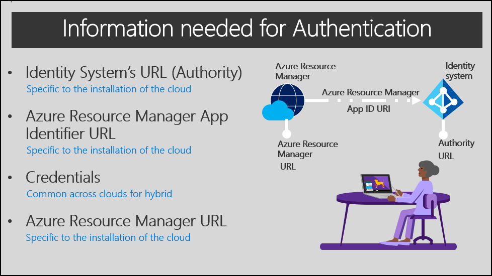
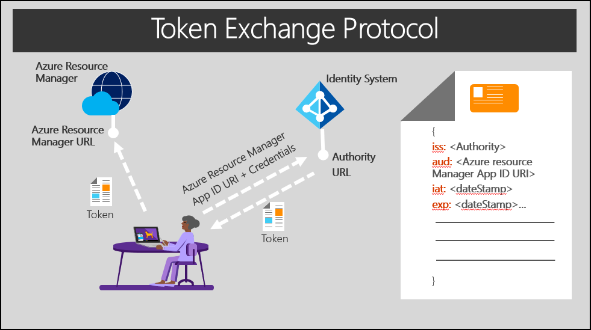

# Overview of identity for Azure Stack

Azure Stack requires Azure Active Directory (Azure AD) or Active Directory Federation Services (AD FS), backed by Active Directory as an identity provider. The choice of a provider is a one-time decision that you make when you first deploy Azure Stack. The concepts and authorization details in this article can help you choose between identity providers.

Your choice of either Azure AD or AD FS might be determined by the mode in which you deploy Azure Stack:

- When you deploy it in a connected mode, you can use either Azure AD or AD FS.
- When you deploy it in a disconnected mode, without a connection to the internet, only AD FS is supported.

For more information about your options, which depend on your Azure Stack environment, see the following articles:

- Azure Stack deployment kit: [Identity considerations](azure-stack-datacenter-integration.md#identity-considerations).
- Azure Stack integrated systems: [Deployment planning decisions for Azure Stack integrated systems](azure-stack-deployment-decisions.md).

## Common concepts for identity

The next sections discuss common concepts about identity providers and their use in Azure Stack.

### Directory tenants and organizations

A directory is a container that holds information about *users*, *applications*, *groups*, and *service principals*.

A directory tenant is an *organization*, such as Microsoft or your own company.

- Azure AD supports multiple tenants, and it can support multiple organizations, each in its own directory. If you use Azure AD and have multiple tenants, you can grant applications and users from one tenant access to other tenants of that same directory.
- AD FS supports only a single tenant and, therefore, only a single organization.

### Users and groups

User accounts (identities) are standard accounts that authenticate individuals by using a user ID and password. Groups can include users or other groups.

How you create and manage users and groups depends on the identity solution you use.

In Azure Stack, user accounts:

- Are created in the *username@domain* format. Although AD FS maps user accounts to an Active Directory instance, AD FS does not support the use of the *\\\<domain>\\\<alias>* format.
- Can be set up to use multi-factor authentication.
- Are restricted to the directory where they first register, which is their organization's directory.
- Can be imported from your on-premises directories. For more information, see  [Integrate your on-premises directories with Azure Active Directory](/azure/active-directory/connect/active-directory-aadconnect).

When you sign in to your organization's tenant portal, you use the *https://portal.local.azurestack.external* URL. When signing into the Azure Stack portal from domains other than the one used to register Azure Stack, the domain name used to register Azure Stack must be appended to the portal url. For example, if Azure Stack has been registered with fabrikam.onmicrosoft.com and the user account logging in is admin@contoso.com, the url to use to log into the user portal would be: https://portal.local.azurestack.external/fabrikam.onmicrosoft.com.

### Guest users

Guest users are user accounts from other directory tenants that have been granted access to resources in your directory. To support guest users, you use Azure AD and enable support for multi-tenancy. When support is enabled, you can invite guest users to access resources in your directory tenant, which in turn enables their collaboration with outside organizations.

To invite guest users, cloud operators and users can use [Azure AD B2B collaboration](/azure/active-directory/active-directory-b2b-what-is-azure-ad-b2b). Invited users get access to documents, resources, and applications from your directory, and you maintain control over your own resources and data. 

As a guest user, you can sign in to another organization's directory tenant. To do so, you append that organization's directory name to the portal URL. For example, if you belong to the Contoso organization and want to sign in to the Fabrikam directory, you use https://portal.local.azurestack.external/fabrikam.onmicrosoft.com.

### Applications

You can register applications to Azure AD or AD FS, and then offer the applications to users in your organization.

Applications include:

- **Web application**: Examples include the Azure portal and Azure Resource Manager. They support Web API calls.
- **Native client**: Examples include Azure PowerShell, Visual Studio, and Azure CLI.

Applications can support two types of tenancy:

- **Single-tenant**: Supports users and services only from the same directory where the application is registered.

  > [!NOTE]
  > Because AD FS supports only a single directory, applications you create in an AD FS topology are, by design, single-tenant applications.

- **Multi-tenant**: Supports use by users and services from both the directory where the application is registered and additional tenant directories. With multi-tenant applications, users of another tenant directory (another Azure AD tenant) can sign in to your application. 

  For more information about multi-tenancy, see [Enable multi-tenancy](azure-stack-enable-multitenancy.md).

  For more information about developing a multi-tenant app, see [Multi-tenant apps](/azure/active-directory/develop/active-directory-devhowto-multi-tenant-overview).

When you register an application, you create two objects:

- **Application object**: The global representation of the application across all tenants. This relationship is one-to-one with the software application and exists only in the directory where the application is first registered.

- **Service principal object**: A credential that is created for an application in the directory where the application is first registered. A service principal is also created in the directory of each additional tenant where that application is used. This relationship can be one-to-many with the software application.

To learn more about application and service principal objects, see [Application and service principal objects in Azure Active Directory](/azure/active-directory/develop/active-directory-application-objects).

### Service principals

A service principal is a set of *credentials* for an application or service that grant access to resources in Azure Stack. The use of a service principal separates the application permissions from the permissions of the user of the application.

A service principal is created in each tenant where the application is used. The service principal establishes an identity for sign-in and access to resources (such as users) that are secured by that tenant.

- A single-tenant application has only one service principal, in the directory where it is first created. This service principal is created and consents to being used during registration of the application.
- A multi-tenant web application or API has a service principal that's created in each tenant where a user from that tenant consents to the use of the application.

Credentials for service principals can be either a key that's generated through the Azure portal or a certificate. The use of a certificate is suited for automation because certificates are considered more secure than keys. 

> [!NOTE]
> When you use AD FS with Azure Stack, only the administrator can create service principals. With AD FS, service principals require certificates and are created through the privileged endpoint (PEP). For more information, see [Provide applications access to Azure Stack](azure-stack-create-service-principals.md).

To learn about service principals for Azure Stack, see [Create service principals](azure-stack-create-service-principals.md).

### Services

Services in Azure Stack that interact with the identity provider are registered as applications with the identity provider. Like applications, registration enables a service to authenticate with the identity system.

All Azure services use [OpenID Connect](/azure/active-directory/develop/active-directory-protocols-openid-connect-code) protocols and [JSON Web Tokens](/azure/active-directory/develop/active-directory-token-and-claims) to establish their identity. Because Azure AD and AD FS use protocols consistently, you can use [Azure Active Directory Authentication Library](/azure/active-directory/develop/active-directory-authentication-libraries) (ADAL) to authenticate on-premises or to Azure (in a connected scenario). With ADAL, you can also use tools such as Azure PowerShell and Azure CLI for cross-cloud and on-premises resource management.

### Identities and your identity system

Identities for Azure Stack include user accounts, groups, and service principals.

When you install Azure Stack, several built-in applications and services automatically register with your identity provider in the directory tenant. Some services that register are used for administration. Other services are available for users. The default registrations give core services identities that can interact both with each other and with identities that you add later.

If you set up Azure AD with multi-tenancy, some applications propagate to the new directories.

## Authentication and authorization

### Authentication by applications and users

For applications and users, the architecture of Azure Stack is described by four layers. Interactions between each of these layers can use different types of authentication.

|Layer    |Authentication between layers  |
|---------|---------|
|Tools and clients, such as the Admin portal     | To access or modify a resource in Azure Stack, tools and clients use a [JSON Web Token](/azure/active-directory/develop/active-directory-token-and-claims) to place a call to Azure Resource Manager.  Azure Resource Manager validates the JSON Web Token and peeks at the *claims* in the issued token to estimate the level of authorization that user or service principal has in Azure Stack. |
|Azure Resource Manager and its core services     |Azure Resource Manager communicates with resource providers to transfer communication from users.   Transfers use *direct imperative* calls or *declarative* calls via [Azure Resource Manager templates](/azure/azure-stack/user/azure-stack-arm-templates).|
|Resource providers     |Calls that are passed to resource providers are secured with certificate-based authentication.  Azure Resource Manager and the resource provider then stay in communication through an API. For every call that's received from Azure Resource Manager, the resource provider validates the call with that certificate.|
|Infrastructure and business logic     |Resource providers communicate with business logic and infrastructure by using an authentication mode of their choice. The default resource providers that ship with Azure Stack use Windows Authentication to secure this communication.|

### Authenticate to Azure Resource Manager

To authenticate with the identity provider and receive a JSON Web Token, you must have the following information:

1. **URL for the identity system (Authority)**: The URL at which your identity provider can be reached. For example, *https://login.windows.net*.
2. **App ID URI for Azure Resource Manager**: The unique identifier for Azure Resource Manager that is registered with your identity provider. It is also unique to each Azure Stack installation.
3. **Credentials**: The credential you use to authenticate with the identity provider.
4. **URL for Azure Resource Manager**: The URL is the location of the Azure Resource Manager service. For example, *https://management.azure.com* or *https://management.local.azurestack.external*.

When a principal (a client, application, or user) makes an authentication request to access a resource, the request must include:

- The principal’s credentials.
- The app ID URI of the resource that the principal wants to access.

The credentials are validated by the identity provider. The identity provider also validates that the app ID URI is for a registered application, and that the principal has the correct privileges to obtain a token for that resource. If the request is valid, a JSON Web Token is granted.

The token must then pass in the header of a request to Azure Resource Manager. Azure Resource Manager does the following, in no specific order:

- Validates the *issuer* (iss) claim to confirm that the token is from the correct identity provider.
- Validates the *audience* (aud) claim to confirm that the token was issued to Azure Resource Manager.
- Validates that the JSON Web Token is signed with a certificate that is configured through OpenID is known to Azure Resource Manager.
- Review the *issued at* (iat) and *expiration* (exp) claims to confirm that the token is active and can be accepted.

When all validations are complete, Azure Resource Manager uses the *objected* (oid) and the *groups* claims to make a list of resources that the principal can access.

> [!NOTE]
> After deployment, Azure Active Directory global administrator permission is not required. However, some operations may require the global administrator credential. For example, a resource provider installer script or a new feature requiring a permission to be granted. You can either temporarily re-instate the account’s global administrator permissions or use a separate global administrator account that is an owner of the *default provider subscription*.

### Use Role-Based Access Control

Role-Based Access Control (RBAC) in Azure Stack is consistent with the implementation in Microsoft Azure. You can manage access to resources by assigning the appropriate RBAC role to users, groups, and applications.
For information about how to use RBAC with Azure Stack, see the following articles:

- [Get started with Role-Based Access Control in the Azure portal](/azure/role-based-access-control/overview).
- [Use Role-Based Access Control to manage access to your Azure subscription resources](/azure/role-based-access-control/role-assignments-portal).
- [Create custom roles for Azure Role-Based Access Control](/azure/role-based-access-control/custom-roles).
- [Manage Role-Based Access Control](azure-stack-manage-permissions.md) in Azure Stack.

### Authenticate with Azure PowerShell

Details about using Azure PowerShell to authenticate with Azure Stack can be found at [Configure the Azure Stack user's PowerShell environment](azure-stack-powershell-configure-user.md).

### Authenticate with Azure CLI

For information about using Azure PowerShell to authenticate with Azure Stack, see [Install and configure Azure CLI for use with Azure Stack](/azure/azure-stack/user/azure-stack-connect-cli).

## Next steps

- [Identity architecture](azure-stack-identity-architecture.md)
- [Datacenter integration - identity](azure-stack-integrate-identity.md)
