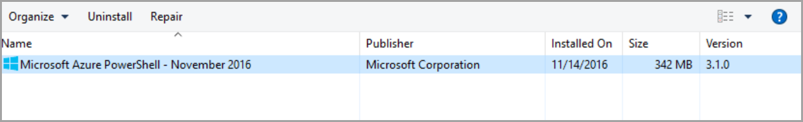
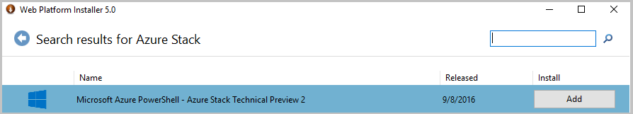
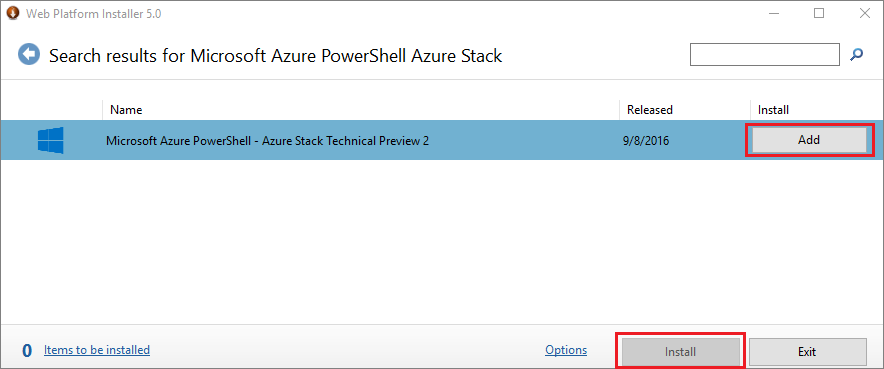
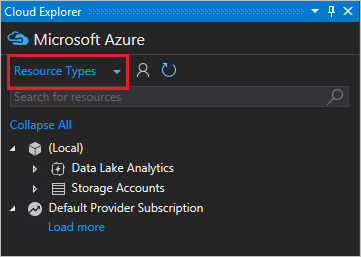

# Install Visual Studio and connect to Azure Stack

> [!IMPORTANT] 
> This topic applies only to Azure Stack Technical Preview 2.
>

You can use Visual Studio to author and deploy Azure Resource Manager [templates](azure-stack-arm-templates.md) in Azure Stack.  Use the following steps to install the supported version for Azure Stack TP2.  

## Before you begin
 - These steps perform a new installation of Visual Studio 2015 Community Edition.  Read more about [coexistence](https://msdn.microsoft.com/library/ms246609.aspx) between other Visual Studio versions.
 - You can install on [MAS-CON01](azure-stack-connect-azure-stack.md#connect-with-remote-desktop), or install on a workstation that has [VPN](azure-stack-connect-azure-stack.md#connect-with-vpn) connectivity to Azure Stack.

## Install Visual Studio
1.	Download and run the [Web Platform Installer](https://www.microsoft.com/web/downloads/platform.aspx).             

2.	Search for **Visual Studio Community 2015 with Microsoft Azure SDK - 2.9.6**, then click **Add**, and **Install**.

     

3.	Uninstall the **Microsoft Azure PowerShell** that is installed as part of the Azure SDK.

       

4.	Open the Web Platform Installer, search for **Microsoft Azure PowerShell - Azure Stack Technical Preview 2**, click **Add**, and **Install**.

    

5.	Restart the operating system once the installation completes.

## Connect to Azure Stack

1.	Launch Visual Studio.

2.  From the **Edit** menu, select **Cloud Explorer**.

3.  In the new pane, select **Add Account** and sign in with your Azure AD credentials.  
    

Once logged in, you can [deploy templates](azure-stack-deploy-template-visual-studio.md) or browse available resource types and resource groups to create your own templates.  

## Next Steps

 - [Develop templates for Azure Stack](azure-stack-develop-templates.md)
