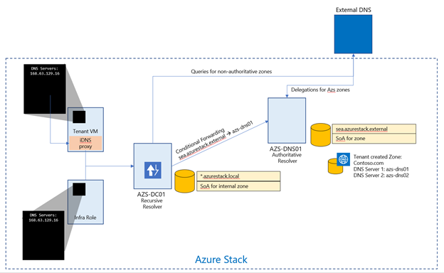

# Azure Stack datacenter integration - DNS
To be able to access Azure Stack endpoints (**portal**, **adminportal**, **management**, **adminmanagement**, etc.)  from outside Azure Stack, you need to integrate the Azure Stack DNS services with the DNS servers that host the DNS zones you want to use in Azure Stack.

## Azure Stack DNS namespace
You are required to provide some important information related to DNS when you deploy Azure Stack.


|Field  |Description  |Example|
|---------|---------|---------|
|Region|The geographic location of your Azure Stack deployment.|`east`|
|External Domain Name|The name of the zone you want to use for your Azure Stack deployment.|`cloud.fabrikam.com`|
|Internal Domain Name|The name of the internal zone that is used for infrastructure services in Azure Stack.  It is Directory Service-integrated and private (not reachable from outside the Azure Stack deployment).|`azurestack.local`|
|DNS Forwarder|DNS servers that are used to forward DNS queries, DNS zones and records that are hosted outside Azure Stack, either on the corporate intranet or public internet.|`10.57.175.34`<br>`8.8.8.8`|
|Naming Prefix (Optional)|The naming prefix you want your Azure Stack infrastructure role instance machine names to have.  If not provided, the default is `azs`.|`azs`|

The fully qualified domain name (FQDN) of your Azure Stack deployment and endpoints is the combination of the Region parameter and the External Domain Name parameter. Using the values from the examples in the previous table, the FQDN for this Azure Stack deployment would be the following name:

`east.cloud.fabrikam.com`

As such, examples of some of the endpoints for this deployment would look like the following URLs:

`https://portal.east.cloud.fabrikam.com`

`https://adminportal.east.cloud.fabrikam.com`

To use this example DNS namespace for an Azure Stack deployment, the following conditions are required:

- The zone `fabrikam.com` is registered either with a domain registrar, an internal corporate DNS server, or both, depending on your name resolution requirements.
- The child domain `cloud.fabrikam.com` exists under the zone `fabrikam.com`.
- The DNS servers that host the zones `fabrikam.com` and `cloud.fabrikam.com` can be reached from the Azure Stack deployment.

To be able to resolve DNS names for Azure Stack endpoints and instances from outside Azure Stack, you need to integrate the DNS servers that host the external DNS zone for Azure Stack with the DNS servers that host the parent zone you want to use.


## Resolution and delegation

There are two types of DNS servers:

- An authoritative DNS server hosts DNS zones. It answers DNS queries for records in those zones only.
- A recursive DNS server does not host DNS zones. It answers all DNS queries by calling authoritative DNS servers to gather the data it needs.

Azure Stack includes both authoritative and recursive DNS servers. The recursive servers are used to resolve names of everything except for the internal private zone and the external public DNS zone for that Azure Stack deployment. 



## Resolving external DNS names from Azure Stack

To resolve DNS names for endpoints outside Azure Stack (for example: www.bing.com), you need to provide DNS servers that Azure Stack can use to forward DNS requests for which Azure Stack is not authoritative. For deployment, DNS servers that Azure Stack forwards requests to are required in the Deployment Worksheet (in the DNS Forwarder field). Provide at least two servers in this field for fault tolerance. Without these values, Azure Stack deployment fails.

### Configure conditional DNS forwarding

> [!IMPORTANT]
> This only applies to an AD FS deployment.

To enable name resolution with your existing DNS infrastructure, configure conditional forwarding.

To add a conditional forwarder, you must use the privileged endpoint.

For this procedure, use a computer in your datacenter network that can communicate with the privileged endpoint in Azure Stack.

1. Open an elevated Windows PowerShell session (run as administrator), and connect to the IP address of the privileged endpoint. Use the credentials for CloudAdmin authentication.

   ```
   $cred=Get-Credential 
   Enter-PSSession -ComputerName <IP Address of ERCS> -ConfigurationName PrivilegedEndpoint -Credential $cred
   ```

2. After you connect to the privileged endpoint, run the following PowerShell command. Substitute the sample values provided with your domain name and IP addresses of the DNS servers you want to use.

   ```
   Register-CustomDnsServer -CustomDomainName "contoso.com" -CustomDnsIPAddresses "192.168.1.1","192.168.1.2"
   ```

## Resolving Azure Stack DNS names from outside Azure Stack
The authoritative servers are the ones that hold the external DNS zone information, and any user-created zones. Integrate with these servers to enable zone delegation or conditional forwarding to resolve Azure Stack DNS names from outside Azure Stack.

## Get DNS Server external endpoint information

To integrate your Azure Stack deployment with your DNS infrastructure, you need the following information:

- DNS server FQDNs
- DNS server IP addresses

The FQDNs for the Azure Stack DNS servers have the following format:

`<NAMINGPREFIX>-ns01.<REGION>.<EXTERNALDOMAINNAME>`

`<NAMINGPREFIX>-ns02.<REGION>.<EXTERNALDOMAINNAME>`

Using the sample values, the FQDNs for the DNS servers are:

`azs-ns01.east.cloud.fabrikam.com`

`azs-ns02.east.cloud.fabrikam.com`


This information is also created at the end of all Azure Stack deployments in a file named `AzureStackStampDeploymentInfo.json`. This file is located in the `C:\CloudDeployment\logs` folder of the Deployment virtual machine. If you’re not sure what values were used for your Azure Stack deployment, you can get the values from here.

If the Deployment virtual machine is no longer available or is inaccessible, you can obtain the values by connecting to the privileged endpoint and running the `Get-AzureStackInfo` PowerShell cmdlet. For more information, see [privileged endpoint](azure-stack-privileged-endpoint.md).

## Setting up conditional forwarding to Azure Stack

The simplest and most secure way to integrate Azure Stack with your DNS infrastructure is to do conditional forwarding of the zone from the server that hosts the parent zone. This approach is recommended if you have direct control over the DNS servers that host the parent zone for your Azure Stack external DNS namespace.

If you’re not familiar with how to do conditional forwarding with DNS, see the following TechNet article: [Assign a Conditional Forwarder for a Domain Name](https://technet.microsoft.com/library/cc794735), or the documentation specific to your DNS solution.

In scenarios where you specified your external Azure Stack DNS Zone to look like a child domain of your corporate domain name, conditional forwarding cannot be used. DNS delegation must be configured.

Example:

- Corporate DNS Domain Name: `contoso.com`
- Azure Stack External DNS Domain Name: `azurestack.contoso.com`

## Delegating the external DNS zone to Azure Stack

For DNS names to be resolvable from outside an Azure Stack deployment, you need to set up DNS delegation.

Each registrar has their own DNS management tools to change the name server records for a domain. In the registrar's DNS management page, edit the NS records and replace the NS records for the zone with the ones in Azure Stack.

Most DNS registrars require you to provide a minimum of two DNS servers to complete the delegation.

## Next steps

[Firewall integration](azure-stack-firewall.md)
