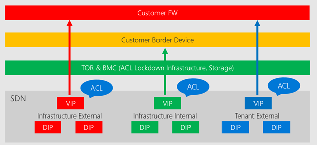

# Azure Stack datacenter integration - Publish endpoints

Azure Stack sets up virtual IP addresses (VIPs) for its infrastructure roles. These VIPs are allocated from the public IP address pool. Each VIP is secured with an access control list (ACL) in the software-defined network layer. ACLs are also used across the physical switches (TORs and BMC) to further harden the solution. A DNS entry is created for each endpoint in the external DNS zone that specified at deployment time.

The following architectural diagram shows the different network layers and ACLs:

## Ports and protocols (inbound)

A set of infrastructure VIPs is required for publishing Azure Stack endpoints to external networks. The *Endpoint (VIP)* table shows each endpoint, the required port, and protocol. Refer to the specific resource provider deployment documentation for endpoints that require additional resource providers, such as the SQL resource provider.

Internal infrastructure VIPs aren't listed because they’re not required for publishing Azure Stack.

> [!Note]  
> User VIPs are dynamic, defined by the users themselves with no control by the Azure Stack operator.

|Endpoint (VIP)|DNS host A record|Protocol|Ports|
|---------|---------|---------|---------|
|AD FS|Adfs.*&lt;region>.&lt;fqdn>*|HTTPS|443|
|Portal (administrator)|Adminportal.*&lt;region>.&lt;fqdn>*|HTTPS|443 12495 12499 12646 12647 12648 12649 12650 13001 13003 13010 13011 13012 13020 13021 13026 30015|
|Adminhosting | *.adminhosting.\<region>.\<fqdn> | HTTPS | 443 |
|Azure Resource Manager (administrator)|Adminmanagement.*&lt;region>.&lt;fqdn>*|HTTPS|443 30024|
|Portal (user)|Portal.*&lt;region>.&lt;fqdn>*|HTTPS|443 12495 12649 13001 13010 13011 13012 13020 13021 30015 13003|
|Azure Resource Manager (user)|Management.*&lt;region>.&lt;fqdn>*|HTTPS|443 30024|
|Graph|Graph.*&lt;region>.&lt;fqdn>*|HTTPS|443|
|Certificate revocation list|Crl.*&lt;region>.&lt;fqdn>*|HTTP|80|
|DNS|&#42;.*&lt;region>.&lt;fqdn>*|TCP & UDP|53|
|Hosting | *.hosting.\<region>.\<fqdn> | HTTPS | 443 |
|Key Vault (user)|&#42;.vault.*&lt;region>.&lt;fqdn>*|HTTPS|443|
|Key Vault (administrator)|&#42;.adminvault.*&lt;region>.&lt;fqdn>*|HTTPS|443|
|Storage Queue|&#42;.queue.*&lt;region>.&lt;fqdn>*|HTTP HTTPS|80 443|
|Storage Table|&#42;.table.*&lt;region>.&lt;fqdn>*|HTTP HTTPS|80 443|
|Storage Blob|&#42;.blob.*&lt;region>.&lt;fqdn>*|HTTP HTTPS|80 443|
|SQL Resource Provider|sqladapter.dbadapter.*&lt;region>.&lt;fqdn>*|HTTPS|44300-44304|
|MySQL Resource Provider|mysqladapter.dbadapter.*&lt;region>.&lt;fqdn>*|HTTPS|44300-44304|
|App Service|&#42;.appservice.*&lt;region>.&lt;fqdn>*|TCP|80 (HTTP) 443 (HTTPS) 8172 (MSDeploy)|
|  |&#42;.scm.appservice.*&lt;region>.&lt;fqdn>*|TCP|443 (HTTPS)|
|  |api.appservice.*&lt;region>.&lt;fqdn>*|TCP|443 (HTTPS) 44300 (Azure Resource Manager)|
|  |ftp.appservice.*&lt;region>.&lt;fqdn>*|TCP, UDP|21, 1021, 10001-10100 (FTP) 990 (FTPS)|
|VPN Gateways|     |     |[See the VPN gateway FAQ](https://docs.microsoft.com/azure/vpn-gateway/vpn-gateway-vpn-faq#can-i-traverse-proxies-and-firewalls-using-point-to-site-capability).|
|     |     |     |     |

## Ports and URLs (outbound)

Azure Stack supports only transparent proxy servers. In a deployment where a transparent proxy uplinks to a traditional proxy server, you must allow the following ports and URLs for outbound communication:

> [!Note]  
> Azure Stack does not support using Express Route to reach the Azure services listed in the following table.

|Purpose|URL|Protocol|Ports|
|---------|---------|---------|---------|
|Identity|login.windows.net login.microsoftonline.com graph.windows.net https://secure.aadcdn.microsoftonline-p.com office.com|HTTP HTTPS|80 443|
|Marketplace syndication|https://management.azure.com https://&#42;.blob.core.windows.net https://*.azureedge.net https://&#42;.microsoftazurestack.com|HTTPS|443|
|Patch & Update|https://&#42;.azureedge.net|HTTPS|443|
|Registration|https://management.azure.com|HTTPS|443|
|Usage|https://&#42;.microsoftazurestack.com https://*.trafficmanager.net|HTTPS|443|
|Windows Defender|.wdcp.microsoft.com .wdcpalt.microsoft.com *.updates.microsoft.com *.download.microsoft.com https://msdl.microsoft.com/download/symbols http://www.microsoft.com/pkiops/crl http://www.microsoft.com/pkiops/certs http://crl.microsoft.com/pki/crl/products http://www.microsoft.com/pki/certs https://secure.aadcdn.microsoftonline-p.com |HTTPS|80 443|
|NTP|     |UDP|123|
|DNS|     |TCP UDP|53|
|CRL|     |HTTPS|443|
|     |     |     |     |

> [!Note]  
> Outbound URLs are load balanced using Azure traffic manager to provide the best possible connectivity based on geographical location. With load balanced URLs, Microsoft can update and change backend endpoints without impacting customers. Microsoft does not share the list of IP addresses for the load balanced URLs. You should use a device that supports filtering by URL rather than by IP.

## Next steps

[Azure Stack PKI requirements](azure-stack-pki-certs.md)
