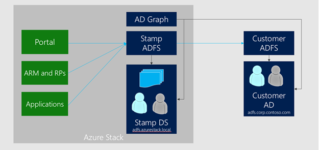

# Azure Stack datacenter integration - Identity
You can deploy Azure Stack using Azure Active Directory (Azure AD) or Active Directory Federation Services (AD FS) as the identity providers. You must make the choice before you deploy Azure Stack. Deployment using AD FS is also referred to as deploying Azure Stack in disconnected mode.

The following table shows the differences between the two identity choices:

||Disconnected from the internet|Connected to the internet|
|---------|---------|---------|
|Billing|Must be Capacity<br> Enterprise Agreement (EA) only|Capacity or Pay-as-you-use<br>EA or Cloud Solution Provider (CSP)|
|Identity|Must be AD FS|Azure AD or AD FS|
|Marketplace |Supported<br>BYOL licensing|Supported<br>BYOL licensing|
|Registration|Recommended, requires removable media<br> and a separate connected device.|Automated|
|Patch and update|Required, requires removable media<br> and a separate connected device.|Update package can be downloaded directly<br> from the Internet to Azure Stack.|

> [!IMPORTANT]
> You cannot switch the identity provider without redeploying the entire Azure Stack solution.

## Active Directory Federation Services and Graph

Deploying with AD FS allows identities in an existing Active Directory forest to authenticate with resources in Azure Stack. This existing Active Directory forest requires a deployment of AD FS to allow the creation of an AD FS federation trust.

Authentication is one part of identity. To manage Role Based Access Control (RBAC) in Azure Stack, the Graph component must be configured. When access to a resource is delegated, the Graph component looks up the user account in the existing Active Directory forest using the LDAP protocol.



The existing AD FS is the account security token service (STS) that sends claims to the Azure Stack AD FS (the resource STS). In Azure Stack, automation creates the claims provider trust with the metadata endpoint for the existing AD FS.

At the existing AD FS, a relying party trust must be configured. This step is not done by the automation, and must be configured by the operator. The Azure Stack metadata endpoint is documented in the AzureStackStampDeploymentInfo.JSON file, or via the privileged endpoint by running the command `Get-AzureStackInfo`.

The relying party trust configuration also requires you to configure the claim transformation rules that are provided by Microsoft.

For the Graph configuration, a service account must be provided that has Read permission in the existing Active Directory. This account is required as input for the automation to enable RBAC scenarios.

For the last step, a new owner is configured for the default provider subscription. This account has full access to all resources when signed in to the Azure Stack administrator portal.

Requirements:


|Component|Requirement|
|---------|---------|
|Graph|Microsoft Active Directory 2012/2012 R2/2016|
|AD FS|Windows Server 2012/2012 R2/2016|

## Setting up Graph integration

Graph only supports integration with a single Active Directory forest. If multiple forests exist, only the forest specified in the configuration will be used to fetch users and groups.

The following information is required as inputs for the automation parameters:


|Parameter|Description|Example|
|---------|---------|---------|
|CustomADGlobalCatalog|FQDN of the target Active Directory forest<br>that you want to integrate with|Contoso.com|
|CustomADAdminCredentials|A user with LDAP Read permission|YOURDOMAIN\graphservice|

### Create user account in the existing Active Directory (optional)

Optionally, you can create an account for the Graph service in the existing Active Directory. Perform this step if you don't already have an account that you want to use.

1. In the existing Active Directory, create the following user account (recommendation):
   - **Username**: graphservice
   - **Password**: use a strong password<br>Configure the password to never expire.

   No special permissions or membership is required.

#### Trigger automation to configure graph

For this procedure, use a computer in your datacenter network that can communicate with the privileged endpoint in Azure Stack.

2. Open an elevated Windows PowerShell session (run as administrator), and connect to the IP address of the privileged endpoint. Use the credentials for **CloudAdmin** to authenticate.

   ```PowerShell  
   $creds = Get-Credential
   Enter-PSSession -ComputerName <IP Address of ERCS> -ConfigurationName PrivilegedEndpoint -Credential $creds
   ```

3. Now that you're connected to the privileged endpoint, run the following command: 

   ```PowerShell  
   Register-DirectoryService -CustomADGlobalCatalog contoso.com
   ```

   When prompted, specify the credential for the user account that you want to use for the Graph service (such as graphservice). The input for the Register-DirectoryService cmdlet must be the forest name / root domain in the forest rather than any other domain in the forest.

   > [!IMPORTANT]
   > Wait for the credentials pop-up (Get-Credential is not supported in the privileged endpoint) and enter the Graph Service Account credentials.

#### Graph protocols and ports

Graph service in Azure Stack uses the following protocols and ports to communicate with a writeable Global Catalog Server (GC) and Key Distribution Center (KDC) that can process login requests in the target Active Directory forest.

Graph service in Azure Stack uses the following protocols and ports to communicate with the target Active Directory:

|Type|Port|Protocol|
|---------|---------|---------|
|LDAP|389|TCP & UDP|
|LDAP SSL|636|TCP|
|LDAP GC|3268|TCP|
|LDAP GC SSL|3269|TCP|

## Setting up AD FS integration by downloading federation metadata

The following information is required as input for the automation parameters:

|Parameter|Description|Example|
|---------|---------|---------|
|CustomAdfsName|Name of the claims provider.<cr>It appears that way on the AD FS landing page.|Contoso|
|CustomAD<br>FSFederationMetadataEndpointUri|Federation metadata link|https://ad01.contoso.com/federationmetadata/2007-06/federationmetadata.xml|


### Trigger automation to configure claims provider trust in Azure Stack

For this procedure, use a computer that can communicate with the privileged endpoint in Azure Stack. It is expected that the certificate used by the account **STS AD FS** is trusted by Azure Stack.

1. Open an elevated Windows PowerShell session, and connect to the privileged endpoint.

   ```PowerShell  
   $creds = Get-Credential
   Enter-PSSession -ComputerName <IP Address of ERCS> -ConfigurationName PrivilegedEndpoint -Credential $creds
   ```

2. Now that you're connected to the privileged endpoint, run the following command using the parameters appropriate for your environment:

   ```PowerShell  
   Register-CustomAdfs -CustomAdfsName Contoso -CustomADFSFederationMetadataEndpointUri https://win-SQOOJN70SGL.contoso.com/federationmetadata/2007-06/federationmetadata.xml
   ```

3. Run the following command to update the owner of the default provider subscription, using the parameters appropriate for your environment:

   ```PowerShell  
   Set-ServiceAdminOwner -ServiceAdminOwnerUpn "administrator@contoso.com"
   ```

## Setting up AD FS integration by providing federation metadata file

Beginning with version 1807, use this method if the either of the following conditions are true:

- The certificate chain is different for AD FS compared to all other endpoints in Azure Stack.
- There’s no network connectivity to the existing AD FS server from Azure Stack’s AD FS instance.

The following information is required as input for the automation parameters:


|Parameter|Description|Example|
|---------|---------|---------|
|CustomAdfsName|Name of the claims provider. It appears that way on the AD FS landing page.|Contoso|
|CustomADFSFederationMetadataFileContent|Metadata content|$using:federationMetadataFileContent|


### Create federation metadata file

For the following procedure, you must use a computer that has network connectivity to the existing AD FS deployment, which becomes the account STS. Also, the necessary certificates must be installed.

1. Open an elevated Windows PowerShell session, and run the following command, using the parameters appropriate for your environment:

   ```PowerShell  
    $metadata = (Invoke-WebRequest -URI " https://win-SQOOJN70SGL.contoso.com/federationmetadata/2007-06/federationmetadata.xml " -UseBasicParsing).Content
    Set-Content -Path c:\metadata.xml -Encoding Unicode -Value $metadata 

   ```

2. Copy the metadata file to a computer that can communicate with the privileged endpoint.

### Trigger automation to configure claims provider trust in Azure Stack

For this procedure, use a computer that can communicate with the privileged endpoint in Azure Stack and has access to the metadata file you created in a previous step.

1. Open an elevated Windows PowerShell session.

   ```PowerShell  
   $federationMetadataFileContent = get-content c:\metadata.xml
   $creds=Get-Credential
   Enter-PSSession -ComputerName <IP Address of ERCS> -ConfigurationName PrivilegedEndpoint -Credential $creds
   Register-CustomAdfs -CustomAdfsName Contoso -CustomADFSFederationMetadataFileContent $using:federationMetadataFileContent
   ```

2. Run the following command to update the owner of the default provider subscription, using the parameters appropriate for your environment:

   ```PowerShell  
   Set-ServiceAdminOwner -ServiceAdminOwnerUpn "administrator@contoso.com"
   ```

## Configure relying party on existing AD FS deployment (account STS)

Microsoft provides a script that configures the relying party trust, including the claim transformation rules. Using the script is optional as you can run the commands manually.

You can download the helper script from [Azure Stack Tools](https://github.com/Azure/AzureStack-Tools/tree/vnext/DatacenterIntegration/Identity) on Github.

If you decide to manually run the commands, follow these steps:

1. Copy the following content into a .txt file (for example, saved as c:\ClaimRules.txt) on your datacenter's AD FS instance or farm member:

   ```text
   @RuleTemplate = "LdapClaims"
   @RuleName = "Name claim"
   c:[Type == "http://schemas.microsoft.com/ws/2008/06/identity/claims/windowsaccountname", Issuer == "AD AUTHORITY"]
   => issue(store = "Active Directory", types = ("http://schemas.xmlsoap.org/ws/2005/05/identity/claims/name"), query = ";userPrincipalName;{0}", param = c.Value);

   @RuleTemplate = "LdapClaims"
   @RuleName = "UPN claim"
   c:[Type == "http://schemas.microsoft.com/ws/2008/06/identity/claims/windowsaccountname", Issuer == "AD AUTHORITY"]
   => issue(store = "Active Directory", types = ("http://schemas.xmlsoap.org/ws/2005/05/identity/claims/upn"), query = ";userPrincipalName;{0}", param = c.Value);

   @RuleTemplate = "LdapClaims"
   @RuleName = "ObjectID claim"
   c:[Type == "http://schemas.microsoft.com/ws/2008/06/identity/claims/primarysid"]
   => issue(Type = "http://schemas.microsoft.com/identity/claims/objectidentifier", Issuer = c.Issuer, OriginalIssuer = c.OriginalIssuer, Value = c.Value, ValueType = c.ValueType);

   @RuleName = "Family Name and Given claim"
   c:[Type == "http://schemas.microsoft.com/ws/2008/06/identity/claims/windowsaccountname", Issuer == "AD AUTHORITY"]
   => issue(store = "Active Directory", types = ("http://schemas.xmlsoap.org/ws/2005/05/identity/claims/surname", "http://schemas.xmlsoap.org/ws/2005/05/identity/claims/givenname"), query = ";sn,givenName;{0}", param = c.Value);

   @RuleTemplate = "PassThroughClaims"
   @RuleName = "Pass through all Group SID claims"
   c:[Type == "http://schemas.microsoft.com/ws/2008/06/identity/claims/groupsid", Issuer =~ "^(AD AUTHORITY|SELF AUTHORITY|LOCAL AUTHORITY)$"]
   => issue(claim = c);

   @RuleTemplate = "PassThroughClaims"
   @RuleName = "Pass through all windows account name claims"
   c:[Type == "http://schemas.microsoft.com/ws/2008/06/identity/claims/windowsaccountname"]
   => issue(claim = c);
   ```

2. Validate that Windows Forms-based authentication for extranet and intranet is enabled. First validate if its already enabled by running the following cmdlet:

   ```PowerShell  
   Get-AdfsAuthenticationProvider | where-object { $_.name -eq "FormsAuthentication" } | select Name, AllowedForPrimaryExtranet, AllowedForPrimaryIntranet
   ```

    > [!Note]  
    > The Windows Integrated Authentication (WIA) supported user agent strings may outdated for you AD FS deployment may require to be updated to support latest clients. You can read more about updating the WIA supported user agent strings in the article [Configuring intranet forms-based authentication for devices that do not support WIA](https://docs.microsoft.com/windows-server/identity/ad-fs/operations/configure-intranet-forms-based-authentication-for-devices-that-do-not-support-wia).<br>The steps to enable Form-based authentication policy are documented in the article, [Configure Authentication Policies](https://docs.microsoft.com/windows-server/identity/ad-fs/operations/configure-authentication-policies).

3. To add the relying party trust, run the following Windows PowerShell command on your AD FS instance or a farm member. Make sure to update the AD FS endpoint, and point to the file created in Step 1.

   **For AD FS 2016**

   ```PowerShell  
   Add-ADFSRelyingPartyTrust -Name AzureStack -MetadataUrl "https://YourAzureStackADFSEndpoint/FederationMetadata/2007-06/FederationMetadata.xml" -IssuanceTransformRulesFile "C:\ClaimIssuanceRules.txt" -AutoUpdateEnabled:$true -MonitoringEnabled:$true -enabled:$true -AccessControlPolicyName "Permit everyone" -TokenLifeTime 1440
   ```

   **For AD FS 2012/2012 R2**

   ```PowerShell  
   Add-ADFSRelyingPartyTrust -Name AzureStack -MetadataUrl "https://YourAzureStackADFSEndpoint/FederationMetadata/2007-06/FederationMetadata.xml" -IssuanceTransformRulesFile "C:\ClaimIssuanceRules.txt" -AutoUpdateEnabled:$true -MonitoringEnabled:$true -enabled:$true -TokenLifeTime 1440
   ```

   > [!IMPORTANT]
   > You must use the AD FS MMC snap-in to configure the Issuance Authorization Rules when using Windows Server 2012 or 2012 R2 AD FS.

4. When you use Internet Explorer or the Edge browser to access Azure Stack, you must ignore token bindings. Otherwise, the sign-in attempts fail. On your AD FS instance or a farm member, run the following command:

   > [!note]  
   > This step is not applicable when using Windows Server 2012 or 2012 R2 AD FS. It is safe to skip this command and continue with the integration.

   ```PowerShell  
   Set-AdfsProperties -IgnoreTokenBinding $true
   ```

## SPN creation

There are many scenarios that require the use of a service principal name (SPN) for authentication. The following are some examples:

- CLI usage with AD FS deployment of Azure Stack
- System Center Management Pack for Azure Stack when deployed with AD FS
- Resource providers in Azure Stack when deployed with AD FS
- Various applications
- You require a non-interactive logon

> [!Important]  
> AD FS only supports interactive logon sessions. If you require a non-interactive logon for an automated scenario, you must use a SPN.

For more information about creating an SPN, see [Create service principal for AD FS](https://docs.microsoft.com/azure/azure-stack/azure-stack-create-service-principals#create-service-principal-for-ad-fs).


## Troubleshooting

### Configuration Rollback

If an error occurs that leaves the environment in a state where you can no longer authenticate, a rollback option is available.

1. Open an elevated Windows PowerShell session and run the following commands:

   ```PowerShell  
   $creds = Get-Credential
   Enter-PSSession -ComputerName <IP Address of ERCS> -ConfigurationName PrivilegedEndpoint -Credential $creds
   ```

2. Then run the following cmdlet:

   ```PowerShell  
   Reset-DatacenterIntegationConfiguration
   ```

   After running the rollback action, all configuration changes are rolled back. Only authentication with the built-in **CloudAdmin** user is possible.

   > [!IMPORTANT]
   > You must configure the original owner of the default provider subscription

   ```PowerShell  
   Set-ServiceAdminOwner -ServiceAdminOwnerUpn "azurestackadmin@[Internal Domain]"
   ```

### Collecting additional logs

If any of the cmdlets fail, you can collect additional logs by using the `Get-Azurestacklogs` cmdlet.

1. Open an elevated Windows PowerShell session, and run the following commands:

   ```PowerShell  
   $creds = Get-Credential
   Enter-pssession -ComputerName <IP Address of ERCS> -ConfigurationName PrivilegedEndpoint -Credential $creds
   ```

2. Then, run the following cmdlet:

   ```PowerShell  
   Get-AzureStackLog -OutputPath \\myworstation\AzureStackLogs -FilterByRole ECE
   ```


## Next steps

[Integrate external monitoring solutions](azure-stack-integrate-monitor.md)
