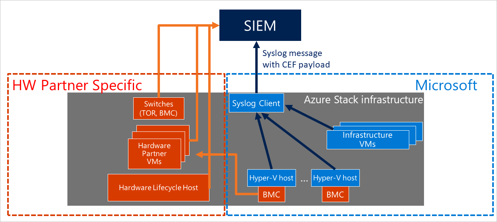

# Azure Stack datacenter integration - syslog forwarding

This article shows you how to use syslog to integrate Azure Stack infrastructure with external security solution(s) already deployed in your datacenter. For example, a Security Information Event Management (SIEM) system. The syslog channel exposes audits, alerts, and security logs from all the components of the Azure Stack infrastructure. Use syslog forwarding to integrate with security monitoring solutions and/or to retrieve all audits, alerts, and security logs to store them for retention. 

Starting with the 1805 update, Azure Stack has an integrated syslog client that, once configured, emits syslog messages with the payload in Common Event Format (CEF). 

> [!IMPORTANT] 
> Syslog forwarding is in preview. It should not be relied upon in production environments.  

The following diagram shows the main components that participate in the syslog integration.



## Configuring syslog forwarding

The syslog client in Azure Stack supports the following configurations:

1. **Syslog over TCP, with mutual authentication (client and server) and TLS 1.2 encryption:** In this configuration, both the syslog server and the syslog client can verify the identity of each other via certificates. The messages are sent over a TLS 1.2 encrypted channel.

2. **Syslog over TCP with server authentication and TLS 1.2 encryption:** In this configuration, the syslog client can verify the identity of the syslog server via a certificate. The messages are sent over a TLS 1.2 encrypted channel.

3. **Syslog over TCP, with no encryption:** In this configuration, neither the syslog client nor syslog server verifies the identity of each other. The messages are sent in clear text over TCP.

4. **Syslog over UDP, with no encryption:** In this configuration, neither the syslog client nor syslog server verifies the identity of each other. The messages are sent in clear text over UDP.

> [!IMPORTANT]
> Microsoft strongly recommends to use TCP using authentication and encryption (configuration #1 or, at the very minimum, #2) for production environments to protect against man-in-the-middle attacks and eavesdropping of messages.

### Cmdlets to configure syslog forwarding
Configuring syslog forwarding requires access to the privileged endpoint (PEP). Two PowerShell cmdlets have been added to the PEP to configure the syslog forwarding:


```powershell
### cmdlet to pass the syslog server information to the client and to configure the transport protocol, the encryption and the authentication between the client and the server

Set-SyslogServer [-ServerName <String>] [-NoEncryption] [-SkipCertificateCheck] [-SkipCNCheck] [-UseUDP] [-Remove]

### cmdlet to configure the certificate for the syslog client to authenticate with the server

Set-SyslogClient [-pfxBinary <Byte[]>] [-CertPassword <SecureString>] [-RemoveCertificate] 
```
#### Cmdlets parameters

Parameters for *Set-SyslogServer* cmdlet:

| Parameter | Description | Type | Required |
|---------|---------|---------|---------|
|*ServerName* | FQDN or IP address of the syslog server | String | yes|
|*NoEncryption*| Force the client to send syslog messages in clear text | flag | no|
|*SkipCertificateCheck*| Skip validation of the certificate provided by the syslog server during initial TLS handshake | flag | no|
|*SkipCNCheck*| Skip validation of the Common Name value of the certificate provided by the syslog server during initial TLS handshake | flag | no|
|*UseUDP*| Use syslog with UDP as transport protocol |flag | no|
|*Remove*| Remove configuration of the server from the client and stop syslog forwarding| flag | no|

Parameters for *Set-SyslogClient* cmdlet:
| Parameter | Description | Type |
|---------|---------| ---------|
| *pfxBinary* | pfx file containing the certificate to be used by the client as identity to authenticate against the syslog server  | Byte[] |
| *CertPassword* |  Password to import the private key that is associated with the pfx file | SecureString |
|*RemoveCertificate* | Remove certificate from the client | flag|

### Configuring syslog forwarding with TCP, mutual authentication, and TLS 1.2 encryption

In this configuration, the syslog client in Azure Stack forwards the messages to the syslog server over TCP, with TLS 1.2 encryption. During the initial handshake, the client verifies that the server provides a valid, trusted certificate; similarly, the client also provides a certificate to the server as proof of its identity. This configuration is the most secure as it provides a full validation of the identity of both the client and the server and it sends messages over an encrypted channel. 

> [!IMPORTANT]
> Microsoft strongly recommends to use this configuration for production environments. 

To configure syslog forwarding with TCP, mutual authentication, and TLS 1.2 encryption, run both these cmdlets:

```powershell
# Configure the server
Set-SyslogServer -ServerName <FQDN or ip address of syslog server>

# Provide certificate to the client to authenticate against the server
Set-SyslogClient -pfxBinary <Byte[] of pfx file> -CertPassword <SecureString, password for accessing the pfx file>
```

The client certificate must have the same root as the one provided during the deployment of Azure Stack. It also must contain a private key.

```powershell
##Example on how to set your syslog client with the certificate for mutual authentication.
##Run these cmdlets from your hardware lifecycle host or privileged access workstation.

$ErcsNodeName = "<yourPEP>"
$password = ConvertTo-SecureString -String "<your cloudAdmin account password" -AsPlainText -Force
 
$cloudAdmin = "<your cloudAdmin account name>"
$CloudAdminCred = New-Object System.Management.Automation.PSCredential ($cloudAdmin, $password)
 
$certPassword = $password
$certContent = Get-Content -Path C:\cert\<yourClientCertificate>.pfx -Encoding Byte
 
$params = @{ 
    ComputerName = $ErcsNodeName 
    Credential = $CloudAdminCred 
    ConfigurationName = "PrivilegedEndpoint" 
}

$session = New-PSSession @params
 
$params = @{ 
    Session = $session 
    ArgumentList = @($certContent, $certPassword) 
}
Write-Verbose "Invoking cmdlet to set syslog client certificate..." -Verbose 
Invoke-Command @params -ScriptBlock { 
    param($CertContent, $CertPassword) 
    Set-SyslogClient -PfxBinary $CertContent -CertPassword $CertPassword 
```

### Configuring syslog forwarding with TCP, Server authentication, and TLS 1.2 encryption

In this configuration, the syslog client in Azure Stack forwards the messages to the syslog server over TCP, with TLS 1.2 encryption. During the initial handshake, the client also verifies that the server provides a valid, trusted certificate. This prevents the client to send messages to untrusted destinations.
TCP using authentication and encryption is the default configuration and represents the minimum level of security that Microsoft recommends for a production environment. 

```powershell
Set-SyslogServer -ServerName <FQDN or ip address of syslog server>
```

In case you want to test the integration of your syslog server with the Azure Stack client by using a self-signed and/or untrusted certificate, you can use these flags to skip the server validation performed by the client during the initial handshake.

```powershell
#Skip validation of the Common Name value in the server certificate. Use this flag if you provide an IP address for your syslog server
Set-SyslogServer -ServerName <FQDN or ip address of syslog server> -SkipCNCheck 
 
#Skip entirely the server certificate validation
Set-SyslogServer -ServerName <FQDN or ip address of syslog server> -SkipCertificateCheck
```

> [!IMPORTANT]
> Microsoft recommends against the use of -SkipCertificateCheck flag for production environments. 

### Configuring syslog forwarding with TCP and no encryption

In this configuration, the syslog client in Azure Stack forwards the messages to the syslog server over TCP, with no encryption. The client does not verify the identity of the server nor it provides its own identity to the server for verification. 

```powershell
Set-SyslogServer -ServerName <FQDN or ip address of syslog server> -NoEncryption
```

> [!IMPORTANT]
> Microsoft recommends against using this configuration for production environments. 


### Configuring syslog forwarding with UDP and no encryption

In this configuration, the syslog client in Azure Stack forwards the messages to the syslog server over UDP, with no encryption. The client does not verify the identity of the server nor it provides its own identity to the server for verification. 

```powershell
Set-SyslogServer -ServerName <FQDN or ip address of syslog server> -UseUDP
```

While UDP with no encryption is the easiest to configure, it does not provide any protection against man-in-the-middle attacks and eavesdropping of messages. 

> [!IMPORTANT]
> Microsoft recommends against using this configuration for production environments. 


## Removing syslog forwarding configuration

To remove the syslog server configuration altogether and stop syslog forwarding:

**Remove the syslog server configuration from the client**

```PowerShell  
Set-SyslogServer -Remove
```

**Remove the client certificate from the client**

```PowerShell  
Set-SyslogClient -RemoveCertificate
```

## Verifying the syslog setup

If you successfully connected the syslog client to your syslog server, you should soon start receiving events. If you don't see any event, verify the configuration of your syslog client, by running the following cmdlets:

**Verify the server configuration in the syslog client**

```PowerShell  
Get-SyslogServer
```

**Verify the certificate setup in the syslog client**

```PowerShell  
Get-SyslogClient
```

## Syslog message schema

The syslog forwarding of the Azure Stack infrastructure sends messages formatted in Common Event Format (CEF).
Each syslog message is structured based on this schema: 

```Syslog
<Time> <Host> <CEF payload>
```

The CEF payload is based on the structure below, but the mapping for each field varies depending on the type of message (Windows Event, Alert created, Alert closed).

```CEF
# Common Event Format schema
CEF: <Version>|<Device Vendor>|<Device Product>|<Device Version>|<Signature ID>|<Name>|<Severity>|<Extensions>
* Version: 0.0
* Device Vendor: Microsoft
* Device Product: Microsoft Azure Stack
* Device Version: 1.0
```

### CEF mapping for Windows events

```
* Signature ID: ProviderName:EventID
* Name: TaskName
* Severity: Level (for details, see the severity table below)
* Extension: Custom Extension Name (for details, see the Custom Extension table below)
```

Severity table for Windows events:
| CEF severity value | Windows event level | Numerical value |
|--------------------|---------------------| ----------------|
|0|Undefined|Value: 0. Indicates logs at all levels|
|10|Critical|Value: 1. Indicates logs for a critical alert|
|8|Error| Value: 2. Indicates logs for an error|
|5|Warning|Value: 3. Indicates logs for a warning|
|2|Information|Value: 4. Indicates logs for an informational message|
|0|Verbose|Value: 5. Indicates logs at all levels|

Custom extension table for Windows events in Azure Stack:
| Custom extension name | Windows event example | 
|-----------------------|---------|
|MasChannel | System|
|MasComputer | test.azurestack.contoso.com|
|MasCorrelationActivityID| C8F40D7C-3764-423B-A4FA-C994442238AF|
|MasCorrelationRelatedActivityID| C8F40D7C-3764-423B-A4FA-C994442238AF|
|MasEventData| svchost!!4132,G,0!!!!EseDiskFlushConsistency!!ESENT!!0x800000|
|MasEventDescription| The Group Policy settings for the user were processed successfully. There were no changes detected since the last successful processing of Group Policy.|
|MasEventID|1501|
|MasEventRecordID|26637|
|MasExecutionProcessID | 29380|
|MasExecutionThreadID |25480|
|MasKeywords |0x8000000000000000|
|MasKeywordName |Audit Success|
|MasLevel |4|
|MasOpcode |1|
|MasOpcodeName |info|
|MasProviderEventSourceName ||
|MasProviderGuid |AEA1B4FA-97D1-45F2-A64C-4D69FFFD92C9|
|MasProviderName |Microsoft-Windows-GroupPolicy|
|MasSecurityUserId |\<Windows SID\> |
|MasTask |0|
|MasTaskCategory| Process Creation|
|MasUserData|KB4093112!!5112!!Installed!!0x0!!WindowsUpdateAgent Xpath: /Event/UserData/*|
|MasVersion|0|

### CEF mapping for alerts created

```
* Signature ID: Microsoft Azure Stack Alert Creation : FaultTypeId
* Name: FaultTypeId : AlertId
* Severity: Alert Severity (for details, see alerts severity table below)
* Extension: Custom Extension Name (for details, see the Custom Extension table below)
```

Alerts severity table:
| Severity | Level |
|----------|-------|
|0|Undefined|
|10|Critical|
|5|Warning|

Custom Extension table for Alerts created in Azure Stack:
| Custom extension name | Example | 
|-----------------------|---------|
|MasEventDescription|DESCRIPTION: A user account \<TestUser\> was created for \<TestDomain\>. It's a potential security risk. -- REMEDIATION: Contact support. Customer Assistance is required to resolve this issue. Do not try to resolve this issue without their assistance. Before you open a support request, start the log file collection process using the guidance from https://aka.ms/azurestacklogfiles |

### CEF mapping for alerts closed

```
* Signature ID: Microsoft Azure Stack Alert Creation : FaultTypeId
* Name: FaultTypeId : AlertId
* Severity: Information
```

The example below shows a syslog message with CEF payload:
```
2018:05:17:-23:59:28 -07:00 TestHost CEF:0.0|Microsoft|Microsoft Azure Stack|1.0|3|TITLE: User Account Created -- DESCRIPTION: A user account \<TestUser\> was created for \<TestDomain\>. It's a potential security risk. -- REMEDIATION: Please contact Support. Customer Assistance is required to resolve this issue. Do not try to resolve this issue without their assistance. Before you open a support request, start the log file collection process using the guidance from https://aka.ms/azurestacklogfiles|10
```

## Next steps

[Servicing policy](azure-stack-servicing-policy.md)