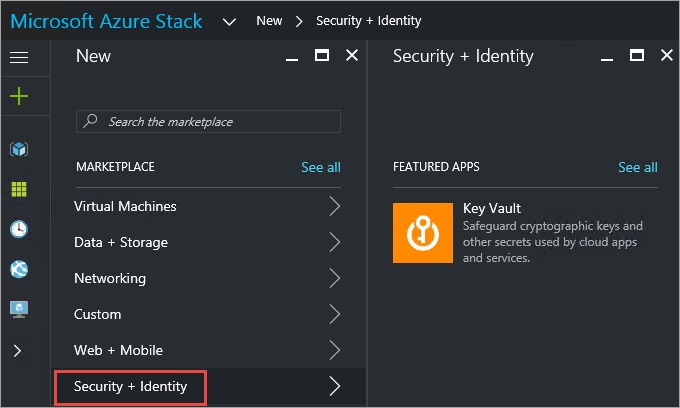
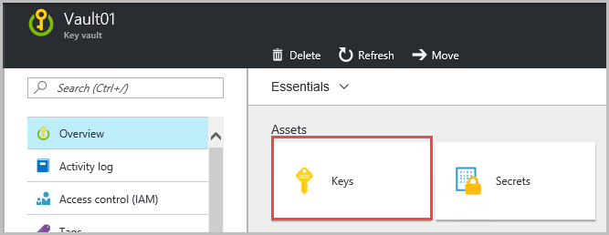
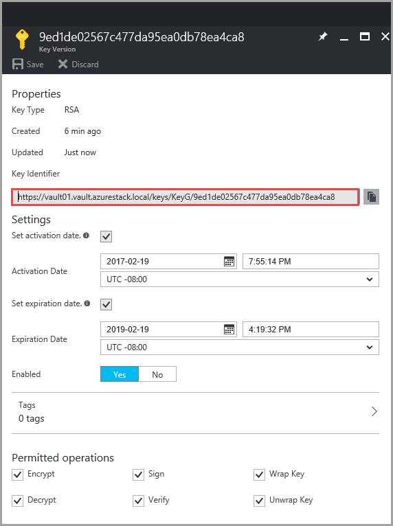
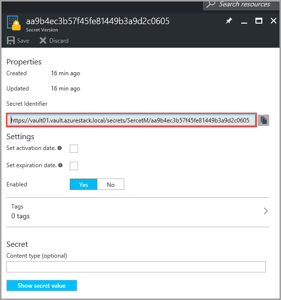

# Manage Key Vault in Azure Stack using the portal

Starting in Technical Preview 3 (TP3), you can manage Key Vault in Azure Stack by using the Azure Stack portal. This article helps you get started to create and manage Key Vault in Azure Stack. 

>[!NOTE]
> In TP3, you can create and manage  a key vault from the tenant portal only. If you are an administrator, you should login to the user portal to access and perform operations on a key vault.   

## Prerequisites  

1. Azure Stack administrators must have [created an offer](azure-stack-create-offer.md) that includes the Key Vault service.  
2. Tenants must subscribe to an offer that includes the Key Vault service.  
 
## Create a key vault 

1.	Sign in to the user portal   (https://publicportal.local.azurestack.external).  

2.	If you haven’t already done, subscribe to an offer that includes the Key Vault service.  

3.	From the dashboard, click **New > Security + Identity > Key Vault**.  

      

4.	On the **Create Key Vault** blade, assign a **Name** for your vault. Vault name can contain only alphanumeric characters, the special character hyphen (-), and it shouldn’t start with a number.  

5.	Choose a **Subscription** from the list of available subscriptions. All subscriptions that offer the Key Vault service are displayed in the drop down.  

6.	Select an existing **Resource Group** or create a new one.  

7.	Select the **Pricing tier**.  
    >[!NOTE]
    > At the TP3 release, key vault supports the **Standard** SKU only.

8.	Choose an existing **Access policies**  or create a new one. Access policy allows you to grant permissions for a user, application or a security group to perform operations with this vault.  

9.	Optionally, choose an **Advanced access policy**  to enable the following features:  

      

10.	After configuring the settings, click **OK** and then **Create**. This starts the key vault deployment. 

## Manage keys and secrets

After creating a vault, use the following steps to create and manage keys and secrets within the vault.

## Create a key

1.	Sign in to the user portal (https://publicportal.local.azurestack.external).  

2.	From the dashboard, click  **All resources** > select the key vault that you created earlier> click on the **Keys** tile.  

      

3.	From the **Keys** blade, click **Add**. 

4.	On the **Create a key** blade, form the list of **Options**, choose the method that you want to use to create a key. You can **Generate** a new key, **Upload**  an existing key or **Restore Backup** key.  

5.	Enter a **Name** for your key. The key name can contain only alphanumeric characters and the special character hyphen (-).  

6.	Optionally, configure **Set activation date** and **Set expiration date**  values for your key.  

7.	Click **Create** to start the deployment.  

After the key is successfully created, you can select it from the **Keys** blade and view or modify its properties. The properties section contains the **Key Identifier**, a URI by which external applications can access this key. To limit operations on this key, configure settings under **Permitted operations**.

      

## Create a secret 

1.	Sign in to the user portal (https://publicportal.local.azurestack.external).  
2.	From the dashboard, click **All resources** > select the key vault that you created earlier> click on the **Secrets** tile.  

3.	From the **Secrets** blade, click **Add**.  

4.	On the **Create a secret** blade, from the list of **Upload options**, choose an option by which you want to create a secret. You can create a secret **Manually** by entering a value for the secret, or by uploading a **Certificate** from your local machine.  

5.	Enter a **Name** for the secret. The secret name can contain only alphanumeric characters and the special character hyphen (-).  

6.	Optionally, specify the **Content type**, and configure values for **Set activation date** and **Set expiration date** values  for the secret.  

7.	Click Create to start the deployment.  

After the secret is successfully created, you can select it from the **Secrets** blade and view or modify its properties. The properties section contains **Secret Identifier**, a URI by which external applications can access this secret. 

 

## Next Steps
•	[Deploy a VM with password stored in a key vault](azure-stack-kv-deploy-vm-with-secret.md)  
•	[Deploy a VM with certificate stored in a key vault](azure-stack-kv-push-secret-into-vm.md)     

