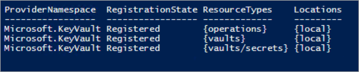
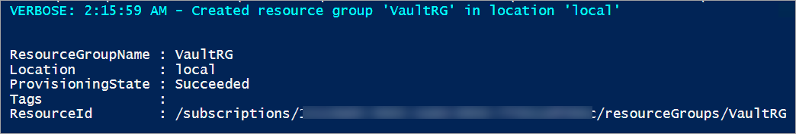
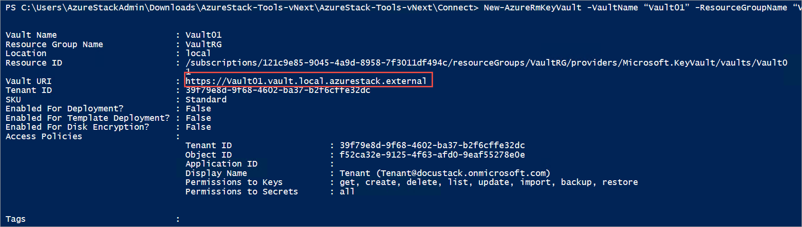
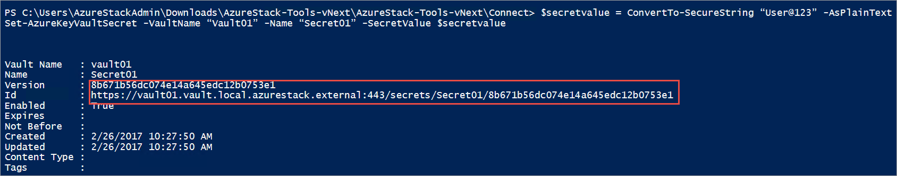

# Manage Key Vault in Azure Stack using PowerShell

This article helps you get started to create and manage Key Vault in Azure Stack by using PowerShell. 

> [!NOTE]
> In Technical Preview 3, you can create and manage a key vault from the [user portal](azure-stack-manage-portals.md#the-user-portal) or user API only. If you are an administrator, sign in to the user portal to access and perform operations on a key vault. 

The Key Vault PowerShell commands described in this article are available as a part of the Azure PowerShell SDK.  Following sections describe the PowerShell commands required to create a vault, store, and manage cryptographic keys and secrets as well as authorize users or applications to invoke operations in the vault. 

## Prerequisites
* [Install PowerShell for Azure Stack.](azure-stack-powershell-install.md)  
* Azure Stack administrators must have [created an offer](azure-stack-create-offer.md) that includes the Key Vault service.  
* Tenants must [subscribe to an offer](azure-stack-subscribe-plan-provision-vm.md) that includes the Key Vault service. 

## Enable your tenant subscription for vault operations

Before you can issue any operations against a key vault, you need to ensure that your tenant subscription is enabled for vault operations. To verify, run the following command:

```PowerShell
Get-AzureRmResourceProvider -ProviderNamespace Microsoft.KeyVault | ft -Autosize
```
**Output**

If your subscription is enabled for vault operations, the output shows “RegistrationState” equals “Registered” for all resource types of a key vault.



If that’s not the case, invoke the following command to register the Key Vault service in your subscription:

```PowerShell
Register-AzureRmResourceProvider -ProviderNamespace Microsoft.KeyVault
```

**Output**

If the registration is successful, the output shows the following:


The following sections assume Key Vault service is registered within the tenant subscription. When invoking key vault commands, if you get an error- "The subscription is not registered to use namespace ‘Microsoft.KeyVault" then, confirm that you have [enabled the Key Vault resource provider](#enable-your-tenant-subscription-for-vault-operations) as per instructions mentioned earlier.

## Create a key vault 

Before you create a key vault, create a resource group so that all key vault related resources exist in a resource group. Use the following command to create a new resource group:

```PowerShell
New-AzureRmResourceGroup -Name “VaultRG” -Location local -verbose -Force

```

**Output**



Now, use the **New-AzureRMKeyVault** command to create a key vault in the resource group that you created earlier. This command reads three mandatory parameters- resource group name, key vault name, and geographic location. 

Run the following command to create a key vault:

```PowerShell
New-AzureRmKeyVault -VaultName “Vault01” -ResourceGroupName “VaultRG” -Location local -verbose
```
**Output**



The output of this command shows the properties of the key vault that you created. When an application accesses this vault, it uses the **Vault URI** property shown in the output. For example, the vault URI here is **https://vault01.vault.local.azurestack.external**. Applications interacting with this key vault through REST API must use this URI.

In ADFS based deployments, when you create a key vault by using PowerShell, you might receive a warning that says "Access policy is not set. No user or application have access permission to use this vault". To resolve this issue, set an access policy for the vault by using the [Set-AzureRmKeyVaultAccessPolicy](azure-stack-kv-manage-powershell.md#authorize-an-application-to-use-a-key-or-secret) command:

```PowerShell
# Obtain the security identifier(SID) of the active directory user
$adUser = Get-ADUser -Filter "Name -eq '{Active directory user name}'"
$objectSID = $adUser.SID.Value 

#Set the key vault access policy
Set-AzureRmKeyVaultAccessPolicy -VaultName "{key vault name}" -ResourceGroupName "{resource group name}" -ObjectId "{object SID}" -PermissionsToKeys {permissionsToKeys} -PermissionsToSecrets {permissionsToSecrets} -BypassObjectIdValidation 
```

## Manage keys and secrets

After creating a vault, use the following steps to create and manage keys and secrets within the vault.

### Create a key

Use the **Add-AzureKeyVaultKey** command to create or import a software protected key in a key vault. 

```PowerShell
Add-AzureKeyVaultKey -VaultName “Vault01” -Name “Key01” -verbose -Destination Software
```
The **Destination** parameter is used to specify that the key is software protected. When the key is successfully created, the command outputs the details of the created key.

**Output**


You can now reference the created key by using its URI. If you create or import a key that has same name as an existing key, the original key is updated with the values specified in the new key.  You can access the previous version by using the version-specific URI of the key. For example, 

* Use **https://vault10.vault.local.azurestack.external:443/keys/key01** to always get the current version  
* Use **https://vault010.vault.local.azurestack.external:443/keys/key01/d0b36ee2e3d14e9f967b8b6b1d38938a** to get this specific version

### Get a key

Use the **Get-AzureKeyVaultKey** command to read a key and its details.

```PowerShell
Get-AzureKeyVaultKey -VaultName “Vault01” -Name “Key01”
```

### Create a secret

Use the **Set-AzureKeyVaultSecret** command to create or update a secret in a vault. A secret is created if it doesn’t already exist, and a new version of the secret is created if it already exists.

```PowerShell
$secretvalue = ConvertTo-SecureString “User@123” -AsPlainText -Force
Set-AzureKeyVaultSecret -VaultName “Vault01” -Name “Secret01” -SecretValue $secretvalue
```

**Output**



### Get a secret

Use the **Get-AzureKeyVaultSecret** command to read a secret in a key vault. This command can return all or specific versions of a secret. 

```PowerShell
Get-AzureKeyVaultSecret -VaultName “Vault01” -Name “Secret01”
```

After creating keys and secrets, you can authorize external applications to use them.

## Authorize an application to use a key or secret

To authorize an application to access a key or secret in the key vault, use the **Set-AzureRmKeyVaultAccessPolicy** command.
For example, if your vault name is ContosoKeyVault and the application you want to authorize has a Client ID of 8f8c4bbd-485b-45fd-98f7-ec6300b7b4ed. Run the following command to authorize the application. Optionally, you can specify the **PermissionsToKeys** parameter to set permissions for a user, application, or a security group:

```PowerShell
Set-AzureRmKeyVaultAccessPolicy -VaultName 'ContosoKeyVault' -ServicePrincipalName 8f8c4bbd-485b-45fd-98f7-ec6300b7b4ed -PermissionsToKeys decrypt,sign
```

If you want to authorize that same application to read secrets in your vault, run the following:

```PowerShell
Set-AzureRmKeyVaultAccessPolicy -VaultName 'ContosoKeyVault' -ServicePrincipalName 8f8c4bbd-485b-45fd-98f7-ec6300 -PermissionsToKeys Get
```

## Next Steps
* [Deploy a VM with password stored in a Key Vault](azure-stack-kv-deploy-vm-with-secret.md)  
* [Deploy a VM with certificate stored in Key Vault](azure-stack-kv-push-secret-into-vm.md) 
