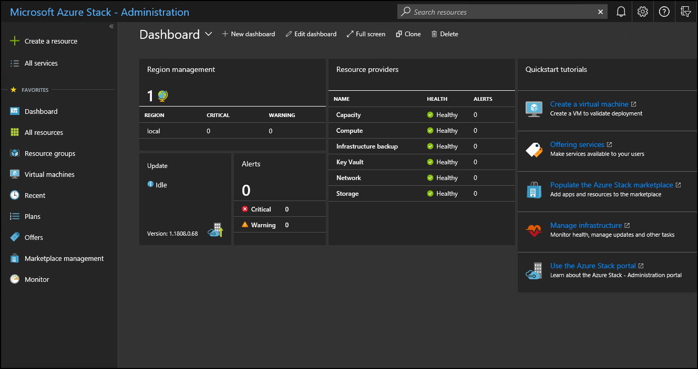

# Using the administrator portal in Azure Stack

*Applies to: Azure Stack integrated systems and Azure Stack Development Kit*

There are two portals in Azure Stack; the administrator portal and the user portal (sometimes referred to as the *tenant* portal.) As an Azure Stack operator, you can use the administrator portal for day-to-day management and operations of Azure Stack.

## Access the administrator portal

For a development kit environment, you need to first make sure that you can [connect to the development kit host](azure-stack-connect-azure-stack.md) through Remote Desktop Connection or through a virtual private network (VPN).

To access the administrator portal, browse to the portal URL and sign in by using the credentials of an Azure Stack operator. For an integrated system, the portal URL varies based on the region name and external fully qualified domain name (FQDN) of your Azure Stack deployment.

| Environment | Administrator Portal URL |   
| -- | -- | 
| Development kit| https://adminportal.local.azurestack.external  |
| Integrated systems | https://adminportal.&lt;*region*&gt;.&lt;*FQDN*&gt; | 
| | |

 

In the administrator portal, you can do things such as:

* Manage the infrastructure (including system health, updates, capacity, etc.)
* Populate the marketplace
* Create subscriptions for users
* Create plans and offers

The **Quickstart tutorial** tile provides links to online documentation for the most common tasks.

Although an operator has can create resources such as virtual machines, virtual networks, and storage accounts in the administrator portal, you should [sign in to the user portal](user/azure-stack-use-portal.md) to create and test resources.

>[!NOTE]
>The **Create a virtual machine** link in the quickstart tutorial tile has you create a virtual machine in the administrator portal, but this is only intended to validate Azure Stack after it's first deployed.

## Understand subscription behavior

There is only one subscription available to use from the administrator portal. This subscription is the *Default Provider Subscription*. You can't add any other subscriptions and use them in the administrator portal.

As an Azure Stack operator, you can add subscriptions for your users (including yourself) from the administrator portal. Users (including yourself) can access and use these subscriptions from the **user** portal. However, the user portal doesn't provide access to any of the administrative or operational capabilities of the administrator portal.

The administrator and user portals are backed by separate instances of Azure Resource Manager. Because of this Resource Manager separation, subscriptions do not cross portals. For example, if you, as an Azure Stack operator, sign in to the user portal, you can't access the *Default Provider Subscription*. Although you don't have access to any administrative functions, you can create subscriptions for yourself from available public offers. As long as you're signed in to the user portal you are considered a tenant user.

  >[!NOTE]
  >In the development kit environment, if a user belongs to the same tenant directory as the Azure Stack operator, they are not blocked from signing in to the administrator portal. However, they can't access any of the administrative functions. Also, from the administrator portal, they can't add subscriptions or access offers that are available to them in the user portal.

## Administrator portal tips

### Customize the dashboard

The dashboard contains a set of default tiles. You can select **Edit dashboard** to modify the default dashboard, or select **New dashboard** to add a custom dashboard. You can easily add tiles to a dashboard. For example, you can select **+ Create a resource**, right-click **Offers + Plans**, and then select **Pin to dashboard**.

Sometimes, you might see a blank dashboard in the portal. To recover the dashboard, click **Edit Dashboard**, and then right click and select **Reset to default state**.

### Quick access to online documentation

To access the Azure Stack operator documentation, use the Help and support icon (question mark) in the upper-right corner of the administrator portal. Move your cursor to the icon, and then select **Help + support**.

### Quick access to help and support

If you select the Help and support icon (question mark) in the upper-right corner of the administrator portal, and then select **New support request**, one of the following results happen:

- If you're using an integrated system, this action opens a site where you can directly open a support ticket with Microsoft Customer Support Services (CSS). Refer to [Where to get support](azure-stack-manage-basics.md#where-to-get-support) to understand when you should go through Microsoft support or through your original equipment manufacturer (OEM) hardware vendor support.
- If you’re using the development kit, this action opens the Azure Stack forums site directly. These forums are regularly monitored. Because the development kit is an evaluation environment, there is no official support offered through Microsoft CSS.

## Next steps

- [Region management in Azure Stack](azure-stack-region-management.md)
