# Manage Storage Accounts in Azure Stack
Learn how to manage storage accounts in Azure Stack to find, recover,
and reclaim storage capacity based on business needs.

## <a name="find"></a>Find a storage account
The list of storage accounts in the region can be viewed in Azure Stack
by:

1. In an Internet browser, navigate to
   https://adminportal.local.azurestack.external.
2. Sign in to the Azure Stack administration portal as an administrator (using the
   credentials you provided during deployment)
3. On the default dashboard – find the **Region management** list and click the region you want to explore. For example **(local**).
   
   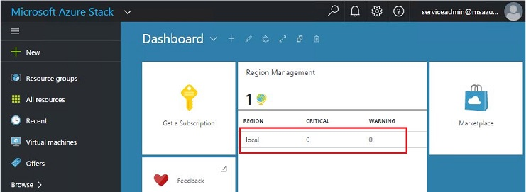
4. Select **Storage** from the **Resource Providers** list.
   
   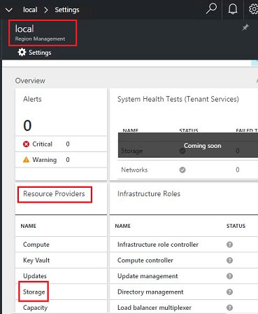
5. Now, on the storage Resource Provider administrator blade – scroll down to
   the **Storage accounts** tab and click it.
   
   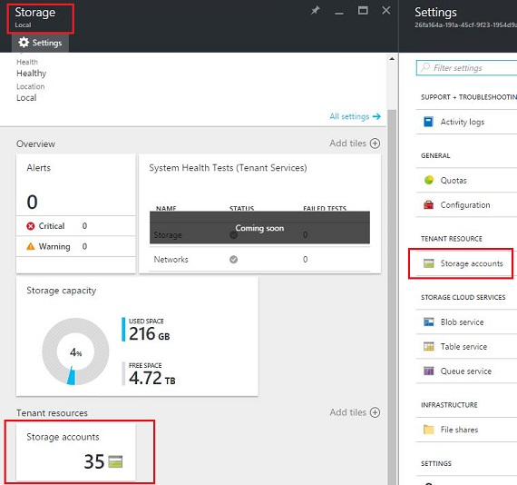
   
   The resulting page is the list of storage accounts in that region.
   
   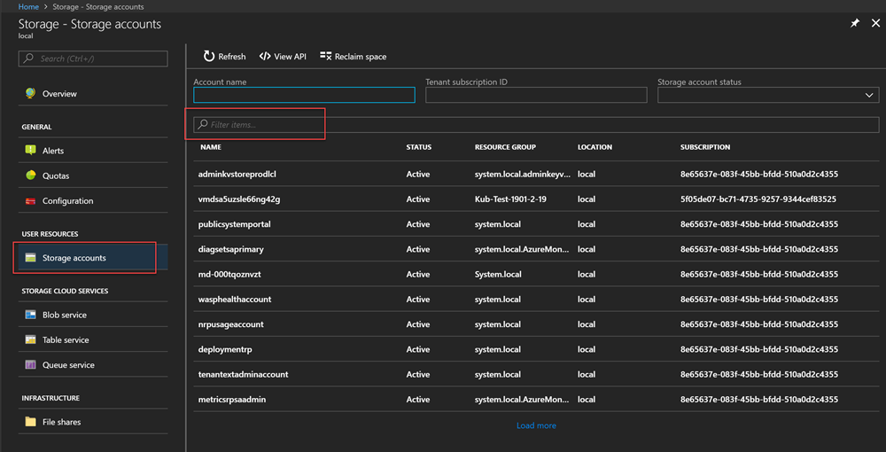

By default, the first 10 accounts are displayed. You can choose to fetch
more by clicking the  **Load more** link at the bottom of the list.

OR

If you are interested in a particular storage account – you can **filter
and fetch the relevant accounts** only.


**To filter for accounts:**

1. Click **Filter** at the top of the blade.
2. On the Filter blade, it allows you to specify **account name**,
    **subscription ID** or **status** to fine-tune the list of storage
    accounts to be displayed. Use them as appropriate.
3. Click **Update**. The list should refresh accordingly.
   
    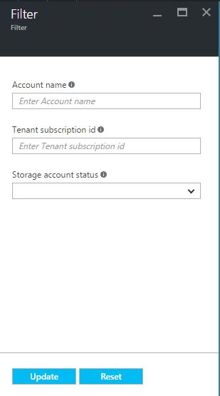
4. To reset the filter: click **Filter**, clear out the
    selections and update.

The search text box (on the top of the storage accounts list blade) lets
you highlight the selected text in the list of accounts. This is
really handy in the case when the full name or id is not easily
available.

You can use free text here to help find the account you are interested
in.

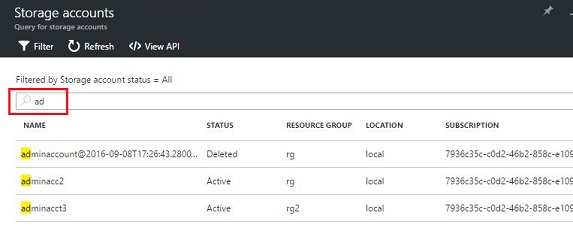

## Look at account details
Once you have located the accounts you are interested in viewing, you
can click the particular account to view certain details. A new blade
opens with the account details such as: the type of the account,
creation time, location, etc.

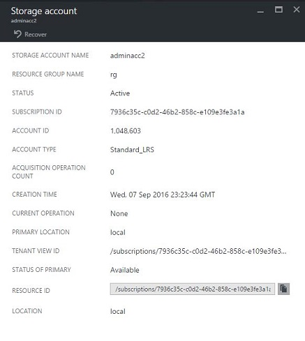

## Recover a deleted account
You may be in a situation where you need to recover a deleted
account.

In Azure Stack there is a very simple way to do that:

1. Browse to the storage accounts list. See [Find a storage account](#find) in this topic for more information.
2. Locate that particular account in the list. You may need to filter.
3. Check the *state* of the account. It should say **Deleted**.
4. Click the account which opens the account details blade.
5. On top of this blade, locate the **Recover** button and click it.
6. Click **Yes** to confirm.
   
   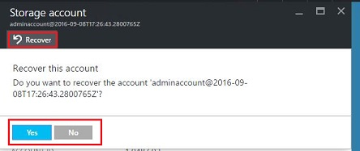
7. The recovery is now in *process…wait* for an indication that it was
   successful.
   You can also click the “bell” icon at the top of the portal to
   view progress indications.
   
   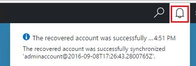
   
   Once the recovered account is successfully synchronized, it can be used again.

### Some Gotchas
* Your deleted account shows state as **out of retention**.
  
  This means that the deleted account has exceeded the retention period
  and may not be recoverable.
* Your deleted account does not show in the accounts list.
  
  This could mean that the deleted account has already been garbage
  collected. In this case it cannot be recovered. See [Reclaim capacity](#reclaim) in this topic.

## Set the retention period
The retention period setting allows an administrator to specify a time period in
days (between 0 and 9999 days) during which any deleted account can
potentially be recovered. The default retention period is set to 15
days. Setting the value to “0” means that any deleted account is
immediately out of retention and marked for periodic garbage
collection.

**To change the retention period:**

1. In an internet browser, navigate to
   https://adminportal.local.azurestack.external.
2. Sign in to the Azure Stack administration portal as an administrator (using the
   credentials you provided during deployment)
3. On the default dashboard – find the **Region management** list and click the region you want to explore – for example **(local**).
4. Select **Storage** from the **Resource Providers** list.
5. Click **Settings** at the top to open the setting blade.
6. Click **Configuration** then edit the retention period value.

   Set the number of days and then save it.
   
   This value is immediately effective and is set for your
   entire region.

   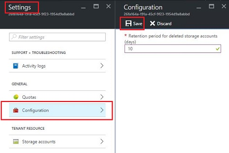

## <a name="reclaim"></a>Reclaim capacity
One of the side effects of having a retention period is that a deleted account continues to consume capacity until it comes out of the retention period. As an administrator you may need a way to reclaim the deleted account space even though the retention period has not yet expired.

You can reclaim capacity using either the portal or PowerShell.

**To reclaim capacity using the portal:**
1. Navigate to the storage accounts blade. See [Find a storage account](#find).
2. Click **Reclaim space** at the top of the blade.
3. Read the message and then click **OK**.

    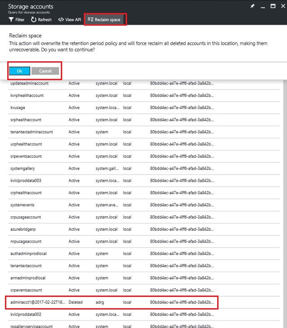
4. Wait for success notification See the bell icon on the portal.

    
5. Refresh the Storage accounts page. The deleted accounts are no longer shown in the list because they have been purged.

You can also use PowerShell to explicitly override the retention period and immediately reclaim capacity.

**To reclaim capacity using PowerShell:**   

1. Confirm that you have Azure PowerShell installed and configured. If not,
   use the following instructions: 
   * To install the latest Azure PowerShell version and associate it with your Azure subscription, see [How to install and configure Azure
   PowerShell](http://azure.microsoft.com/documentation/articles/powershell-install-configure/).
   For more information about Azure Resource Manager cmdlets, see
   [Using Azure PowerShell with Azure Resource
   Manager](http://go.microsoft.com/fwlink/?LinkId=394767)
2. Run the following cmdlet:

> [!NOTE]
> If you run this cmdlet you permanently delete the account and its contents. It is not recoverable. Use this with care.


        Clear-ACSStorageAccount -ResourceGroupName system.local -FarmName <farm ID>


For more details, refer to [Azure Stack powershell documentation.](https://msdn.microsoft.com/library/mt637964.aspx)
 

## Migrate a container
Due to uneven storage use by tenants, an administrator may find one or more underlying tenant shares using more space than others. If this occurs, the administrator can attempt to free up some space on the stressed share by manually migrating some blob containers to another share. 

You must use PowerShell to migrate containers.
> [!NOTE]
>Blob container migration does not support live migration and currently is an offline operation. During migration and until it is complete the underlying blobs in that container cannot be used and are “offline”. 

**To migrate containers using PowerShell:**

1. Confirm that you have Azure PowerShell installed and configured. If not,
   use the following instructions:
    * To install the latest Azure PowerShell version and associate it with your Azure subscription, see [How to install and configure Azure PowerShell](http://azure.microsoft.com/documentation/articles/powershell-install-configure/). For more information about Azure Resource Manager cmdlets, see [Using Azure PowerShell with Azure Resource Manager](http://go.microsoft.com/fwlink/?LinkId=394767)
2. Get the farm name: 
      
      `$farm = Get-ACSFarm -ResourceGroupName system.local`
3. Get the shares: 

   `$shares = Get-ACSShare -ResourceGroupName system.local -FarmName $farm.FarmName`

4. Get the containers for a given share. Note that count and intent are optional parameters:
            
   `$containers = Get-ACSContainer -ResourceGroupName system.local -FarmName $farm.FarmName -ShareName $shares[0].ShareName -Count 4 -Intent Migration`  

   Then examine $containers:

   `$containers`

    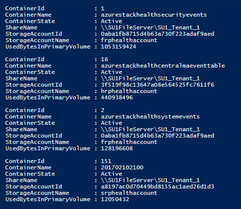
5. Get the best destination shares for the container migration:

    `$destinationshares= Get-ACSSharesForMigration  -ResourceGroupName system.local -FarmName $farm.farmname -SourceShareName $shares[0].ShareName`

    Then examine $destinationshares:

    `$destinationshares`

    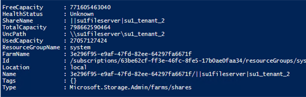
6. Kick off migration for a container, notice this is an async implementation, so one can loop all containers in a share and track the status using the returned job id.

    `$jobId = Start-ACSContainerMigration -ResourceGroupName system.local -FarmName $farm.farmname -ContainerToMigrate $containers[1] -DestinationShareUncPath $destinationshares.UncPath`

    Then examine $jobId:

   ```
   $jobId
   d1d5277f-6b8d-4923-9db3-8bb00fa61b65
   ```
7. Check status of the migration job by its job id. When the container migration finishes, MigrationStatus is set to “Completed”.

    `Get-ACSContainerMigrationStatus -ResourceGroupName system.local -FarmName $farm.farmname -JobId $jobId`

    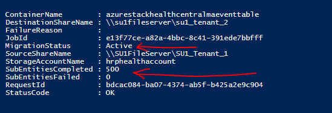

8. You can cancel an in-progress migration job. This again is an async operation and can be tracked using $jobid:

    `Stop-ACSContainerMigration-ResourceGroupName system.local -FarmName $farm.farmname -JobId $jobId-Verbose`

    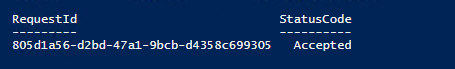

    You can check the status of the migration cancel again:

    `Get-ACSContainerMigrationStatus-ResourceGroupName system.local -FarmName $farm.farmname -JobId $jobId`

    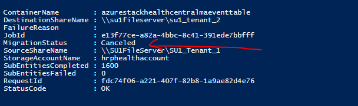


  
  