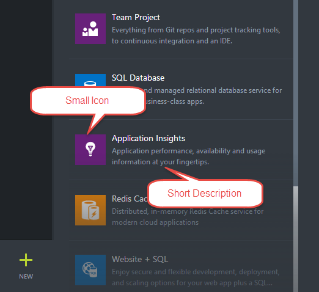
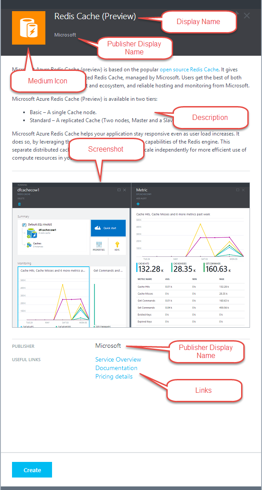

<properties
	pageTitle="Marketplace Item metadata for Azure Stack | Microsoft Azure"
	description="View the Marketplace Item metadata for Azure Stack."
	services="azure-stack"
	documentationCenter=""
	authors="rupisure"
	manager="byronr"
	editor=""/>

<tags
	ms.service="azure-stack"
	ms.workload="na"
	ms.tgt_pltfrm="na"
	ms.devlang="na"
	ms.topic="article"
	ms.date="01/29/2016"
	ms.author="rupisure"/>

# Marketplace item UI references for Azure Stack

Icons and text for marketplace items as seen in the Azure Stack portal:

## Create blade

## Marketplace item details blade

## Next steps

[The Azure Stack Marketplace](azure-stack-marketplace.md)

[Create a marketplace item](azure-stack-create-marketplace-item.md)

[Publish a marketplace item](azure-stack-publish-marketplace-item.md)
