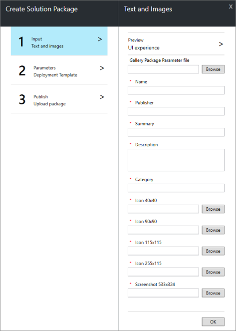
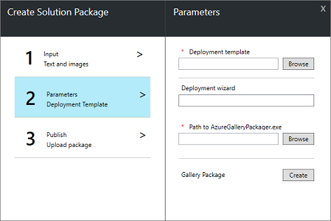
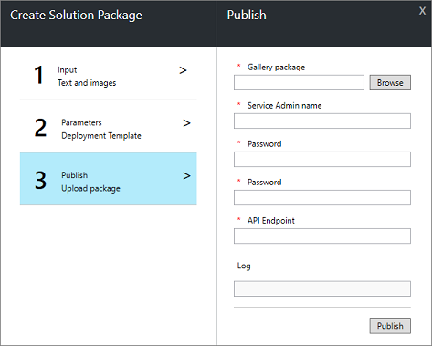

#  Add marketplace items using publishing tool

Adding your content to the [Azure Stack Marketplace](azure-stack-marketplace.md) makes your solutions available to you and your tenants for deployment. The Marketplace toolkit creates Azure Marketplace package (.azpkg) files based on your IaaS Azure Resource Manager templates or VM extensions. You can also use the Marketplace toolkit to publish .azpkg files, either created with the tool or using [manual](azure-stack-create-and-publish-marketplace-item.md) steps. This topic describes downloading the tool, creating a marketplace item based on a VM template, and then publishing that item to the Azure Stack Marketplace.     

## Prerequisites

 - You must run the toolkit on the Azure Stack host or have [VPN](azure-stack-connect-azure-stack.md#connect-to-azure-stack-with-vpn) connectivity from the machine on which you run the tool.

 - Download the [Azure Stack Quickstart templates](https://github.com/Azure/AzureStack-QuickStart-Templates/archive/master.zip) and extract.

 - Download the [Azure Gallery Packaging tool](http://aka.ms/azurestackmarketplaceitem) (AzureGalleryPackage.exe). 

 - Publishing to the marketplace requires icons and a thumbnail file. You can use your own, or save the [sample](azure-stack-marketplace-publisher.md#support-files) files locally for this example.

## Download the tool

You can download the Marketplace Toolkit [from the Azure Stack Tools repo](azure-stack-powershell-download.md).

##  Create marketplace items

In this section, you use the Marketplace toolkit to create a marketplace item package in .azpkg format.  

### Provide marketplace information with wizard

1. Run the Marketplace Toolkit from a PowerShell session:
   ```PowerShell
   .\MarketplaceToolkit.ps1
   ```

2. Click the **Solution** tab. This screen accepts information about your marketplace item. Enter information about your item as you want it to appear in the marketplace. You can also specify a [parameters file](azure-stack-marketplace-publisher.md#use-a-parameters-file) to prepopulate the form.  
    
    
3. Click **Browse** and select an image file for each icon and screenshot field. You can use your own icons, or the sample icons in the [support files](azure-stack-marketplace-publisher.md#support-files) section.
4. Once all fields are populated, select "Preview Solution" for a preview of the solution within the Marketplace. You can revise and edit the text, images, and screenshot before clicking **Next**.  

### Import template and create package

In this section, you import the template and work with input for your solution.

1.  Click **Browse** and select the *azuredeploy.json* from the 101-Simple-Windows-VM folder in the downloaded templates.

    
2.  The Deployment wizard is populated with a *Basic* step and input items for each parameter specified in the template. You can add additional steps and move inputs between steps. As an example, you may want "Front-End Configuration" and "Back-End Configuration" steps for your solution.
3.  Specify the path to AzureGalleryPackager.exe.  
4.  Click **Create**. The Marketplace toolkit packages your solution into an .azpkg file. When complete, the wizard displays the path to your solution file and give you the option to continue publishing your package to Azure Stack.

## Publish marketplace items

In this section, you publish the marketplace item to your Azure Stack Marketplace.



1.  The wizard requires information to publish your solution:
    
    |Field|Description|
    |-----|-----|
    | Service Admin Name | Service Administrator account.  Example: ServiceAdmin@mydomain.onmicrosoft.com |
    | Password | Password for Service Administrator account. |
    | API Endpoint | Azure Stack Azure Resource Manager endpoint. Example: management.local.azurestack.external |
2.  Click **Publish** and the publishing log is displayed.
3.  You are now able to deploy your published item via the Azure Stack portal.

## Use a parameters file

You can also use a parameters file to complete the marketplace item information.  

The Marketplace toolkit includes a *solution.parameters.ps1* you can use to create your own parameters file.

## Support files

| Description | Sample |
| ----- | ----- |
| 40x40 .png icon |  |
| 90x90 .png icon |  |
| 115x115 .png icon |  |
| 255x115 .png icon |  |
| 533x324 .png thumbnail |  |

## Next steps

[Download Marketplace items](azure-stack-download-azure-marketplace-item.md)  
[Create and publish a Marketplace item](azure-stack-create-and-publish-marketplace-item.md)