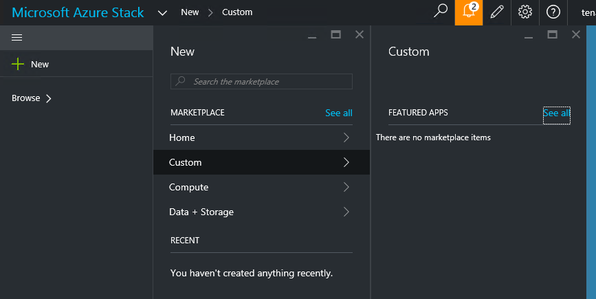

<properties
	pageTitle="Publish a custom marketplace item in Azure Stack (service administrator) | Microsoft Azure"
	description="As a service administrator, learn how to publish a custom marketplace item in Azure Stack."
	services="azure-stack"
	documentationCenter=""
	authors="rupisure"
	manager="byronr"
	editor=""/>

<tags
	ms.service="azure-stack"
	ms.workload="na"
	ms.tgt_pltfrm="na"
	ms.devlang="na"
	ms.topic="article"
	ms.date="01/29/2016"
	ms.author="rupisure"/>

# The Azure Stack Marketplace

The Marketplace is a collection of items customized for Azure Stack, like services, applications, and resources. It's the place where tenants come to create new resources and deploy new applications. Service administrators can add custom items to the Marketplace and tenants will see them right away.

To open the Marketplace, click **New**.

The Marketplace is updated every five minutes.

## Marketplace items

Every Marketplace item has:

-   An Azure Resource Manager template for resource provisioning

-   Metadata, like strings, icons, and other marketing collateral

-   Formatting information to display the item in the portal

Every item published to the Marketplace uses a format called the Azure Gallery Package (azpkg). Deployment or runtime resources (like code, zip files with software, virtual machines, or disks) shouldn't be included in the Azure Gallery Package.

## Next steps

[Create a marketplace item](azure-stack-create-marketplace-item.md)
