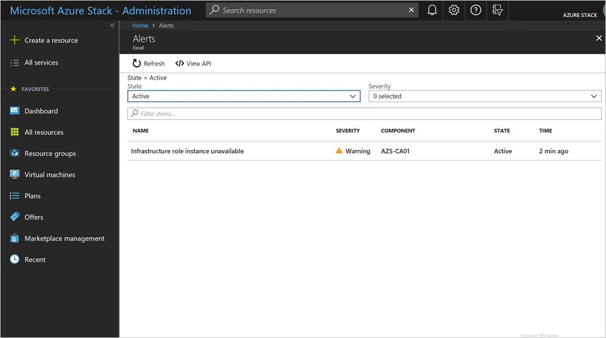
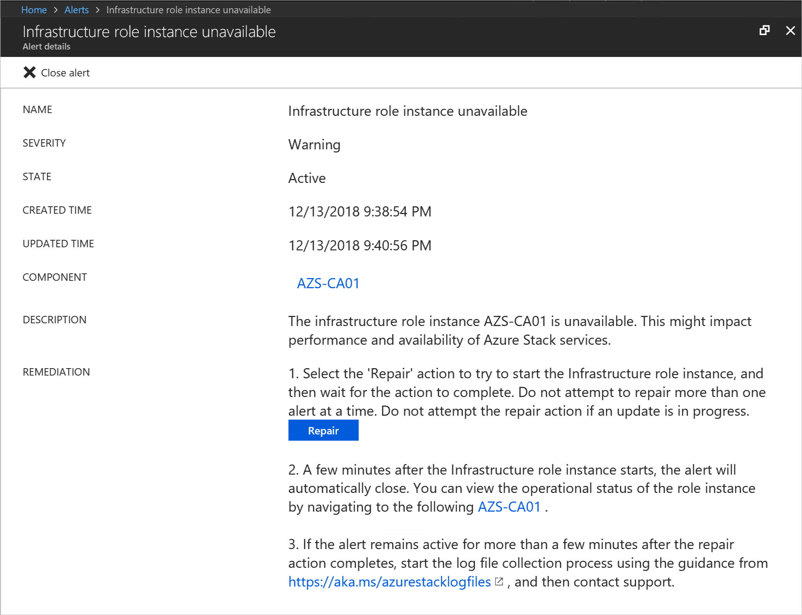
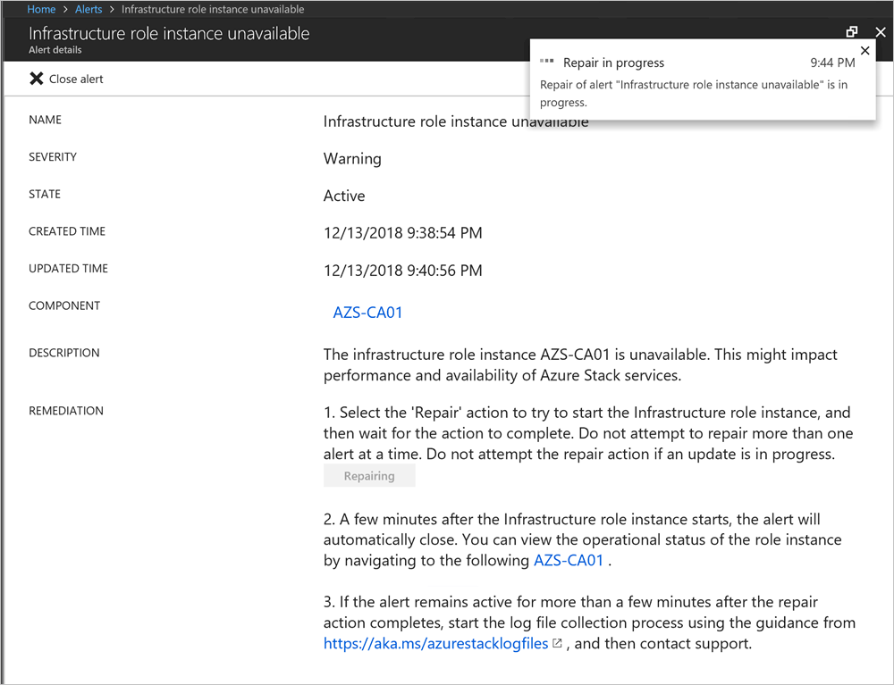
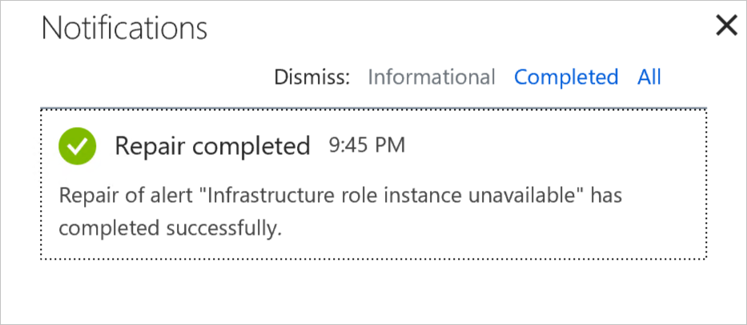

# Monitor health and alerts in Azure Stack

*Applies to: Azure Stack integrated systems and Azure Stack Development Kit*

Azure Stack includes infrastructure monitoring capabilities that help you view health and alerts for an Azure Stack region. The **Region management** tile, pinned by default in the administrator portal for the Default Provider Subscription, lists all the deployed regions of Azure Stack. The tile shows the number of active critical and warning alerts for each region. The tile is your entry point into the health and alert functionality of Azure Stack.

## Understand health in Azure Stack

The Health resource provider manages health and alerts. Azure Stack infrastructure components register with the health resource provider during Azure Stack deployment and configuration. This registration enables the display of health and alerts for each component. Health in Azure Stack is a simple concept. If alerts for a registered instance of a component exist, the health state of that component reflects the worst active alert severity: warning or critical.

## Alert severity definition

In Azure Stack raises alerts with only two severities: **warning** and **critical**.

- **Warning**  
  An operator can address the warning alert in a scheduled manner. The alert typically does not impact user workloads.

- **Critical**  
  An operator should address the critical alert with urgency. These are issues that currently impact or will soon impact Azure Stack users.

## View and manage component health state

You can view the health state of components in the administrator portal and through REST API and PowerShell.

To view the health state in the portal, click the region that you want to view in the **Region management** tile. You can view the health state of infrastructure roles and of resource providers.

You can click a resource provider or infrastructure role to view more detailed information.

> [!WARNING]  
> If you click an infrastructure role, and then click the role instance, there are options to **Start**, **Restart**, or **Shutdown**. Do not use these actions when you apply updates to an integrated system. Also, do **not** use these options in an Azure Stack Development Kit environment. These options are only designed for an integrated systems environment, where there is more than one role instance per infrastructure role. Restarting a role instance (especially AzS-Xrp01) in the development kit causes system instability. For troubleshooting assistance, post your issue to the [Azure Stack forum](https://aka.ms/azurestackforum).
>

## View alerts

The list of active alerts for each Azure Stack region is available directly from the **Region management** blade. The first tile in the default configuration is the **Alerts** tile, which displays a summary of the critical and warning alerts for the region. You can pin the Alerts tile, like any other tile on this blade, to the dashboard for quick access.

By selecting the top part of the **Alerts** tile, you navigate to the list of all active alerts for the region. If you select either the **Critical** or **Warning** line item within the tile, you navigate to a filtered list of alerts (Critical or Warning). 

The **Alerts** blade supports the ability to filter both on status (Active or Closed) and severity (Critical or Warning). The default view displays all active alerts. All closed alerts are removed from the system after seven days.

The **View API** action displays the REST API that was used to generate the list view. This action provides a quick way to become familiar with the REST API syntax that you can use to query alerts. You can use this API in automation or for integration with your existing datacenter monitoring, reporting, and ticketing solutions.

You can click a specific alert to view the alert details. The alert details show all fields that are associated with the alert, and enable quick navigation to the affected component and source of the alert. For example, the following alert occurs if one of the infrastructure role instances goes offline or is not accessible.  

## Repair alerts

You can select **Repair** in some alerts.

When selected, the **Repair** action performs steps specific to the alert to attempt to resolve the issue. Once selected the status of the **Repair** action is available as a portal notification.

The **Repair** action will report successful completion or failure to complete the action in the same portal notification blade.  If a Repair action fails for an alert, you may rerun the **Repair** action from the alert detail. If the Repair action successfully completes, **do not** rerun the **Repair** action.

After the infrastructure role instance is back online, this alert automatically closes. Many, but not every alert, automatically closes when the underlying issue is resolved. Alerts that provide a Repair action button will close automatically if Azure Stack resolves the issue.  For all other alerts, select **Close Alert** after you perform remediation steps. If the issue persists, Azure Stack generates a new alert. If you resolve the issue, the alert remains closed and requires no more steps.

## Next steps

[Manage updates in Azure Stack](azure-stack-updates.md)

[Region management in Azure Stack](azure-stack-region-management.md)
