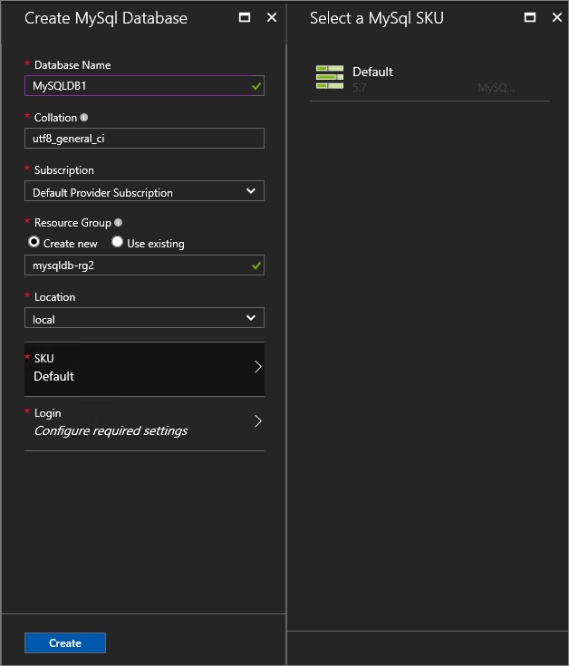
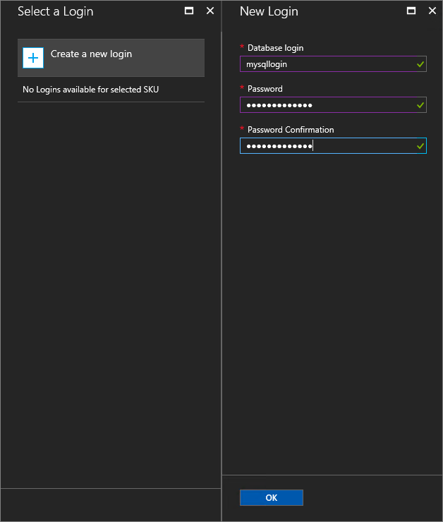
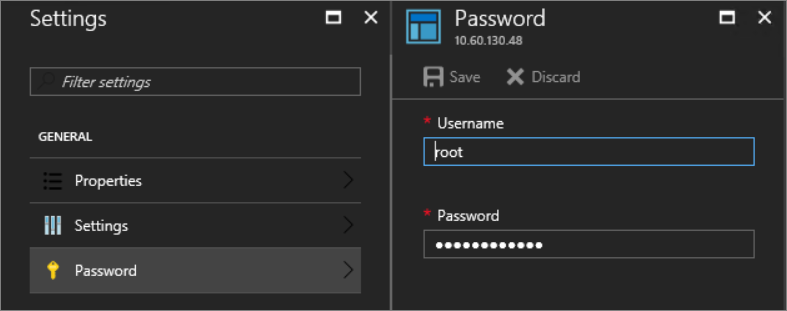

# Create MySQL databases

You can create and manage self-service databases in the user portal. An Azure Stack user needs a subscription with an offer that includes the MySQL database service.

## Test your deployment by creating a MySQL database

1. Sign in to the Azure Stack user portal.
2. Select **+ Create a resource** > **Data + Storage** > **MySQL Database** > **Add**.
3. Under **Create MySQL Database**, enter the Database Name, and configure the other settings as required for your environment.

    

4. Under **Create Database**, select **SKU**. Under **Select a MySQL SKU**, pick the SKU for your database.

    

    >[!Note]
    >As hosting servers are added to Azure Stack, they're assigned a SKU. Databases are created in the pool of hosting servers in a SKU.

5. Under **Login**, select ***Configure required settings***.
6. Under **Select a Login**, you can choose an existing login or select **+ Create a new login** to set up a new login.  Enter a **Database login** name and **Password**, and then select **OK**.

    

    >[!NOTE]
    >The length of the Database login name can't exceed 32 characters in MySQL 5.7. In earlier editions, it can't exceed 16 characters.

7. Select **Create** to finish setting up the database.

After the database is deployed, take note of the **Connection String** under **Essentials**. You can use this string in any application that needs to access the MySQL database.

## Update the administrative password

You can modify the password by changing it on the MySQL server instance.

1. Select **ADMINISTRATIVE RESOURCES** > **MySQL Hosting Servers**. Select the hosting server.
2. Under **Settings**, select **Password**.
3. Under **Password**, enter the new password and then select **Save**.

## Next steps

[Update the MySQL resource provider](azure-stack-mysql-resource-provider-update.md)
