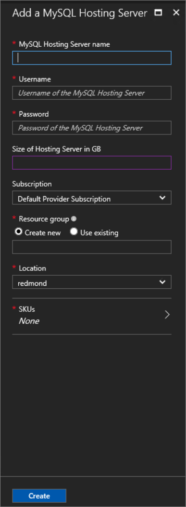

# Use MySQL databases as PaaS on Azure Stack

> [!NOTE]
> The following information only applies to Azure Stack TP3 Refresh deployments. TP3 Refresh now uses the current release of MySQL 5.7.
>

You can deploy a MySQL resource provider on Azure Stack. After you deploy the resource provider, you can create MySQL servers and databases through Azure Resource Manager deployment templates and provide MySQL databases as a service. MySQL databases, which are common on web sites, support many website platforms. As an example, after you deploy the resource provider, you can create WordPress websites from the Azure Web Apps platform as a service (PaaS) add-on for Azure Stack.

To deploy the MySQL provider on a system that does not have internet access, you can copy the files  [mysql-5.7.17-winx64.zip](https://dev.mysql.com/get/Downloads/MySQL-5.7/mysql-5.7.17-winx64.zip) and [mysql-connector-net-6.9.9.msi](https://dev.mysql.com/get/Downloads/Connector-Net/mysql-connector-net-6.9.9.msi) to a local share and provide that share name when prompted (see below).

> [!NOTE]
> The deployment script performs retries, if necessary, to accommodate less reliable network connections or if an operation exceeds a timeout.
>

## Deploy the resource provider

1. If you have not already done so, create a [Windows Server 2016 image with the .NET 3.5 runtime](https://docs.microsoft.com/azure/azure-stack/azure-stack-add-default-image) installed.

  > [!NOTE]
  > Although the .NET 3.5 runtime is not required for this RP, it is used for the SQL Resource Provider, so you can save space by using the same image.
  >
  >

  
2. If you have installed any version of the AzureRm PowerShell module other than 1.2.9, you need to remove it or the install will block.

3. [Download the MySQL resource provider binaries file](https://aka.ms/azurestackmysqlrptp3) and extract it on the Console VM in your Azure Stack.

4. Open a **new** elevated PowerShell console and change to the directory where you extracted the files. Use a new window to avoid problems that may arise from incorrect PowerShell modules already loaded on the system.

5. Run DeployMySqlProvider.ps1.

This script performs these steps:

* If necessary, download a compatible version of Azure PowerShell (only AzureRm version 1.2.9 is supported).
* Create a wildcard certificate to secure communication between the resource provider and Azure Resource Manager.
* Download the MySQL binaries.
* Upload the certificate and all other artifacts to an Azure Stack storage account.
* Publish gallery packages so that you can deploy MySQL resources through the gallery.
* Deploy a virtual machine (VM) that hosts both your resource provider, and a MySQL 5.7 server.
* Register a local DNS record that maps to your resource provider VM.
* Register your resource provider with the local Azure Resource Manager.

Either specify at least the required parameters on the command line, or, if you run without any parameters, you are prompted to enter them. 

Here's an example you can run from the PowerShell prompt (but change the account information and portal endpoints as needed):

```
# Install the AzureRM.Bootstrapper module
Install-Module -Name AzureRm.BootStrapper -Force

# Installs and imports the API Version Profile required by Azure Stack into the current PowerShell session.
Use-AzureRmProfile -Profile 2017-03-09-profile

Install-Module -Name AzureStack -RequiredVersion 1.2.9 -Force

# Download the Azure Stack Tools from GitHub and set the environment
cd c:\
Invoke-Webrequest https://github.com/Azure/AzureStack-Tools/archive/master.zip -OutFile master.zip
Expand-Archive master.zip -DestinationPath . -Force

Import-Module C:\AzureStack-Tools-master\Connect\AzureStack.Connect.psm1
Add-AzureStackAzureRmEnvironment -Name AzureStackAdmin -ArmEndpoint "https://adminmanagement.local.azurestack.external" 

# For AAD, use the following
$tenantID = Get-DirectoryTenantID -AADTenantName "<your directory name>" -EnvironmentName AzureStackAdmin

# For ADFS, replace the previous line with
# $tenantID = Get-DirectoryTenantID -ADFS -EnvironmentName AzureStackAdmin

$vmLocalAdminPass = ConvertTo-SecureString "P@ssw0rd1" -AsPlainText -Force
$vmLocalAdminCreds = New-Object System.Management.Automation.PSCredential ("mysqlrpadmin", $vmLocalAdminPass)

$AdminPass = ConvertTo-SecureString "P@ssw0rd1" -AsPlainText -Force
$AdminCreds = New-Object System.Management.Automation.PSCredential ("admin@mydomain.onmicrosoft.com", $AdminPass)

# Change directory to the folder where you extracted the installation files
<extracted file directory>\DeployMySQLProvider.ps1 -DirectoryTenantID $tenantID -AzCredential $AdminCreds -VMLocalCredential $vmLocalAdminCreds -ResourceGroupName "MySqlRG" -VmName "MySQLRP" -ArmEndpoint "https://adminmanagement.local.azurestack.external" -TenantArmEndpoint "https://management.local.azurestack.external" -AcceptLicense
 ```

### DeployMySqlProvider.ps1 Parameters

You can specify these parameters in the command line. If you do not, or any parameter validation fails, you are prompted to provide the required ones.

| Parameter Name | Description | Comment or Default Value |
| --- | --- | --- |
| **DirectoryTenantID** | The Azure or ADFS Directory ID (guid) | _required_ |
| **ArmEndpoint** | The Azure Stack Administrative Azure Resource Manager Endpoint | _required_ |
| **TenantArmEndpoint** | The Azure Stack Tenant Azure Resource Manager Endpoint | _required_ |
| **AzCredential** | Azure Stack Service Admin account credential (use the same account as you used for deploying Azure Stack) | _required_ |
| **VMLocalCredential** | The local administrator account of the MySQL resource provider VM | _required_ |
| **ResourceGroupName** | Resource Group for the items created by this script |  _required_ |
| **VmName** | Name of the VM holding the resource provider |  _required_ |
| **AcceptLicense** | Skips the prompt to accept the GPL License  (http://www.gnu.org/licenses/old-licenses/gpl-2.0.html) | |
| **DependencyFilesLocalPath** | Path to a local share containing the MySQL files [mysql-5.7.17-winx64.zip](https://dev.mysql.com/get/Downloads/MySQL-5.7/mysql-5.7.17-winx64.zip) and [mysql-connector-net-6.9.9.msi](https://dev.mysql.com/get/Downloads/Connector-Net/mysql-connector-net-6.9.9.msi) | _leave blank to download from the internet_ |
| **MaxRetryCount** | Each operation is retried if there is a failure | 2 |
| **RetryDuration** | Timeout between retries, in seconds | 120 |
| **Uninstall** | Remove the resource provider | No |
| **DebugMode** | Prevents automatic cleanup on failure | No |


Depending on the system performance and download speeds, installation may take as little as 20 minutes or as long as several hours. You will need to refresh the admin portal if the MySQLAdapter blade is not available.

> [!NOTE]
> If the installation takes more than 90 minutes, it may fail and you will see a failure message on the screen and in the log file. The deployment is retried from the failing step. Systems that do not meet the recommended memory and core specifications may not be able to deploy the MySQL RP.


## Provide capacity by connecting to a MySQL hosting server

> [!NOTE]
>  After the installation script completes, you will need to refresh the portal to see the admin blade.


1. Sign in to the Azure Stack POC portal as a service admin

2. Click **Resource Providers** &gt; **MySQLAdapter** &gt; **Hosting Servers** &gt; **+Add**.

	The **MySQL Hosting Servers** blade is where you can connect the MySQL Server Resource Provider to actual instances of MySQL Server that serve as the resource provider’s backend.

	

3. Fill the form with the connection details of your MySQL Server instance. Provide the fully qualified domain name (FQDN) or a valid IPv4 address, and not the short VM name. By default, a preconfigured MySQL 5.7 Server called <VM Name - see above>.local.cloudapp.azurestack.external” with the administrator user name and the password you provided in the "LocalCredential" parameter is running on the VM.


The size provided helps the resource provider manage the database capacity. It should be close to the physical capacity of the database server.


## Create your first MySQL database to test your deployment


1. Sign in to the Azure Stack POC portal as service admin.

2. Click the **+ New** button &gt; **Data + Storage** &gt; **MySQL Database (preview)**.

3. Fill in the form with the database details.


The connections string includes the real database server name. Copy it from the portal.


> [!NOTE]
> The combined length of the user and server names cannot exceed 32 characters with MySQL 5.7 or 16 characters in earlier editions, including the '@' sign. This is a limitation of the MySQL implementations.


## Add Capacity

Add Capacity by adding additional MySQL servers in the Azure Stack portal. If you wish to use another instance of MySQL, click **Resource Providers** &gt; **MySQLAdapter** &gt; **MySQL Hosting Servers** &gt; **+Add**.


## Making MySQL databases available to tenants
Create plans and offers to make MySQL databases available for tenants. Add the Microsoft.MySqlAdapter service, add a quota, and accept the default values.


## Removing the MySQL Adapter Resource Provider

To remove the resource provider, it is essential to first remove any dependencies.

1. Ensure you have the original deployment package that you downloaded for this version of the Resource Provider.

2. All tenant databases must be deleted from the resource provider (this will not delete the data). This should be performed by the tenants themselves.

3. Tenants must unregister from the namespace.

4. Administrator must delete the hosting servers from the MySQL Adapter

5. Administrator must delete any plans that reference the MySQL Adapter.

6. Administrator must delete any quotas associated to the MySQL Adapter.

7. Rerun the deployment script with the -Uninstall parameter, Azure Resource Manager endpoints, DirectoryTenantID, and credentials for the service administrator account.


## Next steps


Try other [PaaS services](azure-stack-tools-paas-services.md) like the [SQL Server resource provider](azure-stack-sql-resource-provider-deploy.md) and the [App Services resource provider](azure-stack-app-service-overview.md).
