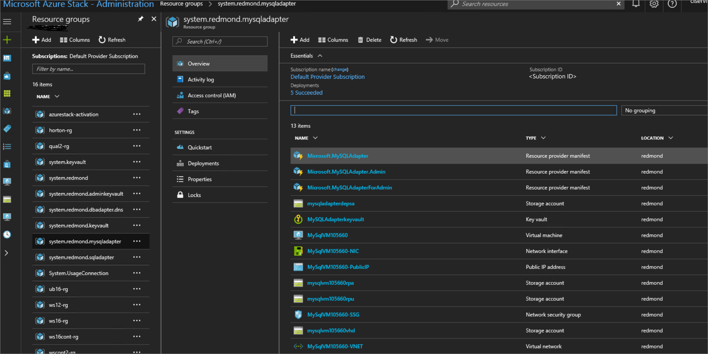
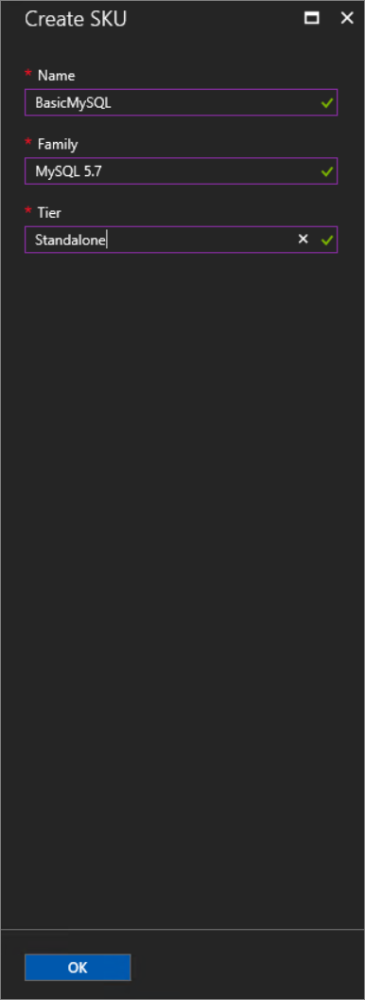

# Use MySQL databases on Microsoft Azure Stack


You can deploy a MySQL resource provider on Azure Stack. After you deploy the resource provider, you can create MySQL servers and databases through Azure Resource Manager deployment templates and provide MySQL databases as a service. MySQL databases, which are common on web sites, support many website platforms. As an example, after you deploy the resource provider, you can create WordPress websites from the Azure Web Apps platform as a service (PaaS) add-on for Azure Stack.

To deploy the MySQL provider on a system that does not have internet access, you can copy the file [mysql-connector-net-6.9.9.msi](https://dev.mysql.com/get/Download/sConnector-Net/mysql-connector-net-6.9.9.msi) to a local share. Then, provide that share name when prompted. You must also install the Azure and Azure Stack PowerShell modules.


## MySQL Server Resource Provider Adapter architecture

The resource provider is made up of three components:

- **The MySQL resource provider adapter VM**, which is a Windows virtual machine running the provider services.
- **The resource provider itself**, which processes provisioning requests and exposes database resources.
- **Servers that host MySQL Server**, which provide capacity for databases, called Hosting Servers. 

This release no longer creates a MySQL instance. You must create them and/or provide access to external SQL instances. Visit the [Azure Stack Quickstart Gallery](https://github.com/Azure/AzureStack-QuickStart-Templates/tree/master/mysql-standalone-server-windows) for an example template that can:
- create a MySQL server for you
- download and deploy a MySQL Server from the Marketplace.

![NOTE] Hosting servers installed on a multi-node Azure Stack must be created from a tenant subscription. They can't be created from the Default Provider Subscription. In other words, they must be created from the tenant portal or from a PowerShell session with an appropriate login. All hosting servers are chargeable VMs and must have appropriate licenses. The service administrator can be the owner of that subscription.

### Required Privileges
The system account must have the following privileges:

1.	Database: Create, Drop
2.	Login: Create, set, Drop, grant, Revoke

## Deploy the resource provider

1. If you have not already done so, register your development kit and download the Windows Server 2016 EVAL image downloadable through Marketplace Management. You now have the option to use a Windows Server 2016 Core image. You can also use a script to create a [Windows Server 2016 image](https://docs.microsoft.com/azure/azure-stack/azure-stack-add-default-image). The .NET 3.5 runtime is no longer required.

2. Sign in to a host that can access the Privileged Endpoint VM.
    a. On Azure Stack Development Kit (ASDK) installations, the host should be the physical host and you must sign in as the domain administrator (for example, AzureStack\AzureStackAdmin).
    b. On multi-node systems, the host must be a system that can access the Privileged Endpoint.

3. [Download the MySQL resource provider binaries file](https://aka.ms/azurestackmysqlrp) and extract it to a temporary directory.

4. The Azure Stack root certificate is retrieved from the Emergency Console JEA endpoint. For ASDK, a self-signed certificate is created as part of this process. For multi-node, you must provide an appropriate certificate.

    __Optional:__ If you need to provide your own, prepare the certificates and copy to a local directory if you wish to customize the certificates (passed to the installation script). You need the following certificate:

    A wildcard certificate for \*.dbadapter.\<region\>.\<external fqdn\>. This certificate must be trusted, such as would be issued by a certificate authority. That is, the chain of trust must exist without requiring intermediate certificates. A single site certificate can be used with the explicit VM name [SQLVM] used during install.


5. Open a **new** elevated (administrative) PowerShell console and change to the directory where you extracted the files. Use a new window to avoid problems that may arise from incorrect PowerShell modules already loaded on the system.

6. Install Azure PowerShell version 1.2.10 as described in ... .

7. Run the DeploySqlProvider.ps1 script.

The script performs these steps:

* Download the MySQL connector binary (this can be provided offline).
* Upload the certificates and other artifacts to a storage account on your Azure Stack.
* Publish gallery packages so that you can deploy SQL databases through the gallery.
* Publish a gallery package for deploying Hosting Servers
* Deploy a VM using the Windows Server 2016 image created in step 1 and install the resource provider.
* Register a local DNS record that maps to your resource provider VM.
* Register your resource provider with the local Azure Resource Manager (Tenant and Admin).


You can:
- specify at least the required parameters on the command line 
- or, if you run without any parameters, enter them when prompted. 

Here's an example you can run from the PowerShell prompt (but change the account information and passwords as needed):


```
# Use the NetBIOS name for the Azure Stack domain. On ASDK, the default is AzureStack
$domain = "AzureStack"
# Extract the downloaded file by executing it and pointing to a temp directory
$tempDir = "C:\TEMP\MySQLRP"
# The service admin (can be AAD or ADFS)
$serviceAdmin = "admin@mydomain.onmicrosoft.com"

# Install the AzureRM.Bootstrapper module
Install-Module -Name AzureRm.BootStrapper -Force

# Install and imports the API Version Profile required by Azure Stack into the current PowerShell session.
Use-AzureRmProfile -Profile 2017-03-09-profile
Install-Module -Name AzureStack -RequiredVersion 1.2.10 -Force

# Create the credentials needed for the deployment - local VM 
$vmLocalAdminPass = ConvertTo-SecureString "P@ssw0rd1" -AsPlainText -Force
$vmLocalAdminCreds = New-Object System.Management.Automation.PSCredential ("mysqlrpadmin", $vmLocalAdminPass)

# and the Service Admin credential
$AdminPass = ConvertTo-SecureString "P@ssw0rd1" -AsPlainText -Force
$AdminCreds = New-Object System.Management.Automation.PSCredential ($serviceAdmin, $AdminPass)

# and the cloud admin credential required for Emergency Console access
$CloudAdminPass = ConvertTo-SecureString "P@ssw0rd1" -AsPlainText -Force
$CloudAdminCreds = New-Object System.Management.Automation.PSCredential ("$domain\cloudadmin", $CloudAdminPass)

# change the following as appropriate
$PfxPass = ConvertTo-SecureString "P@ssw0rd1" -AsPlainText -Force

# Change directory to the folder where you extracted the installation files 
# and adjust the endpoints
$tempDir\DeployMySQLProvider.ps1 -AzCredential $AdminCreds -VMLocalCredential $vmLocalAdminCreds -CloudAdminCredential $cloudAdminCreds -PrivilegedEndpoint '10.10.10.10' -DefaultSSLCertificatePassword $PfxPass -DependencyFilesLocalPath <path to certificate and other dependencies> -AcceptLicense


 ```

### DeployMySqlProvider.ps1 parameters

You can specify these parameters in the command line. If you do not, or any parameter validation fails, you are prompted to provide the required ones.

### DeploySqlProvider.ps1 parameters
You can specify these parameters in the command line. If you do not, or any parameter validation fails, you are prompted to provide the required ones.

| Parameter Name | Description | Comment or Default Value |
| --- | --- | --- |
| **CloudAdminCredential** | The credential for the cloud administrator, necessary for accessing the Emergency Console. | _required_ |
| **AzCredential** | Provide the credentials for the Azure Stack Service Admin account. Use the same credentials as you used for deploying Azure Stack). | _required_ |
| **VMLocalCredential** | Define the credentials for the local administrator account of the MySQL resource provider VM. | _required_ |
| **PrivilegedEndpoint** | Provide the IP address or DNS Name of the Emergency Console. |  _required_ |
| **DependencyFilesLocalPath** | Path to a local share containing [mysql-connector-net-6.9.9.msi](https://dev.mysql.com/get/Downloads/Connector-Net/mysql-connector-net-6.9.9.msi). If you provide one, the certificate file must be placed in this directory as well. | _optional_ (_mandatory_ for multi-node) |
| **DefaultSSLCertificatePassword** | The password for the .pfx certificate | _required_ |
| **Core** | Use a Windows Server 2016 Core image (must be downloaded using Marketplace Management) |  _optional_ |
| **MaxRetryCount** | Define how many times you want to retry each operation if there is a failure.| 2 |
| **RetryDuration** | Define the timeout between retries, in seconds. | 120 |
| **Uninstall** | Remove the resource provider and all associated resources (see notes below) | No |
| **DebugMode** | Prevents automatic cleanup on failure | No |
| **AcceptLicense** | Skips the prompt to accept the GPL License  (http://www.gnu.org/licenses/old-licenses/gpl-2.0.html) | |


Depending on the system performance and download speeds, installation may take as little as 20 minutes or as long as several hours. If the MySQLAdapter blade is not available, refresh the admin portal.

> [!NOTE]
> If the installation takes more than 90 minutes, it may fail and you will see a failure message on the screen and in the log file. The deployment is retried from the failing step. Systems that do not meet the recommended memory and core specifications may not be able to deploy the MySQL RP.


## Verify the deployment using the Azure Stack Portal

> [!NOTE]
>  After the installation script completes, you will need to refresh the portal to see the admin blade.


1. Sign in to the admin portal as the service administrator.

2. Verify that the deployment succeeded. Browse for **Resource Groups** &gt;, click on the **system.<location>.mysqladapter** resource group and verify that all five deployments succeeded.

      

## Provide capacity by connecting to a MySQL hosting server

1. Sign in to the Azure Stack portal as a service admin.

2. Browse to **ADMINISTRATIVE RESOURCES** &gt; **MySQL Hosting Servers** &gt; **+Add**.

	The **MySQL Hosting Servers** blade is where you can connect the MySQL Server Resource Provider to actual instances of MySQL Server that serve as the resource provider’s backend.

	

3. Fill the form with the connection details of your MySQL Server instance. Provide the fully qualified domain name (FQDN) or a valid IPv4 address, and not the short VM name. This installation no longer provides a default MySQL instance. The size provided helps the resource provider manage the database capacity. It should be close to the physical capacity of the database server.

    > [!NOTE]
    > As long as the MySQL instance can be accessed by the tenant and admin Azure Resource Manager, it can be placed under control of the resource provider. The MySQL instance __must__ be allocated exclusively to the RP.

4. As you add servers, you must assign them to a new or existing SKU to allow differentiation of service offerings.
  For example, you can have an enterprise instance providing:
    - database capacity
    - automatic backup
    - reserve high-performance servers for individual departments
    - and so on.
    The SKU name should reflect the properties so that tenants can place their databases appropriately. All hosting servers in a SKU should have the same capabilities.

    


>[!NOTE]
SKUs can take up to an hour to be visible in the portal. You cannot create a database until the SKU is created.


## To test your deployment, create your first MySQL database 


1. Sign in to the Azure Stack portal as service admin.

2. Click the **+ New** button &gt; **Data + Storage** &gt; **MySQL Database**.

3. Fill in the form with the database details.

    

4. Select a SKU.

    

5. Create a login setting. The login setting can be reused or a new one created. This setting contains the user name and password for the database.

    

    The connections string includes the real database server name. Copy it from the portal.

    

> [!NOTE]
> The length of the user names cannot exceed 32 characters with MySQL 5.7 or 16 characters in earlier editions. 


## Add capacity

Add capacity by adding additional MySQL servers in the Azure Stack portal. Additional servers can be added to a new or existing SKU. Make sure the server characteristics are the same.


## Making MySQL databases available to tenants
Create plans and offers to make MySQL databases available for tenants. Add the Microsoft.MySqlAdapter service, add a quota, etc.


## Updating the administrative password
You can modify the password by first changing it on the MySQL server instance. Browse to **ADMINISTRATIVE RESOURCES** &gt; **MySQL Hosting Servers** &gt; and click on the hosting server. In the Settings panel, click on Password.


## Removing the MySQL Adapter Resource Provider

To remove the resource provider, it is essential to first remove any dependencies.

1. Ensure you have the original deployment package that you downloaded for this version of the Resource Provider.

2. All tenant databases must be deleted from the resource provider (this doesn't delete the data). This should be performed by the tenants themselves.

3. Tenants must unregister from the namespace.

4. Administrator must delete the hosting servers from the MySQL Adapter

5. Administrator must delete any plans that reference the MySQL Adapter.

6. Administrator must delete any quotas associated to the MySQL Adapter.

7. Rerun the deployment script with the -Uninstall parameter, Azure Resource Manager endpoints, DirectoryTenantID, and credentials for the service administrator account.


## Next steps


Try other [PaaS services](azure-stack-tools-paas-services.md) like the [SQL Server resource provider](azure-stack-sql-resource-provider-deploy.md) and the [App Services resource provider](azure-stack-app-service-overview.md).
