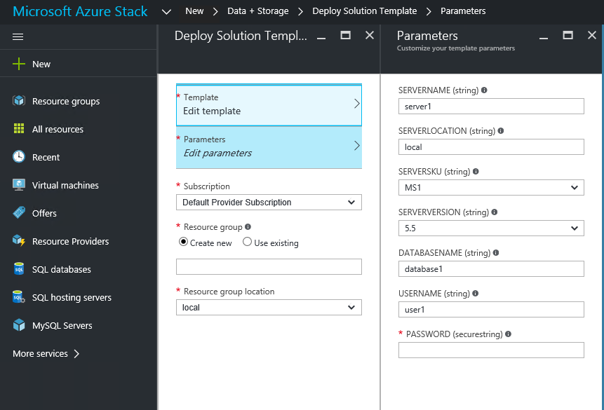

<properties
	pageTitle="Use MySQL databases as PaaS on Azure Stack | Microsoft Azure"
	description="Understand the quick steps to deploy the MySQL resource provider and provide MySQL as a service on Azure Stack."
	services="azure-stack"
	documentationCenter=""
	authors="JeffGo"
	editor=""/>

<tags
	ms.service="multiple"
	ms.workload="na"
	ms.tgt_pltfrm="na"
	ms.devlang="na"
	ms.topic="article"
	ms.date="10/20/2016"
	ms.author="jeffgo"/>

# Use MySQL databases as PaaS on Azure Stack

> [AZURE.NOTE] The following information only applies to Azure Stack TP2 deployments. There have been many changes since the TP1 release, so read this page carefully. Deployment now uses a single script.

You can deploy a MySQL resource provider on Azure Stack. After you deploy the resource provider, you can create MySQL servers and databases through Azure Resource Manager deployment templates and provide MySQL databases as a service. MySQL databases, which are common on web sites, support many website platforms. As an example, after you deploy the resource provider, you can create WordPress websites from the Azure Web Apps platform as a service (PaaS) add-on for Azure Stack.

To deploy the MySQL provider on a system that does not have internet access, you can copy the files [mysql-5.6.26-winx64.zip](https://dev.mysql.com/get/Downloads/MySQL-5.6/mysql-5.6.26-winx64.zip) and [mysql-5.5.44-winx64.zip](https://downloads.mysql.com/archives/get/file/mysql-5.5.44-winx64.zip) to a local share and provide that share name when prompted (see below).

> [AZURE.NOTE] The deployment script will perform retries, if necessary, to accommodate less reliable network connections or if an operation exceeds a timeout.

## Steps to deploy the resource provider

1.  [Download the MySQL resource provider binaries file](https://aka.ms/azurestackmysqlrptp2) and extract it on the Console VM in your Azure Stack proof of concept (PoC).

2. Open an elevated PowerShell console and change to the directory where you extracted the files.

3. Run DeployMySqlProvider.ps1.

This script will do all of the following:

		* If necessary, download a compatible version of Azure PowerShell.
		* Create a wildcard certificate to secure communication between the resource provider and Azure Resource Manager.
		* Download the MySQL binaries.
		* Upload the certificate and all other artifacts to an Azure Stack storage account.
		* Publish gallery packages so that you can deploy MySQL resources through the gallery.
		* Deploy a virtual machine (VM) that will host both your resource provider, MySQL servers and databases that you will instantiate.
		* Register a local DNS record that will map to your resource provider VM.
		* Register your resource provider with the local Azure Resource Manager.

The script prompts for required parameters:
| Parameter Name | Description | Comment 
| ---------------|-------------|--------
**AadTenantDirectoryName**|The Azure Active Directory Name|_required_
**AzCredential**|Azure Stack Service Admin account credential (use the same account as you used for deploying Azure Stack)|_required_
**LocalCredential**|The local administrator account of the SQL resource provider VM" and the password will also be used for the SQL **sa** account|_required_
**ResourceGroupName**|Resource Group for the items created by this script|Default: Microsoft-MySQL-RP1
**VmName**|Name of the VM holding the resource provider|Default: mysqlrp
**AcceptLicense**|Prompts to accept the GPL License Accept the terms of the GPL License (http://www.gnu.org/licenses/old-licenses/gpl-2.0.html)|No
**DependencyFilesLocalPath**|Path to a local share containing the MySQL files [mysql-5.6.26-winx64.zip](https://dev.mysql.com/get/Downloads/MySQL-5.6/mysql-5.6.26-winx64.zip) and [mysql-5.5.44-winx64.zip](https://downloads.mysql.com/archives/get/file/mysql-5.5.44-winx64.zip) |_leave blank to download from the internet_
**MaxRetryCount**|Each operation will be retried if there is a failure|5
**RetryDuration**|Timeout between retries, in seconds|300
|||

Depending on the system performance and download speeds, installation may take as little as 20 minutes or as long as several hours.

> [AZURE.NOTE] If the installation takes more than 90 minutes, it may fail and you will see a failure message on the screen and in the log file, but the deployment will be retried from the failing step. Systems that do not meet the minimum required memory and core specifications may not be able to deploy the MySQL RP.

## Create your first MySQL database to test your deployment

1. Sign in to the Azure Stack POC portal as service admin.

2. Click the **+ New** button &gt; **Data + Storage** &gt; **MySQL Server & database (preview)**.

3. Fill in the form with the database details.

	**Make a note of the "server name" you enter.** The connections string for your database includes the "server name" as part of the user name: for example, **"user@server1"**. You will need to input the user name in this format when you connect to a MySQL database: for example, when you deploy a MySQL web site using the Azure Web Site resource provider.

## Next steps

Create plans and offers to make MySQL databases available for tenants. You will need to add the Microsoft.MySql service, add a new quota, and accept the default values.

Try other [PaaS services](azure-stack-tools-paas-services.md) like the [SQL Server resource provider](azure-stack-sql-rp-deploy.md) and the [App Services resource provider](azure-stack-app-service-deploy.md).
