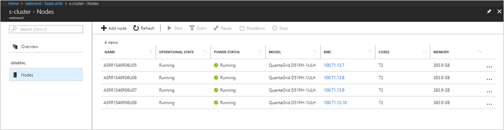

# Scale unit node actions in Azure Stack

*Applies to: Azure Stack integrated systems*

This article describes how to view the status of a scale unit. You can view the unit's nodes. You can run node actions such as power on, power off, shut down, drain, resume, and repair. Typically, you use these node actions during field replacement of parts, or to help recover a node.

> [!Important]  
> All node actions described in this article should target one node at a time.

## View the node status

In the administrator portal, you can view the status of a scale unit and its associated nodes.

To view the status of a scale unit:

1. On the **Region management** tile, select the region.
2. On the left, under **Infrastructure resources**, select **Scale units**.
3. In the results, select the scale unit.
4. On the left, under **General**, select **Nodes**.

  View the following information:

  - The list of individual nodes
  - Operational Status (see list below)
  - Power Status (running or stopped)
  - Server model
  - IP address of the baseboard management controller (BMC)
  - Total number of cores
  - Total amount of memory



### Node operational states

| Status | Description |
|----------------------|-------------------------------------------------------------------|
| Running | The node is actively participating in the scale unit. |
| Stopped | The node is unavailable. |
| Adding | The node is actively being added to the scale unit. |
| Repairing | The node is actively being repaired. |
| Maintenance | The node is paused, and no active user workload is running. |
| Requires Remediation | An error has been detected that requires the node to be repaired. |

## Scale unit node actions

When you view information about a scale unit node, you can also perform node actions such as:
 - Start and stop (depending on current power status)
 - Disable and resume (depending on operations status)
 - Repair
 - Shutdown

The operational state of the node determines which options are available.

You will need to install Azure Stack PowerShell modules. These cmdlets are in the **Azs.Fabric.Admin** module. To install or verify your installation of PowerShell for Azure Stack, see [Install PowerShell for Azure Stack](azure-stack-powershell-install.md).

## Stop

The **Stop** action turns off the node. It's the same as if you press the power button. It does not send a shutdown signal to the operating system. For planned stop operations, always try the shutdown operation first. 

This action is typically used when a node is in a hung state and no longer responds to requests.

To run the stop action, open an elevated PowerShell prompt, and run the following cmdlet:

```PowerShell  
  Stop-AzsScaleUnitNode -Location <RegionName> -Name <NodeName>
```

In the unlikely case that the stop action doesn't work, retry the operation and if it fails a second time use the BMC web interface instead.

For more information, see [Stop-AzsScaleUnitNode](https://docs.microsoft.com/powershell/module/azs.fabric.admin/stop-azsscaleunitnode).

## Start

The **start** action turns on the node. It's the same as if you press the power button. 
 
To run the start action, open an elevated PowerShell prompt, and run the following cmdlet:

```PowerShell  
  Start-AzsScaleUnitNode -Location <RegionName> -Name <NodeName>
```

In the unlikely case that the start action doesn't work, retry the operation and if it fails a second time use the BMC web interface instead.

For more information, see [Start-AzsScaleUnitNode](https://docs.microsoft.com/powershell/module/azs.fabric.admin/start-azsscaleunitnode).

## Drain

The **drain** action moves all active workloads to the remaining nodes in that particular scale unit.

This action is typically used during field replacement of parts, such as the replacement of an entire node.

> [!Important]
> Make sure that you use a drain operation on a node during a planned maintenance window, where users have been notified. Under some conditions, active workloads can experience interruptions.

To run the drain action, open an elevated PowerShell prompt, and run the following cmdlet:

```PowerShell  
  Disable-AzsScaleUnitNode -Location <RegionName> -Name <NodeName>
```

For more information, see [Disable-AzsScaleUnitNode](https://docs.microsoft.com/powershell/module/azs.fabric.admin/disable-azsscaleunitnode).

## Resume

The **resume** action resumes a disabled node and marks it active for workload placement. Earlier workloads that were running on the node do not fail back. (If you use a drain operation on a node be sure to power off. When you power the node back on, it's not marked as active for workload placement. When ready, you must use the resume action to mark the node as active.)

To run the resume action, open an elevated PowerShell prompt, and run the following cmdlet:

```PowerShell  
  Enable-AzsScaleUnitNode -Location <RegionName> -Name <NodeName>
```

For more information, see [Enable-AzsScaleUnitNode](https://docs.microsoft.com/powershell/module/azs.fabric.admin/enable-azsscaleunitnode).

## Repair

The **repair** action repairs a node. Use it only for either of the following scenarios:
 - Full node replacement (with or without new data disks)
 - After hardware component failure and replacement (if advised in the field replaceable unit (FRU) documentation).

> [!Important]  
> See your OEM hardware vendor's FRU documentation for exact steps when you need to replace a node or individual hardware components. The FRU documentation will specify whether you need to run the repair action after replacing a hardware component. 

When you run the repair action, you need to specify the BMC IP address. 

To run the repair action, open an elevated PowerShell prompt, and run the following cmdlet:

  ````PowerShell
  Repair-AzsScaleUnitNode -Location <RegionName> -Name <NodeName> -BMCIPv4Address <BMCIPv4Address>
  ````

## Next steps

To learn more about the Azure Stack Fabric administrator module, see [Azs.Fabric.Admin](https://docs.microsoft.com/powershell/module/azs.fabric.admin/?view=azurestackps-1.5.0).
