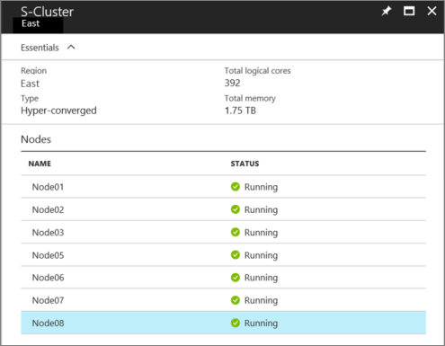
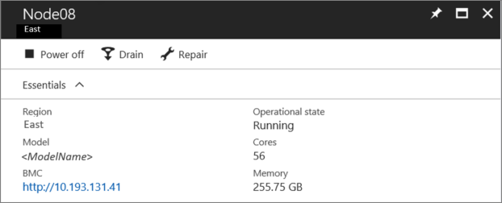

# Scale unit node actions in Azure Stack

*Applies to: Azure Stack integrated systems*

This article describes how to view the status of a scale unit and its associated nodes, and how to use the available node actions. Node actions include power on, power off, drain, resume, and repair. Typically, you use these node actions during field replacement of parts, or for node recovery scenarios.

## View the status of a scale unit and its nodes

In the administrator portal, you can easily view the status of a scale unit and its associated nodes.

To view the status of a scale unit:

1. On the **Region management** tile, select the region.
2. On the left, under **Infrastructure resources**, select **Scale units**.
3. In the results, select the scale unit.
 
Here, you can view the following information:

- region name
- type of system
- total logical cores
- total memory
- the list of individual nodes and their status; either Running or Stopped.



## View information about a scale unit node

If you select an individual node, you can view the following information:

- region name
- server model
- IP address of the baseboard management controller (BMC)
- operational state
- total number of cores
- total amount of memory
 


You can also perform scale unit node actions from here.

## Scale unit node actions

When you view information about a scale unit node, you can also perform node actions such as:

- power on and power off
- drain and resume
- repair

The operational state of the node determines which options are available.

### Power off

The **Power off** action turns off the node. It’s the same as if you press the power button. It does **not** send a shutdown signal to the operating system. For planned power off operations, make sure you drain a scale unit node first.

This action is typically used when a node is in a hung state and no longer responds to requests.  

To run the power off action through PowerShell:

  ````PowerShell
  Stop-AzsScaleUnitNode -Region <RegionName> -Name <NodeName>
  ```` 

In the unlikely case that the power off action doesn't work, use the BMC web interface instead.

### Power on

The **Power on** action turns on the node. It’s the same as if you press the power button. 

To run the power on action through PowerShell:

  ````PowerShell
  Start-AzsScaleUnitNode -Region <RegionName> -Name <NodeName>
  ````

In the unlikely case that the power on action doesn't work, use the BMC web interface instead.

### Drain

The **Drain** action evacuates all active workloads by distributing them among the remaining nodes in that particular scale unit.

This action is typically used during field replacement of parts, such as the replacement of an entire node.

> [!IMPORTANT]
> Make sure that you drain a node only during a planned maintenance window, where users have been notified. Under some conditions, active workloads can experience interruptions.

To run the drain action through PowerShell:

  ````PowerShell
  Disable-AzsScaleUnitNode -Region <RegionName> -Name <NodeName>
  ````

### Resume

The **Resume** action resumes a drained node and marks it active for workload placement. Earlier workloads that were running on the node do not fail back. (If you drain a node and then power off, when you power the node back on, it's not marked as active for workload placement. When ready, you must use the resume action to mark the node as active.)

To run the resume action through PowerShell:

  ````PowerShell
  Enable-AzsScaleUnitNode -Region <RegionName> -Name <NodeName>
  ````

### Repair

The **Repair** action repairs a node. Use it only for either of the following scenarios:

- Full node replacement (with or without new data disks)
- After hardware component failure and replacement (if advised in the field replaceable unit (FRU) documentation).

> [!IMPORTANT]
> See your OEM hardware vendor’s FRU documentation for exact steps when you need to replace a node or individual hardware components. The FRU documentation will specify whether you need to run the repair action after replacing a hardware component.  

When you run the repair action, you need to specify the BMC IP address. 

To run the repair action through PowerShell:

  ````PowerShell
  Repair-AzsScaleUnitNode -Region <RegionName> -Name <NodeName> -BMCIPAddress <BMCIPAddress>
  ````


