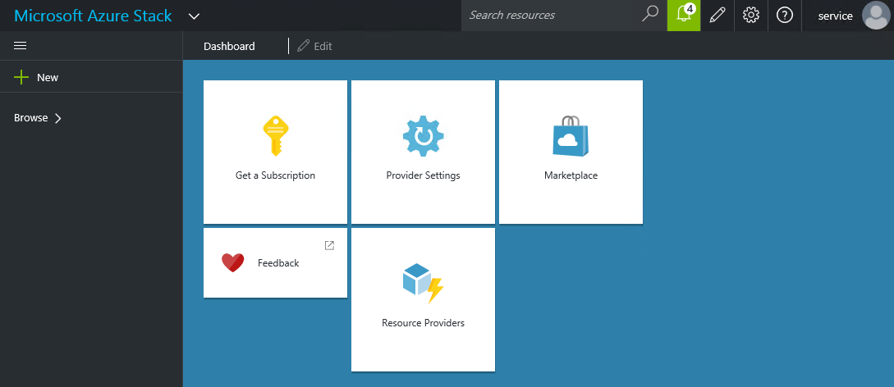

<properties
	pageTitle="Overview: Microsoft Azure Stack"
	description="Overview: Microsoft Azure Stack "
	services="azure-stack"
	documentationCenter=""
	authors="ErikjeMS"
	manager="byronr"
	editor=""/>

<tags
	ms.service="azure-stack"
	ms.workload="na"
	ms.tgt_pltfrm="na"
	ms.devlang="na"
	ms.topic="article"
	ms.date="05/25/2016"
	ms.author="erikje"/>

# Introduction to Azure Stack

Microsoft Azure Stack is a new hybrid cloud platform product that lets you deliver Azure services from your organization’s datacenter. The delivery and administration of these services is consistent with Azure, bringing the cloud model of computing to every datacenter. Azure stack delivers the power of Azure to your datacenter.

[AZURE.VIDEO an-early-look-at-azure-stack-and-what-it-means-for-it-with-jeffrey-snover]

>[AZURE.NOTE] The first release of Azure Stack is Technical Preview 1. Some of the features described will come at different times during the preview cycle.

## Maximize productivity

By using the power of Azure, you can focus on business innovation instead of spending time building your own cloud computing platform. For example, you can:

- Quickly provision and scale services from your datacenter resources using the same self-service experience found in Azure. 

- Use the same Azure management and automation tools for Azure Stack services in your organization’s hybrid cloud.

- Use APIs that are consistent across your on-premises and Azure environments, because Azure Stack is an extension of Azure.

- Enjoy a large ecosystem of operating systems, frameworks, languages, tools, and applications available in Azure and use them in your individual datacenters.

- Use the rich Azure ecosystem of templates, tools, and applications to jumpstart your Azure Stack development and operational efforts.

- Create applications based on a variety of technologies - like Windows, Linux, .NET, PHP, Ruby, or Java - that can be deployed and operated the same way on-premises or in Microsoft Azure datacenters.

All these benefits add up to an environment where application developers can maximize their productivity using a ‘write once, deploy to Azure or Azure Stack’ approach.

## Deliver consistency across clouds

Developers and IT pros will enjoy a consistent experience when working across Azure Stack and Azure because:

- The Azure Stack portal uses the same code as Azure.
- Azure Stack uses the same cloud API as Azure. 

In Azure Stack, the definition of self-service has evolved to include programmatic access to the cloud API for the creation, deployment, and operations of workloads in a cloud. Azure Stack includes experiences, tools, application patterns, automation capabilities, deployment and configuration, and operations that work across clouds. 

## Capabilities

Azure Stack includes a variety of features that showcase the breadth of impact you get from this hybrid cloud platform. Each feature supports your investments in people, processes, and technologies that are transferable between Azure and Azure Stack:

**Portal**: The Azure Stack portal is the graphic, web interface into the cloud API. Administrators and tenants use the portal to access a wide range of features and services.

  

**Tools**: You can use the tools that you use in Azure and know they will work in Azure Stack. You can focus on solving business problems, instead of deployment and tooling development. 

**Application patterns**: Programmatic and abundant access to cloud services is changing the way that applications are being designed, developed, and operated. You can work with the resources in your application as a group – mixing resources across IaaS and PaaS services. 

**Automation capabilities**: The consistent API means that you can create automation for development, deployment, and operational activities knowing that you won’t have to rewrite the automation for other cloud suppliers that use Azure services.

**Deployment and configuration**: Deploy, update, or delete all of the resources for your application in a single, coordinated operation. This can be done from the portal or programmatically using the SDK. 

**Operations**: You can use templated deployments across different environments, like testing, staging, and production. Role-based access control, usage, and audit capabilities are standardized across all cloud resources in the deployment. Updates made to application resources can be performed in an incremental and non-destructive manner.

## Next steps

[What is Azure Stack Technical Preview 1?](azure-stack-poc.md)
