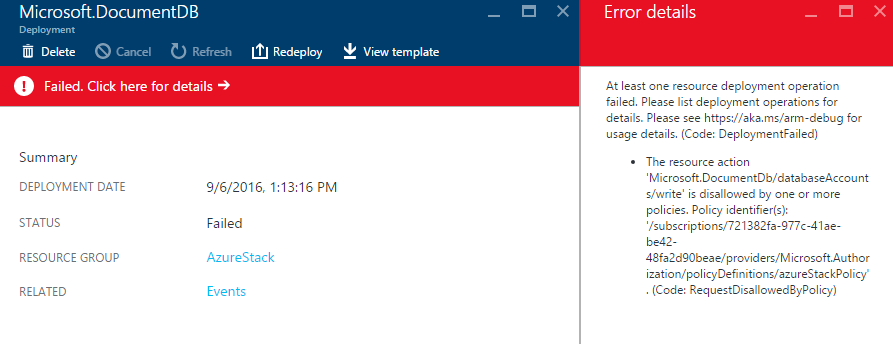

# Manage Azure policy using the Azure Stack Policy Module
The Azure Stack Policy module allows you to configure an Azure subscription with the same versioning and service availability as Azure Stack.  The module uses the **New-AzureRMPolicyAssignment** cmdlet to create an Azure policy, which limits the APIs and services available in a subscription.  Once complete, you can use your Azure subscription to develop apps for Azure Stack.  

## Install the module
1. [Install the AzureRM module](azure-stack-connect-powershell.md) for Azure Stack.   
2. Download the Azure Stack Tools scripts.  These support files can be downloaded by either browsing to the [GitHub repository](https://github.com/Azure/AzureStack-Tools), or running the following Windows PowerShell script as an administrator:
   
   > [!NOTE]
   > The following steps require PowerShell 5.0.  To check your version, run $PSVersionTable.PSVersion and compare the "Major" version.  
   > 
   > 
   
    ```PowerShell
   
       #Download the tools archive
       invoke-webrequest https://github.com/Azure/AzureStack-Tools/archive/master.zip -OutFile master.zip
   
       #Expand the downloaded files. 
       expand-archive master.zip -DestinationPath . -Force
   
       #Change to the tools directory
       cd AzureStack-Tools-master
    ````
3. In the same PowerShell session, navigate to the **Policy** folder, and import the AzureStack.Policy.psm1 module:
   
   ```none
   cd Policy
   import-module .\AzureStack.Policy.psm1
   ```

## Apply policy to subscription
The following command can be used to apply a default Azure Stack policy against your Azure subscription. Before running, replace *Azure Subscription Name* with your Azure subscription.

```none
Login-AzureRmAccount
$s = Select-AzureRmSubscription -SubscriptionName "Azure Subscription Name"
$policy = New-AzureRmPolicyDefinition -Name AzureStack -Policy (Get-AzureStackRmPolicy)
New-AzureRmPolicyAssignment -Name AzureStack -PolicyDefinition $policy -Scope /subscriptions/$s.Subscription.SubscriptionId
```

## Apply policy to a resource group
You may want to apply policies in a more granular method.  As an example, you may have other resources running in the same subscription.  You can scope the policy application to a specific resource group, which lets you test your apps for Azure Stack using Azure resources. Before running, replace *Azure Subscription Name* with your Azure subscription name.

```none
Login-AzureRmAccount
$resourceGroupName = ‘myRG01’
$s = Select-AzureRmSubscription -SubscriptionName "<Azure Subscription Name>"
$policy = New-AzureRmPolicyDefinition -Name AzureStack -Policy (Get-AzureStackRmPolicy)
New-AzureRmPolicyAssignment -Name AzureStack -PolicyDefinition $policy -Scope /subscriptions/$s.Subscription.SubscriptionId/$resourceGroupName

```

## Policy in action
Once you've deployed the Azure policy, you receive an error when you try to deploy a resource that prohibited by policy.  



## Next steps
[Deploy templates with PowerShell](azure-stack-deploy-template-powershell.md)

[Deploy templates with Azure CLI](azure-stack-deploy-template-command-line.md)

[Deploy Templates with Visual Studio](azure-stack-deploy-template-visual-studio.md)

