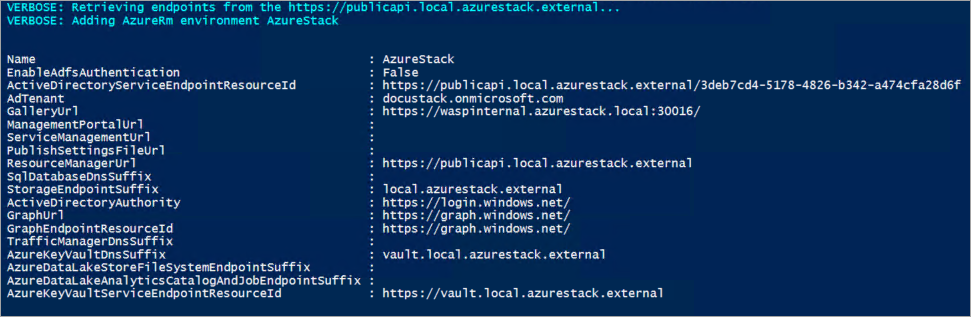
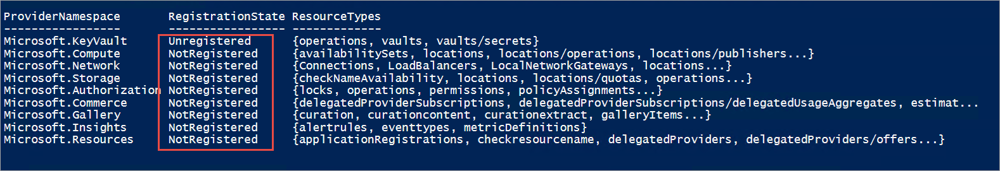
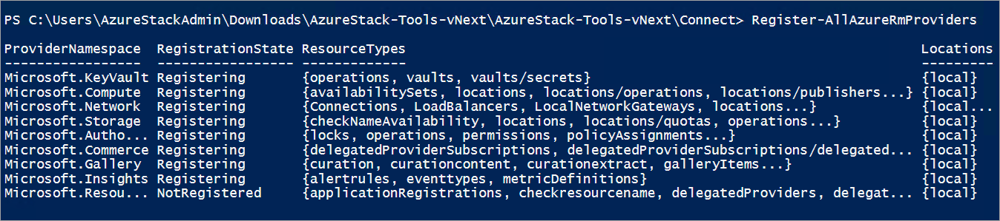

# Configure PowerShell for use with Azure Stack 

This article describes the steps required to connect to an Azure Stack proof-of-concept (POC) instance by using PowerShell. After you connect, you can access the portal and deploy resources through PowerShell. You can use the steps described in this article either from the Azure Stack POC computer, or from a Windows-based external client if you are connected through VPN.

This article has detailed instructions to configure PowerShell for Azure Stack. However, if you want to quickly install and configure PowerShell, you can use the script provided in the [Get up and running with PowerShell](azure-stack-powershell-configure-quickstart.md) topic. 

## Prerequisites
* Install [Azure Stack-compatible Azure PowerShell modules](azure-stack-powershell-install.md).  
* Download the [tools required to work with Azure Stack](azure-stack-powershell-download.md).  

## Import the Connect PowerShell module

After you download the required tools, navigate to the downloaded folder and import the **Connect** PowerShell module. To import the Connect module, run the following command in an elevated PowerShell session:

```PowerShell
Set-ExecutionPolicy RemoteSigned
Import-Module .\Connect\AzureStack.Connect.psm1
```

## Configure the PowerShell environment

To configure your Azure Stack environment, do the following:

1. Register an AzureRM environment that targets your Azure Stack instance by using one of the following cmdlets:

   * **Administrative environment**

       ```PowerShell
       Add-AzureStackAzureRmEnvironment `
         -Name "AzureStackAdmin" `
         -ArmEndpoint "https://adminmanagement.local.azurestack.external"
       ```

   * **User environment**

       ```PowerShell
       Add-AzureStackAzureRmEnvironment `
         -Name "AzureStackUser" `
         -ArmEndpoint "https://management.local.azurestack.external" 
       ```
   
   After you've registered the AzureRM environment, you can use all the AzureRM cmdlets in your Azure Stack environment. The output of the previous cmdlet is shown in the following screenshot:

   

2. Get the GUID value of the Active Directory tenant that is used to deploy Azure Stack. If your Azure Stack environment is deployed, use:  

   * **Azure Active Directory (Azure AD)**
   
      * To access the **administrative environment**, use:
        ```PowerShell
        $TenantID = Get-AzsDirectoryTenantId `
          -AADTenantName "<myDirectoryTenantName>.onmicrosoft.com" `
          -EnvironmentName AzureStackAdmin
        ```

      * To access the **user environment**, use:
        ```PowerShell
        $TenantID = Get-AzsDirectoryTenantId `
          -AADTenantName "<myDirectoryTenantName>.onmicrosoft.com" `
          -EnvironmentName AzureStackUser
        ```

   * **Active Directory Federation Services**
   
      * To access the **administrative environment**, use:
        ```PowerShell
        $TenantID = Get-AzsDirectoryTenantId `
          -ADFS `
          -EnvironmentName AzureStackAdmin
        ```

      * To access the **user environment**, use:
        ```PowerShell 
        $TenantID = Get-AzsDirectoryTenantId `
          -ADFS `
          -EnvironmentName AzureStackUser 
        ```

## Sign in to Azure Stack

To sign in to your Azure Stack environment, do the following:

1. Sign in to the Azure Stack environment by using one of the following two cmdlets:

   * To sign in to the **administrative portal**, use:
    
       ```PowerShell
       Login-AzureRmAccount `
         -EnvironmentName "AzureStackAdmin" `
         -TenantId $TenantID `
       ```

   * To sign in to the **user portal**, use:

       ```PowerShell
       Login-AzureRmAccount `
         -EnvironmentName "AzureStackUser" `
         -TenantId $TenantID `
       ```

## Register resource providers 

After you sign in to the administrator or user portal, you can issue operations against the registered resource providers. By default, all the foundational resource providers are registered in the **Default Provider Subscription (administrator subscription)**. 

When you operate on a newly created user subscription, which doesn’t have any resources deployed through the portal, the resource providers aren't automatically registered. For example, when you look at the output of the following cmdlet, you can see that the registration state is *Unregistered*.

```PowerShell
  Get-AzureRmResourceProvider `
    -ListAvailable 
```

  

Before you use these resource providers, you should explicitly register them in the user subscriptions. To register providers on the current subscription, use the following command:

```PowerShell
Register-AllAzureRmProviders
```

  

To register all the resource providers on all your subscriptions, use the following command:

```PowerShell
Register-AllAzureRmProvidersOnAllSubscriptions
```

## Next steps
* [Develop templates for Azure Stack](azure-stack-develop-templates.md)
* [Deploy templates with PowerShell](azure-stack-deploy-template-powershell.md)
