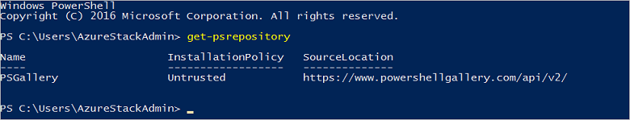

# Install PowerShell for Azure Stack  

Azure Stack compatible Azure PowerShell modules are required to work with Azure Stack. In this guide, we walk you through the steps required to install PowerShell in Azure Stack by using the PowerShell commands. You can use the steps described in this article either from the Azure Stack POC computer, or from a Windows-based external client if you are connected through VPN.

> [!NOTE]
> The following steps require PowerShell 5.0.  To check your version, run $PSVersionTable.PSVersion and compare the "Major" version.

PowerShell commands for Azure Stack are installed from the PowerShell Gallery. To verify if PowerShell Gallery is available, open a PowerShell session on the MAS-CON01 computer or on your local computer if you are connected through VPN and run the following command:

```powershell
# Returns a list of PowerShell module repositories that are registered for the current user.
Get-PSRepository
```


## Install the required version of PowerShell modules

Before installing the required version, make sure that you uninstall any existing Azure PowerShell modules. You can uninstall the existing modules by using one of the following two methods:

a. To uninstall the existing PowerShell modules, sign in to your Azure Stack POC computer, or to the Windows-based external client if you are planning to establish a VPN connection. Close all the active PowerShell sessions and run the following command: 

   ```powershell
   Get-Module -ListAvailable | where-Object {$_.Name -like “Azure*”} | Uninstall-Module
   ```

b. Sign in to your Azure Stack POC computer, or to the Windows-based external client if you are planning to establish a VPN connection. Delete all the folders that start with "Azure" from the `C:\Program Files\WindowsPowerShell\Modules` and `C:\Users\AzureStackAdmin\Documents\WindowsPowerShell\Modules` folders. Deleting these folders removes any existing PowerShell modules from the "AzureStackAdmin" and "global" user scopes. 

Now, use the following steps to install PowerShell for Azure Stack:  

1. Azure Stack compatible AzureRM modules are installed through API version profiles.
To learn about API version profiles and the cmdlets provided by them,
refer to the [manage API version profiles](azure-stack-version-profiles.md)
article. The AzureRM.Bootstrapper module provides PowerShell commands that are 
required to work with API version profiles. Use the following 
command to install the AzureRM.Bootstrapper module:  

  ```powershell
  # Install the AzureRM.Bootstrapper module
  Install-Module `
    -Name AzureRm.BootStrapper
  ```
2. Run the following command to install the **2017-03-09-profile** version of the 
AzureRM modules for Compute, Storage, Network, Key Vault etc.  

  ```powershell
  # Install and import the API Version Profile required by Azure Stack into the current PowerShell session.
  Use-AzureRmProfile `
    -Profile 2017-03-09-profile
  ```
3. In addition to the AzureRM modules, you should also install the Azure Stack-specific PowerShell modules such as AzureStackAdmin, and AzureStackStorage by running the following command:  

  ```powershell
  Install-Module `
    -Name AzureStack `
    -RequiredVersion 1.2.9
  ```
4. To confirm the installation, run the following command:  

  ```powershell
  Get-Module `
    -ListAvailable | where-Object {$_.Name -like “Azure*”}
  ```
  If the installation is successful, the AzureRM and AzureStack modules are displayed in the output.

## Next steps

* [Download Azure Stack tools from GitHub](azure-stack-powershell-download.md)
* [Configure PowerShell for use with Azure Stack](azure-stack-powershell-configure.md)  
* [Manage API version profiles in Azure Stack](azure-stack-version-profiles.md)  
