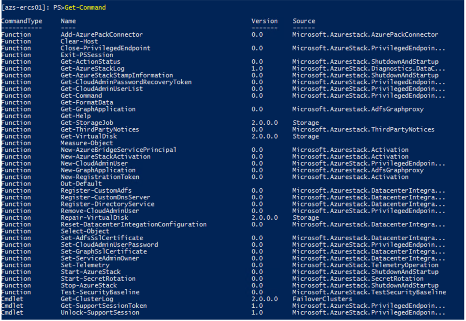

# Using the privileged endpoint in Azure Stack

*Applies to: Azure Stack integrated systems and Azure Stack Development Kit*

As an Azure Stack operator, you should use the administrator portal, PowerShell, or Azure Resource Manager APIs for most day-to-day management tasks. However, for some less common operations, you need to use the *privileged endpoint*. This endpoint is a pre-configured remote PowerShell console that provides you with just enough capabilities to help you perform a required task. The endpoint leverages PowerShell JEA (Just Enough Administration) to expose only a restricted set of cmdlets. To access the privileged endpoint and invoke the restricted set of cmdlets, a low-privileged account is used. No administrator accounts are required. For additional security, scripting is not allowed.

You can use the privileged endpoint to perform tasks such as the following:

- To perform low-level tasks, such as [collecting diagnostic logs](https://docs.microsoft.com/azure/azure-stack/azure-stack-diagnostics#log-collection-tool).
- To perform many post-deployment datacenter integration tasks for integrated systems, such as adding Domain Name System (DNS) forwarders after deployment, setting up Graph integration, Active Directory Federation Services (AD FS) integration, certificate rotation, etc.
- To work with Support to obtain temporary, high-level access for in-depth troubleshooting of an integrated system. 

The privileged endpoint logs every action (and its corresponding output) that you perform in the PowerShell session. This provides full transparency and complete auditing of operations. You can retain these log files for future auditing purposes.

> [!NOTE]
> In Azure Stack Development Kit (ASDK), you can run some of the commands available in the privileged endpoint directly from a PowerShell session on the development kit host. However, you may want to test out some operations using the privileged endpoint, such as log collection, because this is the only method available to perform certain operations in an integrated systems environment.

## Access the privileged endpoint

You access the privileged endpoint through a remote PowerShell session on the virtual machine that hosts the privileged endpoint. In the ASDK, this virtual machine is named AzS-ERCS01. If you’re using an integrated system, there are three instances of the privileged endpoint, each running inside a virtual machine (*Prefix*-ERCS01, *Prefix-ERCS02*, or *Prefix*-ERCS03) on different hosts for resiliency. 

Before you begin this procedure for an integrated system, make sure you can access a privileged endpoint either by IP address, or through DNS. After initial deployment of Azure Stack, you can access the privileged endpoint only by IP address because DNS integration is not yet set up. Your OEM hardware vendor will provide you with a JSON file named "AzureStackStampDeploymentInfo" that contains the privileged endpoint IP addresses.

We recommend that you connect to the privileged endpoint only from the hardware lifecycle host or from a dedicated, locked down computer, like a [Privileged Access Workstation](https://docs.microsoft.com/windows-server/identity/securing-privileged-access/privileged-access-workstations).

1. Do either of the following depending on your environment:

    - On an integrated system, run the following command to add the privileged endpoint as a trusted host on your hardware lifecycle host or Privileged Access Workstation.

      ````PowerShell
        winrm s winrm/config/client '@{TrustedHosts="<IP Address of Privileged Endpoint>"}'
      ````
     - If you’re running the ADSK, sign in to the development kit host.

2. On your hardware lifecycle host or Privileged Access Workstation, open an elevated Windows PowerShell session. Run the following commands to establish a remote session on the virtual machine that hosts the privileged endpoint:
 
    - On an integrated system:
      ````PowerShell
        $cred = Get-Credential

        Enter-PSSession -ComputerName <IP_address_of_ERCS>`
          -ConfigurationName PrivilegedEndpoint -Credential $cred
      ````
      The `ComputerName` parameter can either be the IP address or the DNS name of one of the virtual machines that hosts a privileged endpoint. 
    - If you’re running the ADSK:
     
      ````PowerShell
        $cred = Get-Credential

        Enter-PSSession -ComputerName <azs-ercs01>`
          -ConfigurationName PrivilegedEndpoint -Credential $cred
      ```` 
   When prompted, use the following credentials:

    - **User name**: Specify the CloudAdmin account, in the format **&lt;*Azure Stack domain*&gt;\cloudadmin**. (For ASDK, the user name is **azurestack\cloudadmin**.)
    - **Password**: Enter the same password that was provided during installation for the AzureStackAdmin domain administrator account.
    
3.	After you connect, the prompt will change to **[*IP address or ERCS VM name*]: PS>** or to **[azs-ercs01]: PS>**, depending on the environment. From here, run `Get-Command` to view the list of available cmdlets.

    

    Many of these cmdlets are intended only for integrated system environments (such as the cmdlets related to datacenter integration). In the ASDK, the following cmdlets have been validated:

    - Clear-Host
    - Close-PrivilegedEndpoint
    - Exit-PSSession
    - Get-AzureStackLog
    - Get-AzureStackStampInformation
    - Get-Command
    - Get-FormatData
    - Get-Help
    - Get-ThirdPartyNotices
    - Measure-Object
    - New-CloudAdminUser
    - Out-Default
    - Remove-CloudAdminUser
    - Select-Object
    - Set-CloudAdminUserPassword
    - Stop-AzureStack
    - Get-ClusterLog

4.	Because scripting is not allowed, you can’t use tab completion for parameter values. To get the list of parameters for a given cmdlet, run the following command:

    ````PowerShell
    Get-Command <command_name> -Syntax
    ```` 
> [!NOTE]
> Any type of script operation will fail with the error **ScriptsNotAllowed**. This behavior is expected.

## Close the privileged endpoint session

 As mentioned earlier, the privileged endpoint logs every action (and its corresponding output) that you perform in the PowerShell session. You should close the session by using the  `Close-PrivilegedEndpoint` cmdlet. This cmdlet correctly closes the endpoint, and transfers the log files to an external file share for retention.

To close the endpoint session:

1. Create an external file share that is accessible by the privileged endpoint. In a development kit environment, you can just create a file share on the development kit host.
2. Run the `Close-PrivilegedEndpoint` cmdlet. 
3. You're prompted for a path on which to store the transcript log file. Specify the file share that you created earlier, in the format &#92;&#92;*servername*&#92;*sharename*. If you don’t specify a path, the cmdlet fails and the session remains open. 

    

After the transcript log files are successfully transferred to the file share, they're automatically deleted from the privileged endpoint. If you close the privileged endpoint session by using the cmdlets `Exit-PSSession` or `Exit`, or you just close the PowerShell console, the transcript logs don't transfer to a file share. They remain in the privileged endpoint. The next time you run `Close-PrivilegedEndpoint` and include a file share, the transcript logs from the previous session(s) will also transfer.

## Next steps
[Azure Stack diagnostic tools](azure-stack-diagnostics.md)


