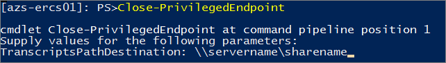

---
title: Using the privileged endpoint in Azure Stack | Microsoft Docs
description: Shows how to use the privileged endpoint (PEP) in Azure Stack (for an Azure Stack operator).
services: azure-stack
documentationcenter: ''
author: mattbriggs
manager: femila
editor: ''

ms.service: azure-stack
ms.workload: na
ms.tgt_pltfrm: na
ms.devlang: na
ms.topic: article
ms.date: 09/10/2018
ms.author: mabrigg
ms.reviewer: fiseraci

---
# Using the privileged endpoint in Azure Stack

*Applies to: Azure Stack integrated systems and Azure Stack Development Kit*

As an Azure Stack operator, you should use the administrator portal, PowerShell, or Azure Resource Manager APIs for most day-to-day management tasks. However, for some less common operations, you need to use the *privileged endpoint* (PEP). The PEP is a pre-configured remote PowerShell console that provides you with just enough capabilities to help you perform a required task. The endpoint uses [PowerShell JEA (Just Enough Administration)](https://docs.microsoft.com/powershell/jea/overview) to expose only a restricted set of cmdlets. To access the PEP and invoke the restricted set of cmdlets, a low-privileged account is used. No administrator accounts are required. For additional security, scripting is not allowed.

You can use the PEP to perform tasks such as the following:

- To perform low-level tasks, such as [collecting diagnostic logs](https://docs.microsoft.com/azure/azure-stack/azure-stack-diagnostics#log-collection-tool).
- To perform many post-deployment datacenter integration tasks for integrated systems, such as adding Domain Name System (DNS) forwarders after deployment, setting up Microsoft Graph integration, Active Directory Federation Services (AD FS) integration, certificate rotation, etc.
- To work with Support to obtain temporary, high-level access for in-depth troubleshooting of an integrated system.

The PEP logs every action (and its corresponding output) that you perform in the PowerShell session. This provides full transparency and complete auditing of operations. You can retain these log files for future audits.

> [!NOTE]
> In the Azure Stack Development Kit (ASDK), you can run some of the commands available in the PEP directly from a PowerShell session on the development kit host. However, you may want to test some operations using the PEP, such as log collection, because this is the only method available to perform certain operations in an integrated systems environment.

## Access the privileged endpoint

You access the PEP through a remote PowerShell session on the virtual machine that hosts the PEP. In the ASDK, this virtual machine is named **AzS-ERCS01**. If you’re using an integrated system, there are three instances of the PEP, each running inside a virtual machine (*Prefix*-ERCS01, *Prefix*-ERCS02, or *Prefix*-ERCS03) on different hosts for resiliency. 

Before you begin this procedure for an integrated system, make sure you can access the PEP either by IP address, or through DNS. After the initial deployment of Azure Stack, you can access the PEP only by IP address because DNS integration is not yet set up. Your OEM hardware vendor will provide you with a JSON file named **AzureStackStampDeploymentInfo** that contains the PEP IP addresses.


> [!NOTE]
> For security reasons, we require that you connect to the PEP only from a hardened virtual machine running on top of the hardware lifecycle host, or from a dedicated, secure computer, such as a [Privileged Access Workstation](https://docs.microsoft.com/windows-server/identity/securing-privileged-access/privileged-access-workstations). The original configuration of the hardware lifecycle host must not be modified from its original configuration, including installing new software, nor it should be used to connect to the PEP.

1. Establish the trust.

    - On an integrated system, run the following command from an elevated Windows PowerShell session to add the PEP as a trusted host on the hardened virtual machine running on the hardware lifecycle host or the Privileged Access Workstation.

      ````PowerShell
        winrm s winrm/config/client '@{TrustedHosts="<IP Address of Privileged Endpoint>"}'
      ````
    - If you’re running the ADSK, sign in to the development kit host.

2. On the hardened virtual machine running on the hardware lifecycle host or the Privileged Access Workstation, open a Windows PowerShell session. Run the following commands to establish a remote session on the virtual machine that hosts the PEP:
 
    - On an integrated system:
      ````PowerShell
        $cred = Get-Credential

        Enter-PSSession -ComputerName <IP_address_of_ERCS> `
          -ConfigurationName PrivilegedEndpoint -Credential $cred
      ````
      The `ComputerName` parameter can be either the IP address or the DNS name of one of the virtual machines that hosts the PEP. 
    - If you’re running the ADSK:
     
      ````PowerShell
        $cred = Get-Credential

        Enter-PSSession -ComputerName azs-ercs01 `
          -ConfigurationName PrivilegedEndpoint -Credential $cred
      ```` 
   When prompted, use the following credentials:

      - **User name**: Specify the CloudAdmin account, in the format **&lt;*Azure Stack domain*&gt;\cloudadmin**. (For ASDK, the user name is **azurestack\cloudadmin**.)
      - **Password**: Enter the same password that was provided during installation for the AzureStackAdmin domain administrator account.

    > [!NOTE]
    > If you are unable to connect to the ERCS endpoint, try steps one and two again with the IP address of an ERCS VM to which you haven't already tried to connect.

3.	After you connect, the prompt will change to **[*IP address or ERCS VM name*]: PS>** or to **[azs-ercs01]: PS>**, depending on the environment. From here, run `Get-Command` to view the list of available cmdlets.

    Many of these cmdlets are intended only for integrated system environments (such as the cmdlets related to datacenter integration). In the ASDK, the following cmdlets have been validated:

    - Clear-Host
    - Close-PrivilegedEndpoint
    - Exit-PSSession
    - Get-AzureStackLog
    - Get-AzureStackStampInformation
    - Get-Command
    - Get-FormatData
    - Get-Help
    - Get-ThirdPartyNotices
    - Measure-Object
    - New-CloudAdminUser
    - Out-Default
    - Remove-CloudAdminUser
    - Select-Object
    - Set-CloudAdminUserPassword
    - Test-AzureStack
    - Stop-AzureStack
    - Get-ClusterLog

## Tips for using the privileged endpoint 

As mentioned above, the PEP is a [PowerShell JEA](https://docs.microsoft.com/powershell/jea/overview) endpoint. While providing a strong security layer, a JEA endpoint reduces some of the basic PowerShell capabilities, such as scripting or tab completion. If you try any type of script operation, the operation fails with the error **ScriptsNotAllowed**. This is expected behavior.

So, for instance, to get the list of parameters for a given cmdlet, you run the following command:

```PowerShell
    Get-Command <cmdlet_name> -Syntax
```

Alternatively, you can use the [Import-PSSession](https://docs.microsoft.com/powershell/module/Microsoft.PowerShell.Utility/Import-PSSession?view=powershell-5.1) cmdlet to import all the PEP cmdlets into the current session on your local machine. By doing so, all cmdlets and functions of the PEP are now available on your local machine, together with tab completion and, more in general, scripting. 

To import the PEP session on your local machine, do the following steps:

1. Establish the trust.

    -On an integrated system, run the following command from an elevated Windows PowerShell session to add the PEP as a trusted host on the hardened virtual machine running on the hardware lifecycle host or the Privileged Access Workstation.

      ````PowerShell
        winrm s winrm/config/client '@{TrustedHosts="<IP Address of Privileged Endpoint>"}'
      ````
    - If you’re running the ADSK, sign in to the development kit host.

2. On the hardened virtual machine running on the hardware lifecycle host or the Privileged Access Workstation, open a Windows PowerShell session. Run the following commands to establish a remote session on the virtual machine that hosts the PEP:
 
    - On an integrated system:
      ````PowerShell
        $cred = Get-Credential

        $session = New-PSSession -ComputerName <IP_address_of_ERCS> `
          -ConfigurationName PrivilegedEndpoint -Credential $cred
      ````
      The `ComputerName` parameter can be either the IP address or the DNS name of one of the virtual machines that hosts the PEP. 
    - If you’re running the ADSK:
     
      ````PowerShell
       $cred = Get-Credential

       $session = New-PSSession -ComputerName azs-ercs01 `
          -ConfigurationName PrivilegedEndpoint -Credential $cred
      ```` 
   When prompted, use the following credentials:

      - **User name**: Specify the CloudAdmin account, in the format **&lt;*Azure Stack domain*&gt;\cloudadmin**. (For ASDK, the user name is **azurestack\cloudadmin**.)
      - **Password**: Enter the same password that was provided during installation for the AzureStackAdmin domain administrator account.

3. Import the PEP session into your local machine
	````PowerShell 
    	Import-PSSession $session
    ````
4. Now, you can use tab-completion and do scripting as usual on your local PowerShell session with all the functions and cmdlets of the PEP, without decreasing the security posture of Azure Stack. Enjoy!


## Close the privileged endpoint session

 As mentioned earlier, the PEP logs every action (and its corresponding output) that you perform in the PowerShell session. You must close the session by using the  `Close-PrivilegedEndpoint` cmdlet. This cmdlet correctly closes the endpoint, and transfers the log files to an external file share for retention.

To close the endpoint session:

1. Create an external file share that is accessible by the PEP. In a development kit environment, you can just create a file share on the development kit host.
2. Run the `Close-PrivilegedEndpoint` cmdlet. 
3. You're prompted for a path on which to store the transcript log file. Specify the file share that you created earlier, in the format &#92;&#92;*servername*&#92;*sharename*. If you don’t specify a path, the cmdlet fails and the session remains open. 

    

After the transcript log files are successfully transferred to the file share, they're automatically deleted from the PEP. 

> [!NOTE]
> If you close the PEP session by using the cmdlets `Exit-PSSession` or `Exit`, or you just close the PowerShell console, the transcript logs don't transfer to a file share. They remain in the PEP. The next time you run `Close-PrivilegedEndpoint` and include a file share, the transcript logs from the previous session(s) will also transfer. Do not use `Exit-PSSession` or `Exit` to close the PEP session; use `Close-PrivilegedEndpoint` instead.


## Next steps
[Azure Stack diagnostic tools](azure-stack-diagnostics.md)
