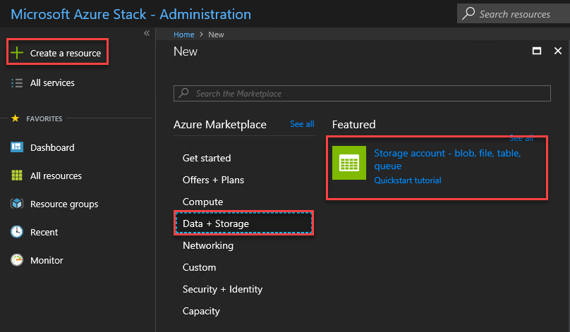
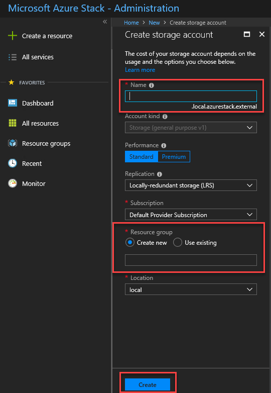
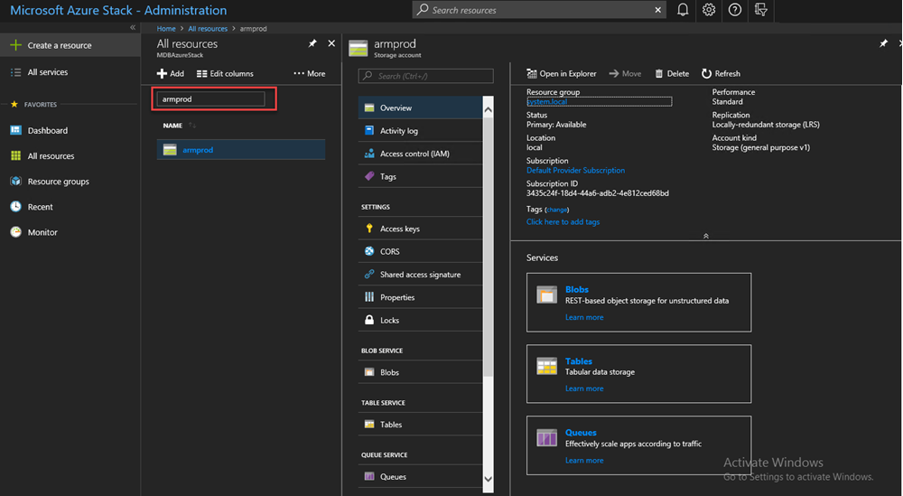

# Storage accounts in Azure Stack
Storage accounts include Blob and Table services, and the unique namespace for your storage data objects. By default, the data in your account is available only to you, the storage account owner.

1. On the Azure Stack POC computer, sign in to `https://adminportal.local.azurestack.external` as [an admin](azure-stack-connect-azure-stack.md), and then click **+ Create a resource** > **Data + Storage** > **Storage account**.

   
2. In the **Create storage account** blade, type a name for your storage account. Create a new **Resource Group**, or select an existing one, then click **Create** to create the storage account.

   
3. To see your new storage account, click **All resources**, then search for the storage account and click its name.

    

### Next steps
[Use Azure Resource Manager templates](user/azure-stack-arm-templates.md)

[Learn about Azure storage accounts](../storage/common/storage-create-storage-account.md)

[Download the Azure Stack Azure-consistent Storage Validation Guide](http://aka.ms/azurestacktp1doc)
