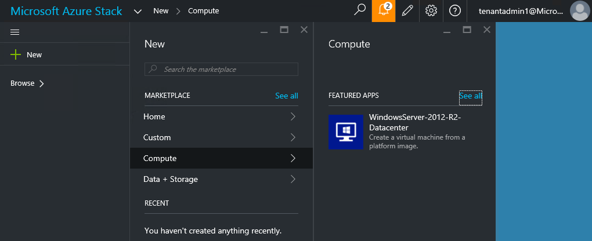
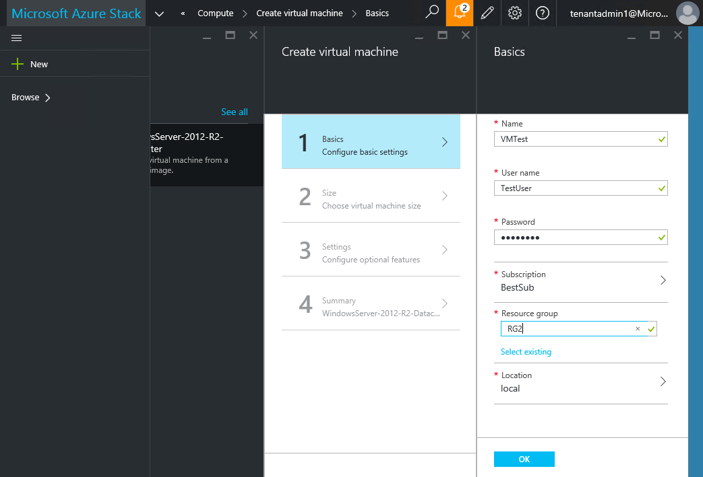
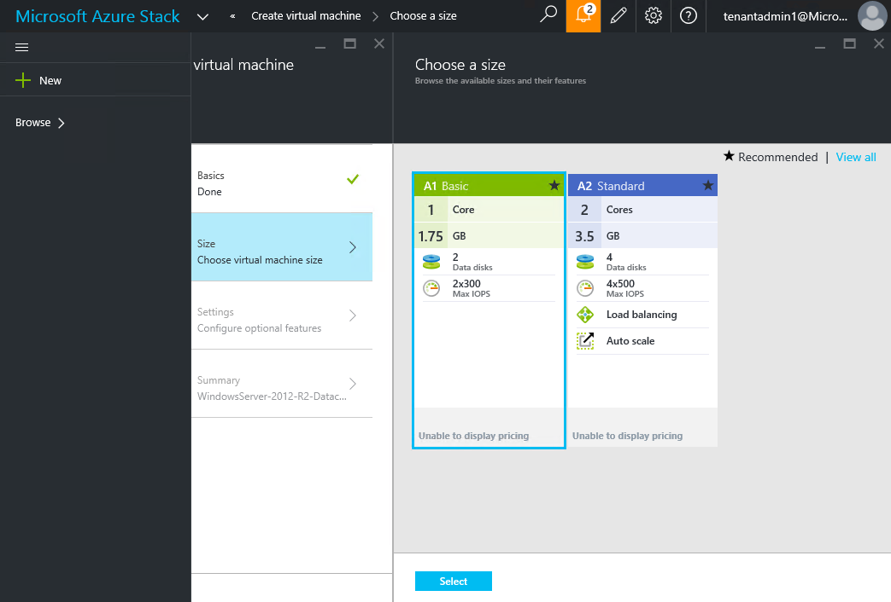
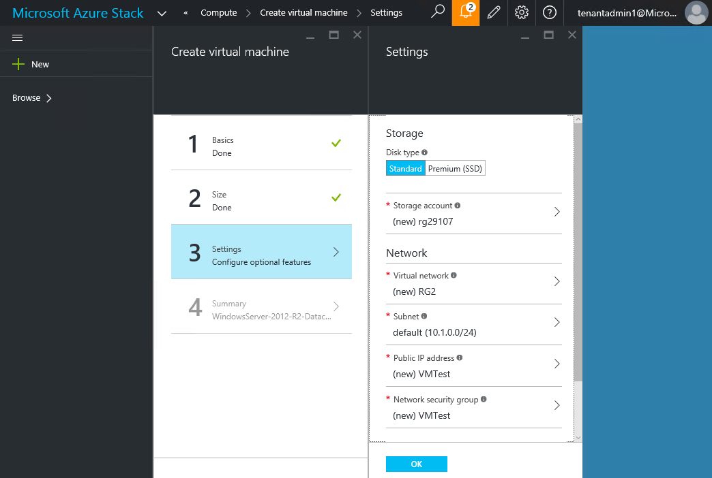
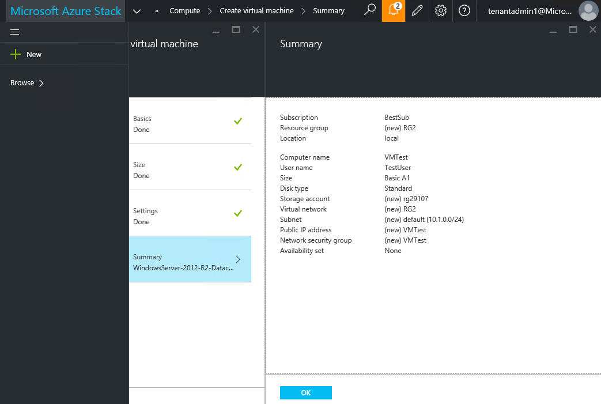

<properties
	pageTitle="Subscribe to an offer and then provision a VM in Azure Stack (tenant) | Microsoft Azure"
	description="As a tenant, learn how to subscribe to an offer and then provision a VM in Azure Stack."
	services="azure-stack"
	documentationCenter=""
	authors="ErikjeMS"
	manager="byronr"
	editor=""/>

<tags
	ms.service="azure-stack"
	ms.workload="na"
	ms.tgt_pltfrm="na"
	ms.devlang="na"
	ms.topic="get-started-article"
	ms.date="08/01/2016"
	ms.author="erikje"/>

# Provision a virtual machine

Now that you've created a subscription, test that your tenants can provision a virtual machine.

1.  Click **New**, click **Compute**, and then click **WindowsServer-2012-R2-Datacenter**.  

	

2.  In the **Basics** blade, type a **Name**, **User name**, **Password**, and **Resource Group,** and then click **OK**.  

	

3.  In the **Choose a size** blade, click **A1 Basic**, and then click **Select**.  

	

4.  In the **Settings** blade, accept all the defaults and click **OK**.  

	

5.  In the **Summary** blade, click **OK** to create the virtual machine.  

	

## Next steps

[Storage accounts](azure-stack-provision-storage-account.md)
