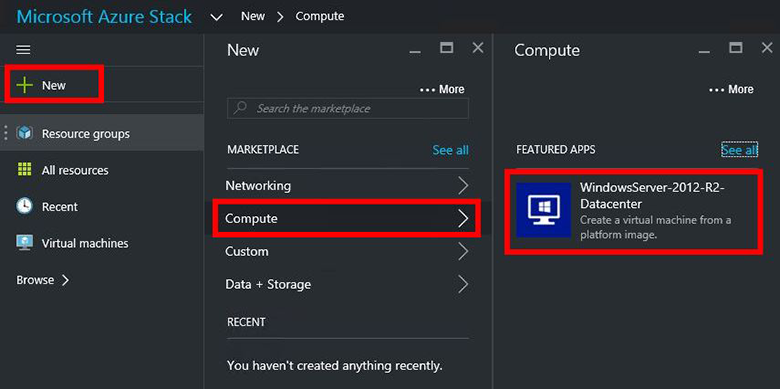
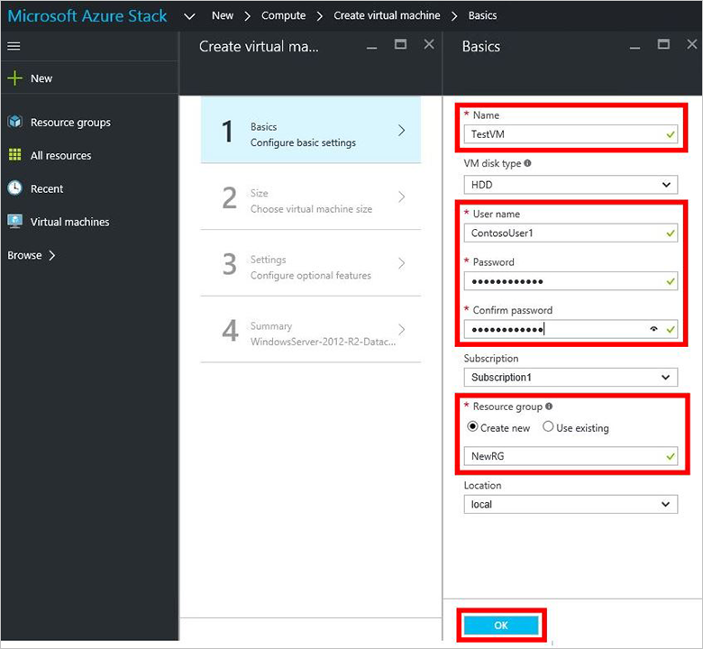
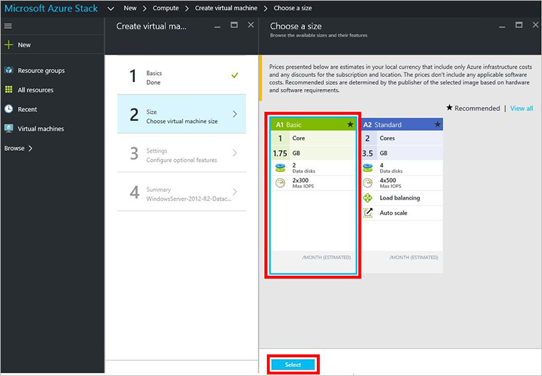
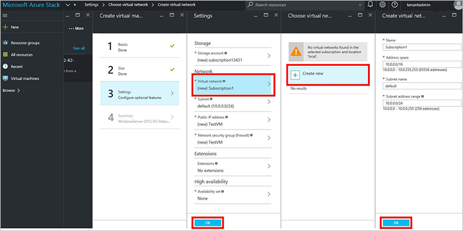
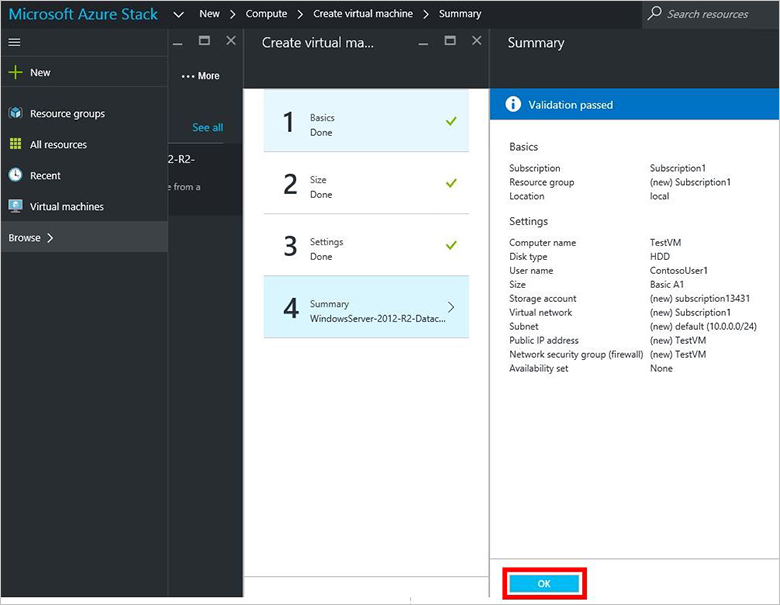
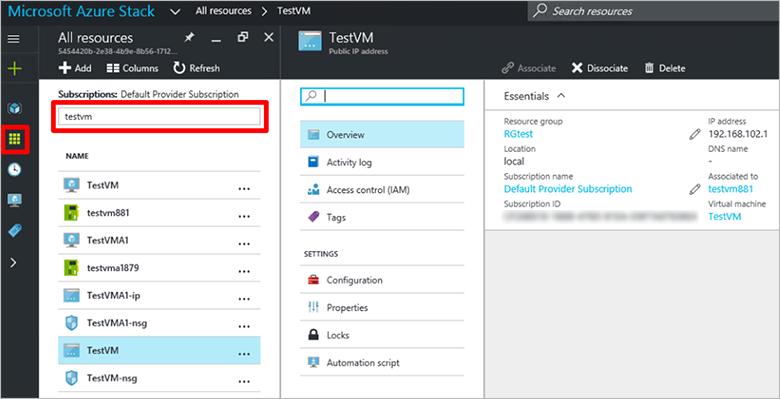

<properties
	pageTitle="Provision a VM in Azure Stack (tenant) | Microsoft Azure"
	description="As a tenant, learn how to provision a VM in Azure Stack."
	services="azure-stack"
	documentationCenter=""
	authors="ErikjeMS"
	manager="byronr"
	editor=""/>

<tags
	ms.service="azure-stack"
	ms.workload="na"
	ms.tgt_pltfrm="na"
	ms.devlang="na"
	ms.topic="get-started-article"
	ms.date="08/01/2016"
	ms.author="erikje"/>

# Provision a virtual machine

Now that you've [created a subscription](azure-stack-subscribe-plan-provision-vm.md), test that your tenants can provision a virtual machine.

1.  On the Azure Stack POC computer, log in to `https://portal.azurestack.local` as [a tenant](azure-stack-connect-azure-stack.md#log-in-as-a-tenant), and then click **New** > **Compute** > **WindowsServer-2012-R2-Datacenter**.  

	

2.  In the **Basics** blade, type a **Name**, **User name**, **Password**, and **Resource Group**. Create a new **Resource group**, or select an existing one, and then click **OK**.  

	

3.  In the **Choose a size** blade, click **A1 Basic**, and then click **Select**.  

	

4.  In the **Settings** blade, click **Virtual network**. In the **Choose virtual network** blade, click **Create new**. In the **Create virtual network** blade, accept all the defaults and click **OK**. In the **Settings** blade, click **OK** to create the virtual machine.

	

5.  In the **Summary** blade, click **OK** to create the virtual machine.  

	
	
6. To see your new virtual machine, click **All resources**, then search for the virtual machine and click its name.

	

## Next steps

[Storage accounts](azure-stack-provision-storage-account.md)
