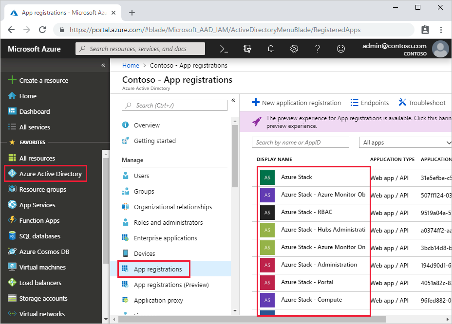

# Register Azure Stack with Azure

Registering Azure Stack with Azure allows you to download marketplace items from Azure and to set up commerce data reporting back to Microsoft. After you register Azure Stack, usage is reported to Azure commerce and you can see it under the Azure billing Subscription ID used for registration.

The information in this article describes registering Azure Stack integrated systems with Azure. For information about registering the ASDK with Azure, see [Azure Stack registration](https://docs.microsoft.com/azure/azure-stack/asdk/asdk-register) in the ASDK documentation.

> [!IMPORTANT]  
> Registration is required to support full Azure Stack functionality, including offering items in the marketplace. In addition, you will be in violation of Azure Stack licensing terms if you do not register when using the pay-as-you-use billing model. To learn more about Azure Stack licensing models, please see the [How to buy page](https://azure.microsoft.com/overview/azure-stack/how-to-buy/).

## Prerequisites

You need the following in place before you register:

 - Verify your credentials
 - Set the PowerShell language mode
 - Install PowerShell for Azure Stack
 - Download the Azure Stack tools
 - Determine your registration scenario

### Verify your credentials

Before registering Azure Stack with Azure, you must have:

- The subscription ID for an Azure subscription. Only EA, CSP, or CSP shared services subscriptions are supported for registration. CSPs need to decide whether to [use a CSP or APSS subscription](azure-stack-add-manage-billing-as-a-csp.md#create-a-csp-or-apss-subscription).<br><br>To get the ID, sign in to Azure, click **All services**. Then, under the **GENERAL** category, select **Subscriptions**, click the subscription you want to use, and under **Essentials** you can find the Subscription ID.

  > [!Note]  
  > Germany cloud subscriptions are not currently supported.

- The username and password for an account that is an owner for the subscription.

- The user account needs to have access to the Azure subscription and have permissions to create identity applications and service principals in the directory associated with that subscription. We recommend that you register Azure Stack with Azure using least-privilege administration. For more information on how to create a custom role definition that limits access to your subscription for registration, see [create a registration role for Azure Stack](azure-stack-registration-role.md).

- Registered the Azure Stack resource provider (see the following Register Azure Stack Resource Provider section for details).

After registration, Azure Active Directory global administrator permission is not required. However, some operations may require the global administrator credential. For example, a resource provider installer script or a new feature requiring a permission to be granted. You can either temporarily reinstate the account’s global administrator permissions or use a separate global administrator account that is an owner of the *default provider subscription*.

The user who registers Azure Stack is the owner of the service principal in Azure Active Directory. Only the user who registered Azure Stack can modify the Azure Stack registration. If a non-admin user that is not an owner of the registration service principal attempts to register or re-register Azure Stack, they may encounter a 403 response. A 403 response indicates the user has insufficient permissions to complete the operation.

If you don’t have an Azure subscription that meets these requirements, you can [create a free Azure account here](https://azure.microsoft.com/free/?b=17.06). Registering Azure Stack incurs no cost on your Azure subscription.

> [!NOTE]
> If you have more than one Azure Stack, a best practice is to register each Azure Stack to its own subscription. This will make it easier for you to track usage.

### PowerShell language mode

To successfully register Azure Stack, the PowerShell language mode must be set to **FullLanguageMode**.  To verify that the current language mode is set to full, open an elevated PowerShell window and run the following PowerShell cmdlets:

```powershell  
$ExecutionContext.SessionState.LanguageMode
```

Ensure the output returns **FullLanguageMode**. If any other language mode is returned, registration needs to be run on another machine or the language mode needs to be set to **FullLanguageMode** before continuing.

### Install PowerShell for Azure Stack

Use the latest PowerShell for Azure Stack to register with Azure.

If the latest version is not already installed, see [install PowerShell for Azure Stack](https://docs.microsoft.com/azure/azure-stack/azure-stack-powershell-install).

### Download the Azure Stack tools

The Azure Stack tools GitHub repository contains PowerShell modules that support Azure Stack functionality; including registration functionality. During the registration process, you need to import and use the **RegisterWithAzure.psm1** PowerShell module, found in the Azure Stack tools repository, to register your Azure Stack instance with Azure.

To ensure you are using the latest version, you should delete any existing versions of the Azure Stack tools and [download the latest version from GitHub](azure-stack-powershell-download.md) before registering with Azure.

### Determine your registration scenario

Your Azure Stack deployment may be *connected* or *disconnected*.

 - **Connected**  
 Connected means you have deployed Azure Stack so that it can connect to the Internet and to Azure. You either have Azure Active Directory (Azure AD) or Active Directory Federation Services (AD FS) for your identity store. With a connected deployment, you can choose from two billing models: pay-as-you-use or capacity-based.
    - [Register a connected Azure Stack with Azure using the **pay-as-you-use** billing model](#register-connected-with-pay-as-you-go-billing)
    - [Register a connected Azure Stack with Azure using the **capacity** billing model](#register-connected-with-capacity-billing)

 - **Disconnected**  
 With the disconnected from Azure deployment option, you can deploy and use Azure Stack without a connection to the Internet. However, with a disconnected deployment, you are limited to an AD FS identity store and the capacity-based billing model.
    - [Register a disconnected Azure Stack using the **capacity** billing model
](#register-disconnected-with-capacity-billing)

### Determine a unique registration name to use 
When you register Azure Stack with Azure, you must provide a unique registration name. An easy way to associate your Azure Stack subscription with an Azure registration is to use your Azure Stack **Cloud ID**. 

> [!NOTE]
> Azure Stack registrations using the capacity-based billing model will need to change the unique name when re-registering after those yearly subscriptions expire unless you [delete the expired registration](azure-stack-registration.md#change-the-subscription-you-use) and re-register with Azure.

To determine the Cloud ID for your Azure Stack deployment, open PowerShell as an administrator on a computer that can access the Privileged Endpoint, run the following commands, and record the **CloudID** value: 

```powershell
Run: Enter-PSSession -ComputerName <privileged endpoint computer name> -ConfigurationName PrivilegedEndpoint
Run: Get-AzureStackStampInformation 
```

## Register connected with pay-as-you-go billing

Use these steps to register Azure Stack with Azure using the pay-as-you-use billing model.

> [!Note]  
> All these steps must be run from a computer that has access to the privileged endpoint (PEP). For details about the PEP, see [Using the privileged endpoint in Azure Stack](azure-stack-privileged-endpoint.md).

Connected environments can access the internet and Azure. For these environments, you need to register the Azure Stack resource provider with Azure and then configure your billing model.

1. To register the Azure Stack resource provider with Azure, start PowerShell ISE as an administrator and use the following PowerShell cmdlets with the **EnvironmentName** parameter set to the appropriate Azure subscription type (see parameters below).

2. Add the Azure account that you use to register Azure Stack. To add the account, run the **Add-AzureRmAccount** cmdlet. You are prompted to enter your Azure account credentials and you may have to use 2-factor authentication based on your account’s configuration.

   ```powershell
   Add-AzureRmAccount -EnvironmentName "<environment name>"
   ```

   | Parameter | Description |  
   |-----|-----|
   | EnvironmentName | The Azure cloud subscription environment name. Supported environment names are **AzureCloud**, **AzureUSGovernment**, or if using a China Azure Subscription, **AzureChinaCloud**.  |

3. If you have multiple subscriptions, run the following command to select the one you want to use:  

   ```powershell  
   Get-AzureRmSubscription -SubscriptionID '<Your Azure Subscription GUID>' | Select-AzureRmSubscription
   ```

4. Run the following command to register the Azure Stack resource provider in your Azure subscription:

   ```powershell  
   Register-AzureRmResourceProvider -ProviderNamespace Microsoft.AzureStack
   ```

5. Start PowerShell ISE as an administrator and navigate to the **Registration** folder in the **AzureStack-Tools-master** directory created when you downloaded the Azure Stack tools. Import the **RegisterWithAzure.psm1** module using PowerShell:

   ```powershell  
   Import-Module .\RegisterWithAzure.psm1
   ```

6. Next, in the same PowerShell session, ensure you are logged in to the correct Azure PowerShell Context. This is the Azure account that was used to register the Azure Stack resource provider previously. Powershell to run:

   ```powershell  
   Connect-AzureRmAccount -Environment "<environment name>"
   ```

   | Parameter | Description |  
   |-----|-----|
   | EnvironmentName | The Azure cloud subscription environment name. Supported environment names are **AzureCloud**, **AzureUSGovernment**, or if using a China Azure Subscription, **AzureChinaCloud**.  |

7. In the same PowerShell session, run the **Set-AzsRegistration** cmdlet. PowerShell to run:  

   ```powershell  
   $CloudAdminCred = Get-Credential -UserName <Privileged endpoint credentials> -Message "Enter the cloud domain credentials to access the privileged endpoint."
   $RegistrationName = "<unique-registration-name>"
   Set-AzsRegistration `
      -PrivilegedEndpointCredential $CloudAdminCred `
      -PrivilegedEndpoint <PrivilegedEndPoint computer name> `
      -BillingModel PayAsYouUse `
      -RegistrationName $RegistrationName
   ```
   For more information on the Set-AzsRegistration cmdlet, see [Registration reference](#registration-reference).

   The process takes between 10 and 15 minutes. When the command completes, you see the message **"Your environment is now registered and activated using the provided parameters."**

## Register connected with capacity billing

Use these steps to register Azure Stack with Azure using the pay-as-you-use billing model.

> [!Note]  
> All these steps must be run from a computer that has access to the privileged endpoint (PEP). For details about the PEP, see [Using the privileged endpoint in Azure Stack](azure-stack-privileged-endpoint.md).

Connected environments can access the internet and Azure. For these environments, you need to register the Azure Stack resource provider with Azure and then configure your billing model.

1. To register the Azure Stack resource provider with Azure, start PowerShell ISE as an administrator and use the following PowerShell cmdlets with the **EnvironmentName** parameter set to the appropriate Azure subscription type (see parameters below).

2. Add the Azure account that you use to register Azure Stack. To add the account, run the **Add-AzureRmAccount** cmdlet. You are prompted to enter your Azure account credentials and you may have to use 2-factor authentication based on your account’s configuration.

   ```powershell  
   Connect-AzureRmAccount -Environment "<environment name>"
   ```

   | Parameter | Description |  
   |-----|-----|
   | EnvironmentName | The Azure cloud subscription environment name. Supported environment names are **AzureCloud**, **AzureUSGovernment**, or if using a China Azure Subscription, **AzureChinaCloud**.  |

3. If you have multiple subscriptions, run the following command to select the one you want to use:  

   ```powershell  
   Get-AzureRmSubscription -SubscriptionID '<Your Azure Subscription GUID>' | Select-AzureRmSubscription
   ```

4. Run the following command to register the Azure Stack resource provider in your Azure subscription:

   ```powershell  
   Register-AzureRmResourceProvider -ProviderNamespace Microsoft.AzureStack
   ```

5. Start PowerShell ISE as an administrator and navigate to the **Registration** folder in the **AzureStack-Tools-master** directory created when you downloaded the Azure Stack tools. Import the **RegisterWithAzure.psm1** module using PowerShell:

   ```powershell  
   $CloudAdminCred = Get-Credential -UserName <Privileged endpoint credentials> -Message "Enter the cloud domain credentials to access the privileged endpoint."
   $RegistrationName = "<unique-registration-name>"
   Set-AzsRegistration `
      -PrivilegedEndpointCredential $CloudAdminCred `
      -PrivilegedEndpoint <PrivilegedEndPoint computer name> `
      -AgreementNumber <EA agreement number> `
      -BillingModel Capacity `
      -RegistrationName $RegistrationName
   ```
   > [!Note]  
   > You can disable usage reporting with the UsageReportingEnabled parameter for the **Set-AzsRegistration** cmdlet by setting the parameter to false. 
   
   For more information on the Set-AzsRegistration cmdlet, see [Registration reference](#registration-reference).

## Register disconnected with capacity billing

If you are registering Azure Stack in a disconnected environment (with no internet connectivity), you need to get a registration token from the Azure Stack environment and then use that token on a computer that can connect to Azure and has PowerShell for Azure Stack installed.  

### Get a registration token from the Azure Stack environment

1. Start PowerShell ISE as an administrator and navigate to the **Registration** folder in the **AzureStack-Tools-master** directory created when you downloaded the Azure Stack tools. Import the **RegisterWithAzure.psm1** module:  

   ```powershell  
   Import-Module .\RegisterWithAzure.psm1
   ```

2. To get the registration token, run the following PowerShell cmdlets:  

   ```Powershell
   $FilePathForRegistrationToken = "$env:SystemDrive\RegistrationToken.txt"
   $RegistrationToken = Get-AzsRegistrationToken -PrivilegedEndpointCredential $YourCloudAdminCredential -UsageReportingEnabled:$False -PrivilegedEndpoint $YourPrivilegedEndpoint -BillingModel Capacity -AgreementNumber '<EA agreement number>' -TokenOutputFilePath $FilePathForRegistrationToken
   ```
   For more information on the Get-AzsRegistrationToken cmdlet, see [Registration reference](#registration-reference).

   > [!Tip]  
   > The registration token is saved in the file specified for *$FilePathForRegistrationToken*. You can change the filepath or filename at your discretion.

3. Save this registration token for use on the Azure connected machine. You can copy the file or the text from $FilePathForRegistrationToken.

### Connect to Azure and register

On the computer that is connected to the Internet, perform the same steps to import the RegisterWithAzure.psm1 module and sign in to the correct Azure Powershell context. Then call Register-AzsEnvironment. Specify the registration token to register with Azure. If you are registering more than one instance of Azure Stack using the same Azure Subscription ID, specify a unique registration name. Run the following cmdlet:

  ```powershell  
  $RegistrationToken = "<Your Registration Token>"
  $RegistrationName = "<unique-registration-name>"
  Register-AzsEnvironment -RegistrationToken $RegistrationToken -RegistrationName $RegistrationName
  ```

Optionally, you can use the Get-Content cmdlet to point to a file that contains your registration token:

  ```powershell  
  $RegistrationToken = Get-Content -Path '<Path>\<Registration Token File>'
  Register-AzsEnvironment -RegistrationToken $RegistrationToken -RegistrationName $RegistrationName
  ```

  > [!Note]  
  > Save the registration resource name and the registration token for future reference.

### Retrieve an Activation Key from Azure Registration Resource

Next, you need to retrieve an activation key from the registration resource created in Azure during Register-AzsEnvironment.

To get the activation key, run the following PowerShell cmdlets:  

  ```Powershell
  $RegistrationResourceName = "<unique-registration-name>"
  $KeyOutputFilePath = "$env:SystemDrive\ActivationKey.txt"
  $ActivationKey = Get-AzsActivationKey -RegistrationName $RegistrationResourceName -KeyOutputFilePath $KeyOutputFilePath
  ```

  > [!Tip]  
  > The activation key is saved in the file specified for *$KeyOutputFilePath*. You can change the filepath or filename at your discretion.

### Create an Activation Resource in Azure Stack

Return to the Azure Stack environment with the file or text from the activation key created from Get-AzsActivationKey. Next you create an activation resource in Azure Stack using that activation key. To create an activation resource, run the following PowerShell cmdlets: 

  ```Powershell
  $ActivationKey = "<activation key>"
  New-AzsActivationResource -PrivilegedEndpointCredential $YourCloudAdminCredential -PrivilegedEndpoint $YourPrivilegedEndpoint -ActivationKey $ActivationKey
  ```

Optionally, you can use the Get-Content cmdlet to point to a file that contains your registration token:

  ```Powershell
  $ActivationKey = Get-Content -Path '<Path>\<Activation Key File>'
  New-AzsActivationResource -PrivilegedEndpointCredential $YourCloudAdminCredential -PrivilegedEndpoint $YourPrivilegedEndpoint -ActivationKey $ActivationKey
  ```

## Verify Azure Stack registration

You can use the **Region management** tile to verify that the Azure Stack registration was successful. This tile is available on the default dashboard in the administration portal. The status can be registered, or not registered. If registered, it also shows the Azure subscription ID that you used to register your Azure Stack along with the registration resource group and name.

1. Sign in to the [Azure Stack administration portal](https://adminportal.local.azurestack.external).

2. From the Dashboard, select **Region management**.

3. Select **Properties**. This blade shows the status and details of your environment. The status can be **Registered**, **Not registered**, or **Expired**.

    [](media/azure-stack-registration/admin1.png#lightbox)

    If registered, the properties include:
    
    - **Registration subscription ID**: The Azure subscription ID registered and associated to Azure Stack
    - **Registration resource group**: The Azure resource group in the associated subscription containing the Azure Stack resources.

4. Use the Azure portal to view the Azure Stack app registrations. Sign in to the Azure portal using an account associated to the subscription you used to register Azure Stack. Switch to the tenant associated with Azure Stack.
5. Navigate to **Azure Active Directory > App registrations > View all applications**.

    

    Azure Stack app registrations are prefixed with **Azure Stack**.

Alternatively, you can verify if your registration was successful by using the Marketplace management feature. If you see a list of marketplace items in the Marketplace Management blade, your registration was successful. However, in disconnected environments, you will not be able to see marketplace items in Marketplace management.

> [!NOTE]
> After registration is complete, the active warning for not registering will no longer appear. In disconnected scenarios, you will see a message in Marketplace management asking you to register and activate your Azure Stack, even if you have registered successfully.

## Renew or change registration

### Renew or change registration in connected environments

You’ll need to update or renew your registration in the following circumstances:

- After you renew your capacity-based yearly subscription.
- When you change your billing model.
- When you scale changes (add/remove nodes) for capacity-based billing.

#### Change the subscription you use

If you would like to change the subscription you use, you must first run the **Remove-AzsRegistration** cmdlet, then ensure you are logged in to the correct Azure PowerShell context, and finally run **Set-AzsRegistration** with any changed parameters including `<billing model>`:

  ```powershell  
  Remove-AzsRegistration -PrivilegedEndpointCredential $YourCloudAdminCredential -PrivilegedEndpoint $YourPrivilegedEndpoint -RegistrationName $RegistrationName
  Set-AzureRmContext -SubscriptionId $NewSubscriptionId
  Set-AzsRegistration -PrivilegedEndpointCredential $YourCloudAdminCredential -PrivilegedEndpoint $YourPrivilegedEndpoint -BillingModel <billing model> -RegistrationName $RegistrationName
  ```

#### Change the billing model or how to offer features

If you would like to change the billing model or how to offer features for your installation, you can call the registration function to set the new values. You do not need to first remove the current registration:

  ```powershell  
  Set-AzsRegistration -PrivilegedEndpointCredential $YourCloudAdminCredential -PrivilegedEndpoint $YourPrivilegedEndpoint -BillingModel <billing model> -RegistrationName $RegistrationName
  ```

### Renew or change registration in disconnected environments

You’ll need to update or renew your registration in the following circumstances:

- After you renew your capacity-based yearly subscription.
- When you change your billing model.
- When you scale changes (add/remove nodes) for capacity-based billing.

#### Remove the activation resource from Azure Stack

You first need to remove the activation resource from Azure Stack, and then the registration resource in Azure.  

To remove the activation resource in Azure Stack, run the following PowerShell cmdlets in your Azure Stack environment:  

  ```Powershell
  Remove-AzsActivationResource -PrivilegedEndpointCredential $YourCloudAdminCredential -PrivilegedEndpoint $YourPrivilegedEndpoint
  ```

Next, to remove the registration resource in Azure, ensure you are on an Azure connected computer, sign in to the correct Azure PowerShell context, and run the appropriate PowerShell cmdlets as described below.

You can use the registration token used to create the resource:  

  ```Powershell
  $RegistrationToken = "<registration token>"
  Unregister-AzsEnvironment -RegistrationToken $RegistrationToken
  ```

Or you can use the registration name:

  ```Powershell
  $RegistrationName = "AzureStack-<unique-registration-name>"
  Unregister-AzsEnvironment -RegistrationName $RegistrationName
  ```

### Re-register using disconnected steps

You have now completely unregistered in a disconnected scenario and must repeat the steps for registering an Azure Stack environment in a disconnected scenario.

### Disable or enable usage reporting

For Azure Stack environments that use a capacity billing model, turn off usage reporting with the **UsageReportingEnabled** parameter using either the **Set-AzsRegistration** or the **Get-AzsRegistrationToken** cmdlets. Azure Stack reports usage metrics by default. Operators with capacity uses or supporting a disconnected environment needs to turn off usage reporting.

#### With a connected Azure Stack

   ```powershell  
   $CloudAdminCred = Get-Credential -UserName <Privileged endpoint credentials> -Message "Enter the cloud domain credentials to access the privileged endpoint."
   $RegistrationName = "<unique-registration-name>"
   Set-AzsRegistration `
      -PrivilegedEndpointCredential $CloudAdminCred `
      -PrivilegedEndpoint <PrivilegedEndPoint computer name> `
      -BillingModel Capacity
      -RegistrationName $RegistrationName
   ```

#### With a disconnected Azure Stack

1. To change the registration token, run the following PowerShell cmdlets:  

   ```Powershell
   $FilePathForRegistrationToken = $env:SystemDrive\RegistrationToken.txt
   $RegistrationToken = Get-AzsRegistrationToken -PrivilegedEndpointCredential -UsageReportingEnabled:$False
   $YourCloudAdminCredential -PrivilegedEndpoint $YourPrivilegedEndpoint -BillingModel Capacity -AgreementNumber '<EA agreement number>' -TokenOutputFilePath $FilePathForRegistrationToken
   ```

   > [!Tip]  
   > The registration token is saved in the file specified for *$FilePathForRegistrationToken*. You can change the filepath or filename at your discretion.

2. Save this registration token for use on the Azure connected machine. You can copy the file or the text from $FilePathForRegistrationToken.

## Move a registration resource
Moving a registration resource between resource groups under the same subscription **is** supported for all environments. However, moving a registration resource between subscriptions is only supported for CSPs when both subscriptions resolve to the same Partner ID. For more information about moving resources to a new resource group, see [Move resources to new resource group or subscription](https://docs.microsoft.com/azure/azure-resource-manager/resource-group-move-resources).

## Registration reference

### Set-AzsRegistration

You can use Set-AzsRegistration to register Azure Stack with Azure and enable or disable the offer of items in the marketplace and usage reporting.

To run the cmdlet, you need:
- A global Azure subscription of any type.
- You must also be logged in to Azure PowerShell with an account that is an owner or contributor to that subscription.

```powershell
Set-AzsRegistration [-PrivilegedEndpointCredential] <PSCredential> [-PrivilegedEndpoint] <String> [[-AzureContext]
    <PSObject>] [[-ResourceGroupName] <String>] [[-ResourceGroupLocation] <String>] [[-BillingModel] <String>]
    [-MarketplaceSyndicationEnabled] [-UsageReportingEnabled] [[-AgreementNumber] <String>] [[-RegistrationName]
    <String>] [<CommonParameters>]
```

| Parameter | Type | Description |
|-------------------------------|--------------|-------------------------------------------------------------------------------------------------------------------------------------------------------------------------------------------------------------------------------------------------------------------------------------------------------------------------------------|
| PrivilegedEndpointCredential | PSCredential | The credentials used to [access the privileged endpoint](azure-stack-privileged-endpoint.md#access-the-privileged-endpoint). The username is in the format **AzureStackDomain\CloudAdmin**. |
| PrivilegedEndpoint | String | A pre-configured remote PowerShell console that provides you with capabilities like log collection and other post deployment tasks. To learn more, refer to the [using the privileged endpoint](azure-stack-privileged-endpoint.md#access-the-privileged-endpoint) article. |
| AzureContext | PSObject |  |
| ResourceGroupName | String |  |
| ResourceGroupLocation | String |  |
| BillingModel | String | The billing model that your subscription uses. Allowed values for this parameter are: Capacity, PayAsYouUse, and Development. |
| MarketplaceSyndicationEnabled | True/False | Determines whether or not the marketplace management feature is available in the portal. Set to true if registering with internet connectivity. Set to false if registering in disconnected environments. For disconnected registrations, the [offline syndication tool](azure-stack-download-azure-marketplace-item.md#disconnected-or-a-partially-connected-scenario) can be used for downloading marketplace items. |
| UsageReportingEnabled | True/False | Azure Stack reports usage metrics by default. Operators with capacity uses or supporting a disconnected environment needs to turn off usage reporting. Allowed values for this parameter are: True, False. |
| AgreementNumber | String |  |
| RegistrationName | String | Set a unique name for the registration if you are running the registration script on more than one instance of Azure Stack using the same Azure Subscription ID. The parameter has a default value of **AzureStackRegistration**. However, if you use the same name on more than one instance of Azure Stack, the script fails. |

### Get-AzsRegistrationToken

Get-AzsRegistrationToken generates a registration token from the input parameters.

```powershell  
Get-AzsRegistrationToken [-PrivilegedEndpointCredential] <PSCredential> [-PrivilegedEndpoint] <String>
    [-BillingModel] <String> [[-TokenOutputFilePath] <String>] [-UsageReportingEnabled] [[-AgreementNumber] <String>]
    [<CommonParameters>]
```
| Parameter | Type | Description |
|-------------------------------|--------------|-------------|
| PrivilegedEndpointCredential | PSCredential | The credentials used to [access the privileged endpoint](azure-stack-privileged-endpoint.md#access-the-privileged-endpoint). The username is in the format **AzureStackDomain\CloudAdmin**. |
| PrivilegedEndpoint | String |  A pre-configured remote PowerShell console that provides you with capabilities like log collection and other post deployment tasks. To learn more, refer to the [using the privileged endpoint](azure-stack-privileged-endpoint.md#access-the-privileged-endpoint) article. |
| AzureContext | PSObject |  |
| ResourceGroupName | String |  |
| ResourceGroupLocation | String |  |
| BillingModel | String | The billing model that your subscription uses. Allowed values for this parameter are: Capacity, PayAsYouUse, and Development. |
| MarketplaceSyndicationEnabled | True/False |  |
| UsageReportingEnabled | True/False | Azure Stack reports usage metrics by default. Operators with capacity uses or supporting a disconnected environment needs to turn off usage reporting. Allowed values for this parameter are: True, False. |
| AgreementNumber | String |  |

## Registration failures

You might see one of the errors below while attempting registration of your Azure Stack:
1. Could not retrieve mandatory hardware info for $hostName. Please check physical host and connectivity then try to re-run registration.

2. Cannot connect to $hostName to get hardware info - please check physical host and connectivity then try to re-run registration.

> Cause: this is typically because we try to obtain hardware details such as UUID, Bios and CPU from the hosts to attempt activation and were not able to due to the inability to connect to the physical host.

When trying to access Marketplace management, an error occurs when trying to syndicate products. 
> Cause: this usually happens when Azure Stack is unable to access the registration resource. One common reason for this is that when an Azure subscription’s directory tenant changes it resets the registration. You can't access the Azure Stack marketplace or report usage if you've changed the subscription’s directory tenant. You need to re-register to fix this issue.

Marketplace management still asks you to register and activate your Azure Stack even when you've already registered your stamp using the disconnected process. 
> Cause: this is a known issue for disconnected environments. You can verify your registration status by following [these steps](azure-stack-registration.md#verify-azure-stack-registration). In order to use Marketplace management, you will need to use [the offline tool](azure-stack-download-azure-marketplace-item.md#disconnected-or-a-partially-connected-scenario). 

## Next steps

[Download marketplace items from Azure](azure-stack-download-azure-marketplace-item.md)
