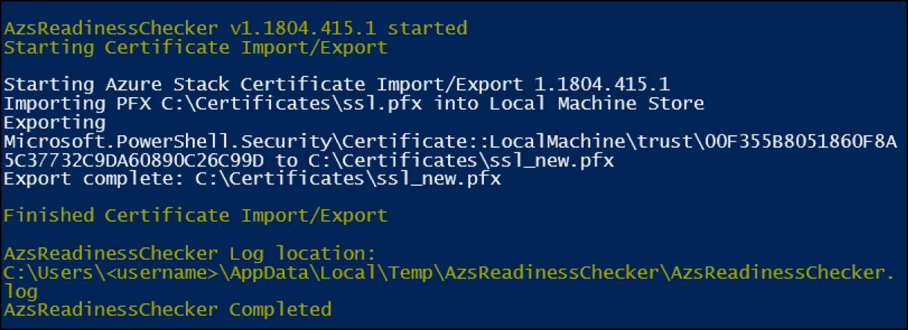

# Remediate common issues for Azure Stack PKI certificates
The information in this article can help you understand and resolve common issues for Azure Stack PKI certificates. You can discover issues when you use Azure Stack Readiness Checker tool to [validate Azure Stack PKI certificates](azure-stack-validate-pki-certs.md). The tool checks to ensure that certificates meet the PKI requirements of an Azure Stack deployment and Azure Stack Secret Rotation, and logs the results in a [report.json file](azure-stack-validation-report.md).  

## PFX Encryption
**Failure** - PFX encryption is not TripleDES-SHA1.   
**Remediation** - Export PFX files with **TripleDES-SHA1** encryption. This is the default for all Windows 10 Clients when exporting from Certificate Snap in or using Export-PFXCertificate. 

## Read PFX
**Warning** - Password only protects the private information in the certificate.  
**Remediation** - We recommend you export PFX files with the optional setting for **Enable certificate privacy**.  

**Failure** - PFX file invalid.  
**Remediation** - Re-export the certificate using the steps in [Prepare Azure Stack PKI certificates for deployment](azure-stack-prepare-pki-certs.md).

## Signature Algorithm
**Failure** - Signature Algorithm is SHA1.    
**Remediation** - Use the steps in Azure Stack certificates signing request generation to regenerate the Certificate Signing Request (CSR) with the Signature Algorithm of SHA256. Then resubmit the CSR to the Certificate Authority to reissue the certificate.

## Private key
**Failure** - The private key is missing or does not contain the Local Machine Attribute.  
**Remediation** - From the computer that generated the CSR, re-export the certificate using the steps in Prepare Azure Stack PKI certificates for deployment. These steps include exporting from the Local Machine certificate store.

## Certificate chain
**Failure** - Certificate chain is not complete.  
**Remediation** - Certificates should contain a complete certificate chain.  Re-export the certificate using the steps in  [Prepare Azure Stack PKI certificates for deployment](azure-stack-prepare-pki-certs.md) and select the option **Include all certificates in the certification path if possible.**

## DNS Names
**Failure** - DNSNameList on the certificate does not contain the Azure Stack service endpoint name, or a valid wildcard match.  Wildcard matches are only valid for the left-most namespace of the DNS name. For example, _*.region.domain.com_ is only valid for *portal.region.domain.com*, not _*.table.region.domain.com_.  
**Remediation** - Use the steps in Azure Stack certificates signing request generation to regenerate the CSR with the correct DNS names to support Azure Stack endpoints. Resubmit the CSR to a Certificate Authority, and then follow the steps in [Prepare Azure Stack PKI certificates for deployment](azure-stack-prepare-pki-certs.md) to export the certificate from the machine that generated the CSR.  

## Key Usage
**Failure** - Key Usage is missing Digital Signature or Key Encipherment, orEnhanced Key Usage is missing Server Authentication or Client Authentication.  
**Remediation** - Use the steps in [Azure Stack certificates signing request generation](azure-stack-get-pki-certs.md) to regenerate the CSR with the correct Key Usage attributes.  Resubmit the CSR to the Certificate Authority and confirm that a certificate template is not overwriting the Key Usage in the request.

## Key Size
**Failure** - Key Size is smaller than 2048    
**Remediation** - Use the steps in [Azure Stack certificates signing request generation](azure-stack-get-pki-certs.md) to regenerate the CSR  with the correct Key Length (2048), and then resubmit the CSR to the Certificate Authority.

## Chain order
**Failure** - The order of the certificate chain is incorrect.  
**Remediation** - Re-export the certificate using the steps in  [Prepare Azure Stack PKI certificates for deployment](azure-stack-prepare-pki-certs.md) and select the option **Include all certificates in the certification path if possible.** Ensure that only the leaf certificate is selected for export. 

## Other certificates
**Failure** - The PFX package contains certificates that are not the leaf certificate or part of the certificate chain.  
**Remediation** - Re-export the certificate using the steps in [Prepare Azure Stack PKI certificates for deployment](azure-stack-prepare-pki-certs.md), and  select the option **Include all certificates in the certification path if possible.** Ensure that only the leaf certificate is selected for export.

## Fix common packaging issues
The AzsReadinessChecker can import and then export a PFX file to fix common packaging issues, including: 
 - *PFX Encryption* is not TripleDES-SHA1
 - *Private Key* is missing Local Machine Attribute.
 - *Certificate chain* is incomplete or wrong. (The local machine must contain the certificate chain if the PFX package does not.) 
 - *Other certificates*.
However, the AzsReadinessChecker cannot help if you need to generate a new CSR and reissue a certificate. 

### Prerequisites
The following prerequisites must be in place on the computer where the tool runs: 
 - Windows 10 or Windows Server 2016, with internet connectivity.
 - PowerShell 5.1 or later. To check your version, run the following PowerShell cmd and then review the *Major* version and *Minor* versions.

   > `$PSVersionTable.PSVersion`
 - Configure [PowerShell for Azure Stack](azure-stack-powershell-install.md). 
 - Download the latest version of [Microsoft Azure Stack Readiness Checker](https://aka.ms/AzsReadinessChecker) tool.

### Import and export an existing PFX File
1. On a computer that meets the prerequisites, open an administrative PowerShell prompt and then run the following command to install the AzsReadinessChecker  
   > `Install-Module Microsoft.AzureStack.ReadinessChecker- Force`

2. From the PowerShell prompt, run the following to set the PFX password. Replace *PFXpassword* with the actual password. 
   > `$password = Read-Host -Prompt PFXpassword -AsSecureString`

3. From the PowerShell prompt, run the following to export a new PFX file.
   - For *-PfxPath*, specify the path to the PFX file you are working with.  In the following example, the path is *.\certificates\ssl.pfx*.
   - For *-ExportPFXPath*, specify the location and name of the PFX file for export.  In the following example, the path is *.\certificates\ssl_new.pfx*

   > `Start-AzsReadinessChecker -PfxPassword $password -PfxPath .\certificates\ssl.pfx -ExportPFXPath .\certificates\ssl_new.pfx`  

4. After the tool completes, review the output for success: 

## Next steps
[Learn more about Azure Stack security](azure-stack-rotate-secrets.md)
