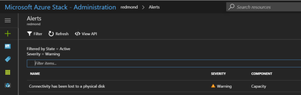
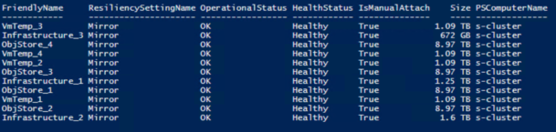
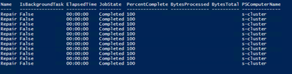

# Replace a physical disk in Azure Stack

*Applies to: Azure Stack integrated systems and Azure Stack Development Kit*

This article describes the general process to replace a physical disk in Azure Stack. If a physical disk fails, you should replace it as soon as possible.

You can use this procedure for integrated systems, and for development kit deployments that have hot-swappable disks.

Actual disk replacement steps will vary based on your original equipment manufacturer (OEM) hardware vendor. See your vendor’s field replaceable unit (FRU) documentation for detailed steps that are specific to your system. 

## Review disk alert information
When a disk fails, you receive an alert that tells you that connectivity has been lost to a physical disk. 

 

If you open the alert, the alert description contains the scale unit node and the exact physical slot location for the disk that you must replace. Azure Stack further helps you to identify the failed disk by using LED indicator capabilities.

 ## Replace the disk

Follow your OEM hardware vendor’s FRU instructions for actual disk replacement.

> [!note]
> Replace disks for one scale unit node at a time. Wait for the virtual disk repair jobs to complete before moving on to the next scale unit node

To prevent the use of an unsupported disk in an integrated system, the system blocks disks that are not supported by your vendor. If you try to use an unsupported disk, a new alert tells you that a disk has been quarantined because of an unsupported model or firmware.

After you replace the disk, Azure Stack automatically discovers the new disk and starts the virtual disk repair process.  
 
 ## Check the status of virtual disk repair
 
 After you replace the disk, you can monitor the virtual disk health status and repair job progress by using the privileged endpoint. Follow these steps from any computer that has network connectivity to the privileged endpoint.

1. Open a Windows PowerShell session and connect to the privileged endpoint.
    ````PowerShell
        $cred = Get-Credential
        Enter-PSSession -ComputerName <IP_address_of_ERCS>`
          -ConfigurationName PrivilegedEndpoint -Credential $cred
    ```` 
  
2. Run the following command to view virtual disk health:
    ````PowerShell
        Get-VirtualDisk -CimSession s-cluster
    ````
   

3. Run the following command to view current storage job status:
    ```PowerShell
        Get-VirtualDisk -CimSession s-cluster | Get-StorageJob
    ````
      

## Troubleshoot virtual disk repair

If the virtual disk repair job appears stuck, run the following command to restart the job:
  ````PowerShell
        Get-VirtualDisk -CimSession s-cluster | Repair-VirtualDisk
  ```` 
