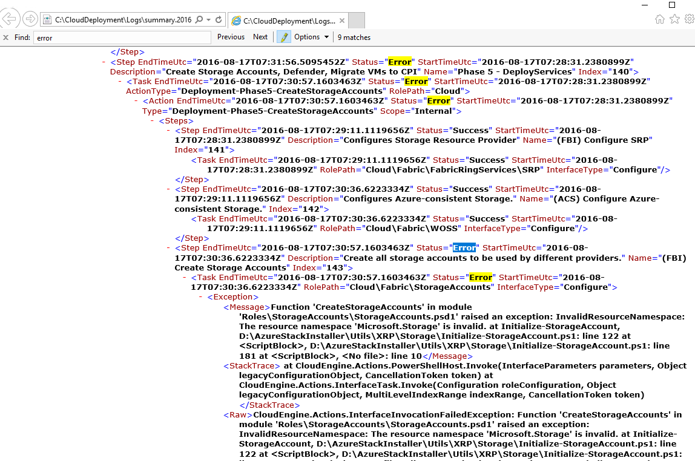
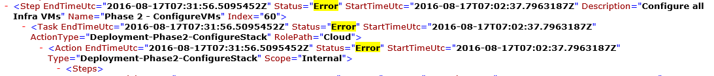

<properties
	pageTitle="Rerun a deployment from a failed step | Microsoft Azure"
	description="If you experience a failure during deployment, you can attempt the following steps to rerun the deployment from where it failed."
	services="azure-stack"
	documentationCenter=""
	authors="ErikjeMS"
	manager="byronr"
	editor=""/>

<tags
	ms.service="azure-stack"
	ms.workload="na"
	ms.tgt_pltfrm="na"
	ms.devlang="na"
	ms.topic="get-started-article"
	ms.date="09/26/2016"
	ms.author="erikje"/>
	
# Rerun a deployment from a failed step
  
If you experience a failure during deployment, you can attempt the following steps to rerun the deployment from where it failed.

## Find the failure

Take note of the failure, specifically the portion that calls out at which step the invocation failed. For example,

**2016-08-17 00:30:57 Error 1> 1> Action: Invocation of step 60.140.143 failed. Stopping invocation of action plan.**

This is the deployment step where you will start the rerun of the deployment.

## Find more detail on the failure

If you want more details on the error, find the associated **summary.YYYY-MM-DD.tt.N.log.xml** in the **C:\CloudDeployment\Logs\** folder.
Search for the string “Error”, and follow it down through the output until you see a large amount of non-XML formatted text containing the error message (this section often coincides with the last instance of the string “Error”). For example:

You can also use this information to track the rerun step, follow the “Index” numbers up from that last error. In the image above, you can see (starting from the bottom): 143, 140, and then if scroll up, you see 60:

Putting this all together (now from the top down), you get 60.140.143, just like in the PS console output of the failure (as seen in the “Find the Failure” section above).

## Rerun the deployment at a specific step

Now that you have the step that the deployment failed on, you can attempt a -Rerun of the deployment from that step. 

### Execute the Invoke-EceAction command

1. From an elevated PS console, import the following Modules:

        Import-Module C:\CloudDeployment\CloudDeployment.psd1 -Force
        Import-Module C:\CloudDeployment\ECEngine\EnterpriseCloudEngine.psd1 -Force 

2. Then execute the following command (example from above used here):

        Invoke-EceAction -RolePath Cloud -ActionType Deployment -Start 60.140.143 -Verbose

3.	This will initiate the deployment from the step identified by the -Start parameter of the Invoke-EceAction command

### Results of a -Rerun/-Start

Regardless of the option you choose, the deployment will begin again from the specified -Start parameter.

1.	If the failure is recoverable, the deployment will continue through completion.

2.	If the deployment fails again at…
    
    - the same place: the failure is probably not recoverable, and further investigation is required.

    - a new place AFTER where it failed this time:  you can attempt these same steps to get it going again.

    - a new place BEFORE where it failed this time: something else went wrong with an idempotent call, which requires further investigation.

## Next steps

[Connect to Azure Stack](azure-stack-connect-azure-stack.md)

