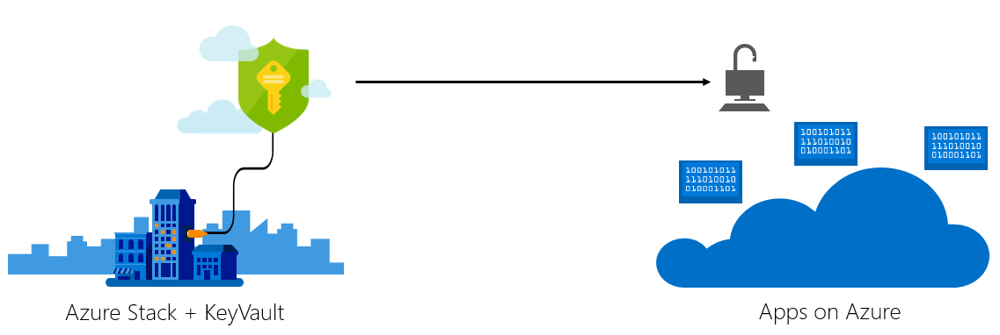

# Build your cloud app with on-prem secrets

To meet security or regulatory requirements, organizations may need to keep specific information out of the public cloud.  Azure Stack provides KeyVault services, which stores secrets like passwords and certificates in a hardened vault. This document provides pattern guidance on architecting your public cloud application to store secrets in Azure Stack. 

## Architectural overview

## Service limitations
KeyVault can be accessed via Azure Resource Manager templates, or via REST APIs.  Limitations in Azure Resource Manager only allow for REST API Access to KeyVault across clouds.

## Deploy the samples
