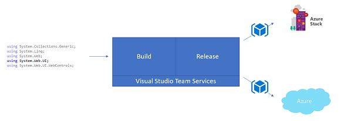

# Deploy apps with a hybrid CI/CD pipeline
A hybrid CI/CD pipeline enables you to automatically build, test, and deploy your application across multiple clouds. This means you, as a developer, can spend less time worrying about reliably building, testing, and deploying your app, and more time writing code to empower your users.   

As an example of a hybrid CI/CD pipeline, consider how you could take advantage of the following pipeline:
 
 1. Initiate a new build based on code commits to your master branch in Visual Studio Team Services (VSTS).
 2. Automatically deploy your newly built code to Azure for user acceptance testing.
 3. Once your code has passed testing, automatically deploy to production on Azure Stack. 

This series of four topics guides you through the configuration of a simple hybrid CI/CD pipeline for an ASP.NET app using Visual Studio, VSTS, Azure, and Azure Stack.

## Before you begin
You need a few components to build a hybrid CI/CD pipeline, and you may have some of them already.  Before proceeding, review the following list, and make sure your environment meet the requirements.

### Azure
 - You can use any Azure subscription to get started.  If you don't have a subscription, you can create a [trial account](https://azure.microsoft.com/free/)
 - Create a [Web App](../app-service-web/app-service-web-how-to-create-a-web-app-in-an-ase.md), and configure for [FTP publishing](../app-service-web/app-service-deploy-ftp.md)
 - Create a [service principal](../azure-resource-manager/resource-group-create-service-principal-portal.md) for VSTS access to Azure on your behalf

### Azure Stack
 - Make sure you've [deployed Azure Stack](azure-stack-run-powershell-script.md)
 - Deploy [SQL](azure-stack-sql-resource-provider-deploy.md) and [App Service](azure-stack-app-service-deploy.md) PaaS services
 - Create Web App and configure for [FTP publishing](azure-stack-app-service-enable-ftp.md)

### Dev tools
 - Create a [VSTS workspace](https://www.visualstudio.com/en-us/docs/setup-admin/team-services/sign-up-for-visual-studio-team-services) and [project](https://www.visualstudio.com/en-us/docs/setup-admin/team-services/connect-to-visual-studio-team-services#create-your-team-project-in-visual-studio-team-services)
 - [Install Visual Studio 2017](../visualstudio/install/install-visual-studio.md) and [sign-in to VSTS](https://www.visualstudio.com/en-us/docs/setup-admin/team-services/connect-to-visual-studio-team-services#connect-and-share-code-from-visual-studio)
 
## Get started
Ready to start automating your code releases across clouds?  Start by [creating your sample app](azure-stack-sol-pipeline-2.md) with Visual Studio.

