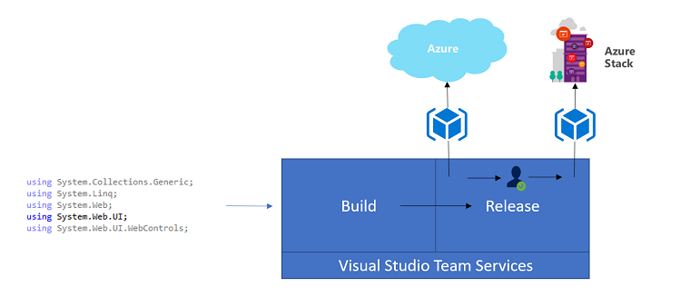
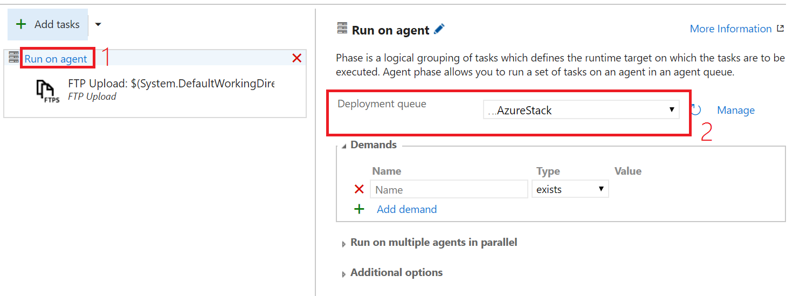
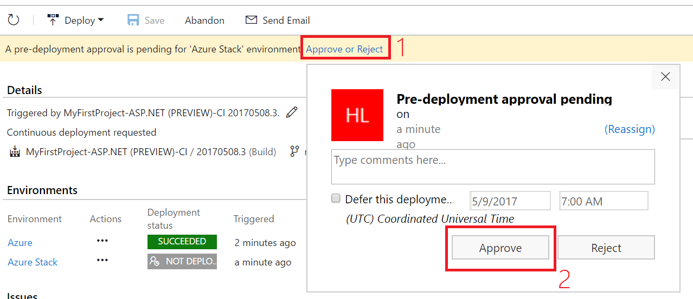

# Deploy apps to Azure and Azure Stack
A hybrid [continuous integration](https://www.visualstudio.com/learn/what-is-continuous-integration/)/[continuous delivery](https://www.visualstudio.com/learn/what-is-continuous-delivery/)(CI/CD) pipeline enables you to build, test, and deploy your app to multiple clouds.  In this tutorial, you build a sample environment to learn how a hybrid CI/CD pipeline can help you:
 
> [!div class="checklist"]
> * Initiate a new build based on code commits to your Visual Studio Team Services (VSTS) repository.
> * Automatically deploy your newly built code to Azure for user acceptance testing.
> * Once your code has passed testing, automatically deploy to Azure Stack. 

## Prerequisites
A few components are required to build a hybrid CI/CD pipeline, and may take some time to prepare.  If you already have some of these components, make sure they meet the requirements before beginning.

This topic also assumes that you have some knowledge of Azure and Azure Stack. If you want to learn more before proceeding, be sure to start with these topics:

- [Introduction to Azure](https://docs.microsoft.com/azure/fundamentals-introduction-to-azure)
- [Azure Stack Key Concepts](azure-stack-key-features.md)

### Azure
 - If you don't have an Azure subscription, create a [free account](https://azure.microsoft.com/free/?WT.mc_id=A261C142F) before you begin.
 - Create a [Web App](../app-service-web/app-service-web-how-to-create-a-web-app-in-an-ase.md), and configure it for [FTP publishing](../app-service-web/app-service-deploy-ftp.md).  Make note of the new Web App URL, as it is used later.

### Azure Stack
 - [Deploy Azure Stack](azure-stack-run-powershell-script.md).  The installation usually takes a few hours to complete, so plan accordingly.
 - Deploy [SQL](azure-stack-sql-resource-provider-deploy.md) and [App Service](azure-stack-app-service-deploy.md) PaaS services to Azure Stack.
 - Create a Web App and configure it for [FTP publishing](azure-stack-app-service-enable-ftp.md).  Make note of the new Web App URL, as it is used later.  

### Developer tools
 - Create a [VSTS workspace](https://www.visualstudio.com/docs/setup-admin/team-services/sign-up-for-visual-studio-team-services).  The sign-up process creates a project named "MyFirstProject".  
 - [Install Visual Studio 2017](https://docs.microsoft.com/visualstudio/install/install-visual-studio) and [sign-in to VSTS].(https://www.visualstudio.com/docs/setup-admin/team-services/connect-to-visual-studio-team-services#connect-and-share-code-from-visual-studio)
 - Connect to the project and [clone locally](https://www.visualstudio.com/docs/git/gitquickstart).
 - Create an [agent pool](https://www.visualstudio.com/docs/build/concepts/agents/pools-queues#creating-agent-pools-and-queues) in VSTS.
 - Install Visual Studio and deploy a [VSTS build agent](https://www.visualstudio.com/docs/build/actions/agents/v2-windows) to a virtual machine on Azure Stack. 
 

## Create app & push to VSTS

### Create application
In this section, you create a simple ASP.NET application and push it to VSTS.  These steps represent the normal developer workflow, and could be adapted for developer tools and languages. 

1.  Open Visual Studio.
2.  From the Team Explorer space and **Solutions...** area, click **New**.
3.  Select **Visual C#** > **Web** > **ASP.NET Web Application (.NET Framework)**.
4.  Provide a name for the application and click **OK**.
5.  On the next screen, keep the defaults (Web forms) and click **OK**.

### Commit and push changes to VSTS
1.  Using Team Explorer in Visual Studio, select the dropdown and click **Changes**.
2.  Provide a commit message and select **Commit all**. You may be prompted to save the solution file, click yes to save all.
3.  Once committed, Visual Studio will offer you to sync changes to your project. Select **Sync**.

    

4.  In the synchronization tab, under *Outgoing*, you will see your new commit.  Select **Push** to synchronize the change to VSTS.

    

### Review code in VSTS
Once you've committed a change and pushed to VSTS, check your code from the VSTS portal.  Select **Code**, and then **Files** from the dropdown menu.  You can see the solution you created.

## Create build definition
The build process defines how your application is built and packaged for deployment on each commit of code changes. In our example, we use the included template to configure the build process for an ASP.NET app, though this configuration could be adapted depending on your application.

1.  Sign in to your VSTS workspace from a web browser.
2.  From the banner, select **Build & Release**  and then **Builds**.
3.  Click **+ New definition**.
4.  From the list of templates, select **ASP.NET (Preview)** and select **Apply**.
5.  Modify the *MSBuild Arguments* field in *Build Solution* step to:

    `/p:DeployOnBuild=True /p:WebPublishMethod=FileSystem /p:DeployDefaultTarget=WebPublish /p:publishUrl="$(build.artifactstagingdirectory)\\"`

6.  Select the **Options** tab, and select the agent queue for the build agent you deployed to a virtual machine on Azure Stack. 
7.  Select the **Triggers** tab, and enable **Continuous Integration**.
7.  Click **Save & queue** and then select **Save** from the dropdown. 

## Create release definition
The release process defines how builds from the previous step are deployed to an environment.  In this tutorial, we publish our ASP.NET app with FTP to an Azure Web App. To configure a release to Azure, use the following steps:

1.  From the VSTS banner, select **Build & Release**  and then **Releases**.
2.  Click the green **+ New definition**.
3.  Select **Empty** and click **Next**.
4.  Check the box for *Continuous deployment*, and then click **Create**.

Now that you've created an empty release definition and tied it to the build, we add steps for the Azure environment:

1.  Click the green **+** to add tasks.
2.  Select **All**, and then from the list, add **FTP Upload** and select **Close**.
3.  Select the **FTP Upload** task you just added, and configure the following parameters:
    
    | Parameter | Value |
    | ----- | ----- |
    |Authentication Method| Enter Credentials|
    |Server URL | Web App FTP URL retrieved from Azure portal |
    |Username | Username you configured when creating FTP Credentials for Web App |
    |Password | Password you created when establishing FTP credentials for Web App|
    |Source Directory | $(System.DefaultWorkingDirectory)\**\ |
    |Remote Directory | /site/wwwroot/ |
    |Preserve file paths | Enabled (checked)|

4.  Click **Save**

Finally, you configure the release definition to use the agent pool containing the agent deployed using the following steps:
1.  Select the release definition and click **Edit**.
2.  Select **Run on agent** from the middle column.  In the right column, select the agent queue containing the build agent running on Azure Stack.  
    

## Deploy your app to Azure
This step uses your newly built CI/CD pipeline to deploy the ASP.NET app to a Web App on Azure. 

1.  From the banner in VSTS, select **Build & Release**, and then select **Builds**.
2.  Click **...** on the build definition previously created, and select **Queue new build**.
3.  Accept the defaults and click **Ok**.  The build will now begin and display progress.
4.  Once the build is complete, you can track the status by selecting **Buuld & Release** and selecting **Releases**.
5.  After the build is complete, visit the website using the URL noted when creating the Web App.    

## Add Azure Stack to pipeline
Now that you've tested your CI/CD pipeline by deploying to Azure, it's time to add Azure Stack to the pipeline.  In the following steps, you create a new environment and add an FTP Upload task to deploy your app to Azure Stack.  You also add a release approver, which serves as a way to simulate "signing off" on a code release to Azure Stack.  

1.  In the Release definition, select **+ Add Environment** and **Create new environment**.
2.  Select **Empty**, click **Next**.
3.  Select **Specific users** and specify your account.  Select **Create**.
4.  Rename the environment by selecting the existing name and typing *Azure Stack*.
5.  Now, selection the Azure Stack environment, then select **Add tasks**.
6.  Select the **FTP Upload** task and select **Add**, then select **Close**.

### Configure FTP task
Now that you've created a release, you'll configure the steps required for publishing to the Web App on Azure Stack.  Just like you configured the FTP Upload task for Azure, you configure the task for Azure Stack:

1.  Select the **FTP Upload** task you just added, and configure the following parameters:
    
    | Parameter | Value |
    | -----     | ----- |
    |Authentication Method| Enter Credentials|
    |Server URL | Web App FTP URL retrieved from Azure Stack portal |
    |Username | Username you configured when creating FTP Credentials for Web App |
    |Password | Password you created when establishing FTP credentials for Web App|
    |Source Directory | $(System.DefaultWorkingDirectory)\**\ |
    |Remote Directory | /site/wwwroot/|
    |Preserve file paths | Enabled (checked)|

2.  Click **Save**

Finally, configure the release definition to use the agent pool containing the agent deployed using the following steps:
1.  Select the release definition and click **Edit**
2.  Select **Run on agent** from the middle column. In the right column, select the agent queue containing the build agent running on Azure Stack.  
    

## Deploy new code
You can now test the hybrid CI/CD pipeline, with the final step publishing to Azure Stack.  In this section, you modify the site's footer and start deployment through the pipeline.  Once complete, you will see your changes deployed to Azure for review, then once you approve the release, they are published to Azure Stack.

1. In Visual Studio, open the *site.master* file and change this line:
    
    `
        
&copy; <%: DateTime.Now.Year %> - My ASP.NET Application

    `

    to this:

    `
        
&copy; <%: DateTime.Now.Year %> - My ASP.NET Application delivered by VSTS, Azure, and Azure Stack

    `
3.  Commit the changes and sync to VSTS.  
4.  From the VSTS workspace, check the build status by selecting **Build & Release** > **Build**
5.  You will see a build in progress.  Double-click the status, and you can watch the build progress.  Once you see "Finished build" in the console, move on to check the release from **Build & Release** > **Release**.  Double-click the release.
6.  You will receive notification that a release requires review. Check the Web App URL and verify the new changes are present.  Approve the release in VSTS.
    
    
7.  Verify publishing to Azure Stack is complete by visiting the website using the URL noted when creating the Web App.
    

You can now use your new hybrid CI/CD pipeline as a building block for other hybrid cloud patterns.

## Next steps
In this tutorial, you learned how to build a hybrid CI/CD pipeline that:

> [!div class="checklist"]
> * Initiates a new build based on code commits to your Visual Studio Team Services (VSTS) repository.
> * Automatically deploys your newly built code to Azure for user acceptance testing.
> * Once your code has passed testing, automatically deploys to Azure Stack. 

Now that you have a hybrid CI/CD pipeline, continue by learning how to develop apps for Azure Stack.

> [!div class="nextstepaction"]
> [Develop for Azure Stack](azure-stack-developer.md)

