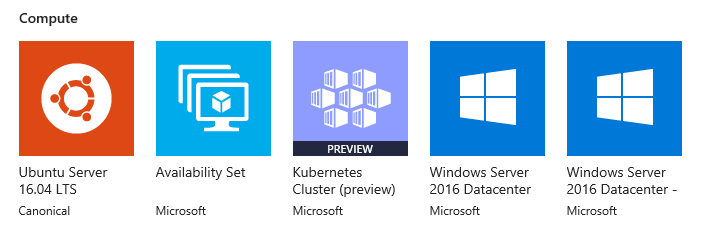

# Add Kubernetes to the Azure Stack Marketplace

*Applies to: Azure Stack integrated systems and Azure Stack Development Kit*

> [!note]  
> Kubernetes on Azure Stack is in preview. Azure Stack disconnected scenario is not currently supported by the preview.

You can offer Kubernetes as a Marketplace item to your users. Your users can, then, deploy Kubernetes in a single, coordinated operation.

The following article look at using an Azure Resource Manager template to deploy and provision the resources for a standalone Kubernetes cluster. Before you start, check your Azure Stack and global Azure tenant settings. Collect the required information about your Azure Stack. Add necessary resources to your tenant and to the Azure Stack Marketplace. The cluster depends on an Ubuntu server, custom script, and the Kubernetes Cluster Marketplace item to be in the marketplace.

## Create a plan, an offer, and a subscription

Create a plan, an offer, and a subscription for the Kubernetes Marketplace item. You can also use an existing plan and offer.

1. Sign in to the [Administration portal.](https://adminportal.local.azurestack.external)

1. Create a plan as the base plan. For instructions, see [Create a plan in Azure Stack](azure-stack-create-plan.md).

1. Create an offer. For instructions, see [Create an offer in Azure Stack](azure-stack-create-offer.md).

1. Select **Offers**, and find the offer you created.

1. Select **Overview** in the Offer blade.

1. Select **Change state**. Select **Public**.

1. Select **+ Create a resource** > **Offers and Plans** > **Subscription** to create a subscription.

    a. Enter a **Display Name**.

    b. Enter a **User**. Use the Azure AD account associated with your tenant.

    c. **Provider Description**

    d. Set the **Directory tenant** to the Azure AD tenant for your Azure Stack. 

    e. Select **Offer**. Select the name of the offer that you created. Make note of the Subscription ID.

## Create a service principal and credentials in AD FS

If you use Active Directory Federated Services (AD FS) for your identity management service, you will need to create a service principal for users deploying a Kubernetes cluster.

1. Create and export a  self-signed certificate used to create the service principal. 

    - You need the following pieces of information:

       | Value | Description |
       | ---   | ---         |
       | Password | Enter a new password for the certificate. |
       | Local certificate path | Enter the path and file name of the certificate. For example: `c:\certfilename.pfx` |
       | Certificate name | Enter the name of the certificate. |
       | Certificate store location |  For example, `Cert:\LocalMachine\My` |

    - Open PowerShell with an elevated prompt. Run the following script with the parameters updated to your values:

        ```powershell  
        # Creates a new self signed certificate 
        $passwordString = "<password>"
        $certlocation = "<local certificate path>.pfx"
        $certificateName = "CN=<certificate name>"
        $certStoreLocation="<certificate store location>"
        
        $params = @{
        CertStoreLocation = $certStoreLocation
        DnsName = $certificateName
        FriendlyName = $certificateName
        KeyLength = 2048
        KeyUsageProperty = 'All'
        KeyExportPolicy = 'Exportable'
        Provider = 'Microsoft Enhanced Cryptographic Provider v1.0'
        HashAlgorithm = 'SHA256'
        }
        
        $cert = New-SelfSignedCertificate @params -ErrorAction Stop
        Write-Verbose "Generated new certificate '$($cert.Subject)' ($($cert.Thumbprint))." -Verbose
        
        #Exports certificate with password in a .pfx format
        $pwd = ConvertTo-SecureString -String $passwordString -Force -AsPlainText
        Export-PfxCertificate -cert $cert -FilePath $certlocation -Password $pwd
        ```

2.  Make a note of the new certificate ID displayed in your PowerShell session, `1C2ED76081405F14747DC3B5F76BB1D83227D824`. The ID will be used when creating the service principal.

    ```powershell  
    VERBOSE: Generated new certificate 'CN=<certificate name>' (1C2ED76081405F14747DC3B5F76BB1D83227D824).
    ```

3. Create service principal using the certificate.

    - You need the following pieces of information:

       | Value | Description                     |
       | ---   | ---                             |
       | ERCS IP | In the ASDK, the privileged endpoint is normally `AzS-ERCS01`. |
       | Application name | Enter a simple name for the application service principal. |
       | Certificate store location | The path on your computer where you have stored the certificate. This is indicated by the store location and the certificate ID generated in the first step. For example: `Cert:\LocalMachine\My\1C2ED76081405F14747DC3B5F76BB1D83227D824` |

       When prompted, use the following credentials to connect to the privilege endpoint. 
        - User name: Specify the CloudAdmin account, in the format `<Azure Stack domain>\cloudadmin`. (For ASDK, the user name is azurestack\cloudadmin.)
        - Password: Enter the same password that was provided during installation for the AzureStackAdmin domain administrator account.

    - Run the following script with the parameters updated to your values:

        ```powershell  
        #Create service principal using the certificate
        $privilegedendpoint="<ERCS IP>"
        $applicationName="<application name>"
        $certStoreLocation="<certificate location>"
        
        # Get certificate information
        $cert = Get-Item $certStoreLocation
        
        # Credential for accessing the ERCS PrivilegedEndpoint, typically domain\cloudadmin
        $creds = Get-Credential

        # Creating a PSSession to the ERCS PrivilegedEndpoint
        $session = New-PSSession -ComputerName $privilegedendpoint -ConfigurationName PrivilegedEndpoint -Credential $creds

        # Get Service principal Information
        $ServicePrincipal = Invoke-Command -Session $session -ScriptBlock { New-GraphApplication -Name "$using:applicationName" -ClientCertificates $using:cert}

        # Get Stamp information
        $AzureStackInfo = Invoke-Command -Session $session -ScriptBlock { get-azurestackstampinformation }

        # For Azure Stack development kit, this value is set to https://management.local.azurestack.external. This is read from the AzureStackStampInformation output of the ERCS VM.
        $ArmEndpoint = $AzureStackInfo.TenantExternalEndpoints.TenantResourceManager

        # For Azure Stack development kit, this value is set to https://graph.local.azurestack.external/. This is read from the AzureStackStampInformation output of the ERCS VM.
        $GraphAudience = "https://graph." + $AzureStackInfo.ExternalDomainFQDN + "/"

        # TenantID for the stamp. This is read from the AzureStackStampInformation output of the ERCS VM.
        $TenantID = $AzureStackInfo.AADTenantID

        # Register an AzureRM environment that targets your Azure Stack instance
        Add-AzureRMEnvironment `
        -Name "AzureStackUser" `
        -ArmEndpoint $ArmEndpoint

        # Set the GraphEndpointResourceId value
        Set-AzureRmEnvironment `
        -Name "AzureStackUser" `
        -GraphAudience $GraphAudience `
        -EnableAdfsAuthentication:$true
        Add-AzureRmAccount -EnvironmentName "azurestackuser" `
        -ServicePrincipal `
        -CertificateThumbprint $ServicePrincipal.Thumbprint `
        -ApplicationId $ServicePrincipal.ClientId `
        -TenantId $TenantID

        # Output the SPN details
        $ServicePrincipal
        ```

    - The Service principal details look like the snippet below

        ```Text  
        ApplicationIdentifier : S-1-5-21-1512385356-3796245103-1243299919-1356
        ClientId              : 3c87e710-9f91-420b-b009-31fa9e430145
        Thumbprint            : 30202C11BE6864437B64CE36C8D988442082A0F1
        ApplicationName       : Azurestack-MyApp-c30febe7-1311-4fd8-9077-3d869db28342
        PSComputerName        : azs-ercs01
        RunspaceId            : a78c76bb-8cae-4db4-a45a-c1420613e01b
        ```

## Add an Ubuntu server image

Add the following Ubuntu Server image to the Marketplace:

1. Sign in to the [Administration portal](https://adminportal.local.azurestack.external).

1. Select **All services**, and then under the **ADMINISTRATION** category, select **Marketplace management**.

1. Select **+ Add from Azure**.

1. Enter `Ubuntu Server`.

1. Select the newest version of the server. Check the full version and ensure that you have the newest version:
    - **Publisher**: Canonical
    - **Offer**: UbuntuServer
    - **Version**: 16.04.201806120 (or latest version)
    - **SKU**: 16.04-LTS

1. Select **Download.**

## Add a custom script for Linux

Add the Kubernetes from the Marketplace:

1. Open the [Administration portal](https://adminportal.local.azurestack.external).

1. Select **ALL services** and then under the **ADMINISTRATION** category, select **Marketplace Management**.

1. Select **+ Add from Azure**.

1. Enter `Custom Script for Linux`.

1. Select the script with the following profile:
   - **Offer**: Custom Script for Linux 2.0
   - **Version**: 2.0.6 (or latest version)
   - **Publisher**: Microsoft Corp

     > [!Note]  
     > More than one version of Custom Script for Linux may be listed. You will need to add the last version of the item.

1. Select **Download.**


## Add Kubernetes to the marketplace

1. Open the [Administration portal](https://adminportal.local.azurestack.external).

1. Select **All services** and then under the **ADMINISTRATION** category, select **Marketplace Management**.

1. Select **+ Add from Azure**.

1. Enter `Kubernetes`.

1. Select `Kubernetes Cluster`.

1. Select **Download.**

    > [!note]  
    > It may take five minutes for the marketplace item to appear in the Marketplace.

    

## Update or remove the Kubernetes 

When updating the Kubernetes item, you'll remove the previous item in the Marketplace. Follow the instruction in this article to add the Kubernetes update to the marketplace.

To remove the Kubernetes item:

1. Connect to Azure Stack with PowerShell as an operator. For instruction, see [Connect to Azure Stack with PowerShell as an operator](https://docs.microsoft.com/azure/azure-stack/azure-stack-powershell-configure-admin).

2. Find the current Kubernetes Cluster item in the gallery.

    ```powershell  
    Get-AzsGalleryItem | Select Name
    ```
    
3. Note name of the current item, such as `Microsoft.AzureStackKubernetesCluster.0.3.0`

4. Use the following PowerShell cmdlet to remove the item:

    ```powershell  
    $Itemname="Microsoft.AzureStackKubernetesCluster.0.3.0"

    Remove-AzsGalleryItem -Name $Itemname
    ```

## Next steps

[Deploy a Kubernetes to Azure Stack](https://docs.microsoft.com/azure/azure-stack/user/azure-stack-solution-template-kubernetes-deploy)

[Overview of offering services in Azure Stack](azure-stack-offer-services-overview.md)
