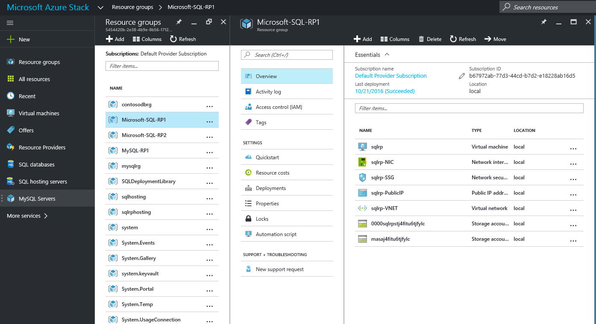
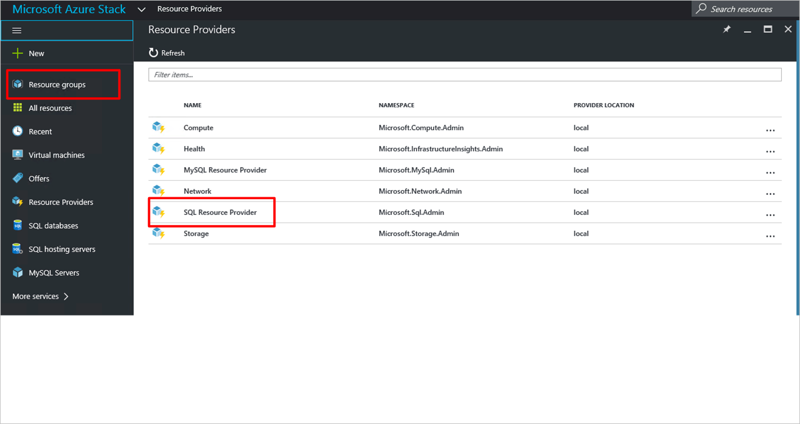
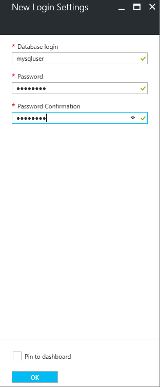
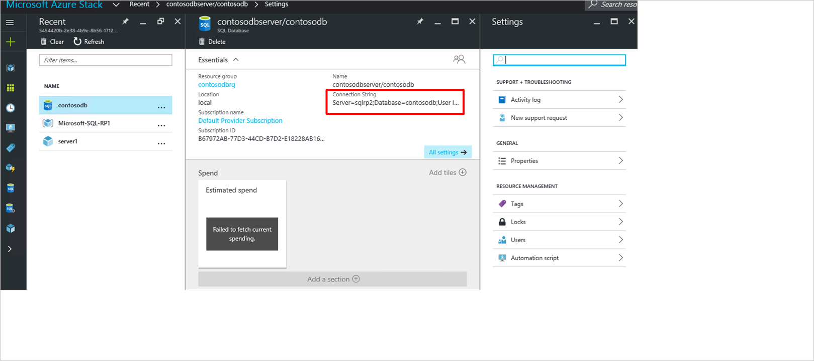

# Use SQL databases on Azure Stack

> [!NOTE]
> The following information only applies to Azure Stack TP3 Refresh deployments.
>
>

Use the SQL Server resource provider adapter to expose SQL databases as a service of Azure Stack. After you install the resource provider and connect it to a SQL Server instance, you and your users can create databases for cloud-native apps, websites that are based on SQL, and workloads that are based on SQL without having to provision a virtual machine (VM) that hosts SQL Server each time.

## SQL Server resource provider adapter architecture
The resource provider is not based on, nor does it offer all the database management capabilities of Azure SQL Database. For example, elastic database pools and the ability to dial database performance up and down automatically aren't available. However, the resource provider does support similar create, read, update, and delete (CRUD) operations.

The resource provider is made up of three components:

- **The SQL resource provider adapter VM**, which encompasses the resource provider process and the servers that host a small SQL Server used for RP state and as a sample Hosting Server.
- **The resource provider itself**, which processes provisioning requests and exposes database resources.
- **Servers that host SQL Server**, which provide capacity for databases, called Hosting Servers

> [!NOTE]
> The SQL Server Resource Provider Adapter requires an Azure Stack TP3 Refresh deployment.
>
>

You can offer SQL Server databases as a service to your Azure Stack users. To do so, you must deploy the SQL Server resource provider, connect it to a SQL Server instance, and then create plans and offers that users can subscribe to. Users who subscribe can then create databases for cloud native apps and SQL-based websites and workloads without having to provision a SQL Server virtual machine each time.

The resource provider is made up of three components:

- **The SQL resource provider adapter VM**: the VM on which the resource provider and servers hosting SQL server reside.
- **The resource provider**: processes provisioning requests and provides database resources.
- **Servers that host SQL Server**: provides capacity for databases.

The resource provider does not support all of the database management capabilities of [Azure SQL Database](https://azure.microsoft.com/en-us/services/sql-database/). For example, elastic database pools and the ability to dial database performance up and down automatically aren't supported.

### Deploy without internet access

To deploy the SQL provider on a system that does not have internet access, you can copy the file [SQL 2014 SP1 Enterprise Evaluation ISO](http://care.dlservice.microsoft.com/dl/download/2/F/8/2F8F7165-BB21-4D1E-B5D8-3BD3CE73C77D/SQLServer2014SP1-FullSlipstream-x64-ENU.iso) to a local file share and provide that share name when prompted (see below). You will also need to provision the Windows Server 2016 VM image and install the PowerShell module using the offline procedure.

> [!NOTE]
> The deployment script will perform retries, if necessary, to accommodate less reliable network connections or if an operation exceeds a timeout.
>
>

## Deploy the resource provider

1. If you have not already done so, create a [Windows Server 2016 image with the .NET 3.5 runtime](https://docs.microsoft.com/en-us/azure/azure-stack/azure-stack-add-default-image) installed.

  > [!NOTE]
  > The current RP uses SQL Server 2014 SP1, which requires the .NET 3.5 runtime - if your image does not contain this optional component, the deployment will fail.
  >
  >

2. Sign in to the POC host, [download the SQL Server RP installer executable file](https://aka.ms/azurestacksqlrptp3), and extract the files to a temporary directory. If your POC host has limited hard disk space, you can instead download the executable to another computer and then copy the extracted files to the POC host.

3. If you have installed any versions of the AzureRm PowerShell module other than 1.2.9, you will need to remove them or the install will not proceed.

4. Open a **new** elevated PowerShell console and change to the directory where you extracted the files. Use a new window to avoid problems that may arise from incorrect PowerShell modules already loaded on the system.

5. Run the DeploySqlProvider.ps1 script with the parameters listed below. Depending on your hardware and download speed, it may take up to 60 minutes for the resource provider to get up and running, and another 60 minutes for the configuration of the virtual machines to complete.

* If necessary, download a compatible version of Azure PowerShell (only AzureRm version 1.2.9 is supported).
* Create a wildcard certificate to secure communication between the resource provider and Azure Resource Manager.
* Download an evaluation build of SQL Server SP1 from the internet or from a local file share.
* Upload the certificate and all other artifacts to a storage account on your Azure Stack.
* Publish gallery package so that you can deploy SQL database through the gallery.
* Deploy a VM using the Windows Server image create in step 1.
* Register a local DNS record that maps to your resource provider VM.
* Register your resource provider with the local Azure Resource Manager.

> If the installation takes more than 90 minutes, it may fail and you will see a failure message on the screen and in the log file, but the deployment will be retried from the failing step. Systems that do not meet the minimum required memory and core specifications may not be able to deploy the SQL RP.
>

### DeploySqlProvider.ps1 Parameters

| Parameter Name | Description | Comment or Default Value |
| --- | --- | --- |
| **DirectoryTenantID** | Provide the name of the Azure Active Directory used for the Azure Stack deployment. For example, *mydomain.onmicrosoft.com*. | _required_ |
| **AzCredential** | Provide the credentails for the Azure Stack Service Admin account. You must use the same credentials as you used for deploying Azure Stack). You can use the **New-Object** command to define this info, such as: `New-Object System.Management.Automation.PSCredential ("admin@mydomain.onmicrosoft.com", $AADAdminPass)`. | _required_ |
| **VMLocalCredential** | Define the credentials for the local administrator account of the SQL resource provider VM. This password will also be used for the SQL **sa** account. You can use the **New-Object** command to provide this info, such as: `New-Object System.Management.Automation.PSCredential ("sqlrpadmin", $vmLocalAdminPass)`. | _required_ |
| **ResourceGroupName** | Define a name for a Resource Group in which items created by this script will be stored. For example, *System.Sql*. | Microsoft-SQL-RP1 |
| **VmName** | Define the name of the virtual machine on which to install the resource provider. For example, *SystemSqlRP*. | sqlvm |
| **DependencyFilesLocalPath** | If you're doing an offline deployment, this is path to a local share containing the SQL ISO. You can download [SQL 2014 SP1 Enterprise Evaluation ISO](http://care.dlservice.microsoft.com/dl/download/2/F/8/2F8F7165-BB21-4D1E-B5D8-3BD3CE73C77D/SQLServer2014SP1-FullSlipstream-x64-ENU.iso) from the Microsoft Download Center. | _leave blank to download from the internet_ |
| **MaxRetryCount** | Define how many times you want to retry each operation if there is a failure.| 2 |
| **RetryDuration** | Define the timeout between retries, in seconds. | 120 |
| **Uninstall** | Clean up the resource provider and remove all resources (see notes below) | No |
| **DebugMode** | Prevents automatic clean up on failure | No |

You can specify these parameters in the command line. If you do not, or parameter validation failes, you will be prompted to provide them.

Here's an example you can run from the PowerShell prompt (but change the account information and portal endpoints as needed):

```
$vmLocalAdminPass = ConvertTo-SecureString "P@ssw0rd1" -AsPlainText -Force
$vmLocalAdminCreds = New-Object System.Management.Automation.PSCredential ("sqlrpadmin", $vmLocalAdminPass)

$AdminPass = ConvertTo-SecureString "P@ssw0rd1" -AsPlainText -Force
$AdminCreds = New-Object System.Management.Automation.PSCredential ("admin@mydomain.onmicrosoft.com", $AdminPass)

.\DeploySQLProvider.ps1 -DirectoryTenantID "51377b64-4a17-46b1-83ff-902d97c50b22" -AzCredential $AdminCreds -VMLocalCredential $vmLocalAdminCreds -ResourceGroupName "System.Sql" -VmName "SQLVM" -ArmEndpoint "https://adminmanagement.local.azurestack.external" -TenantArmEndpoint "https://management.local.azurestack.external"
 ```

## Verify the deployment using the Azure Stack Portal

> [!NOTE]
>  After the installation script completes, it can take up to 60 minutes for all of the virtual machines to finish configuration. If you attempt the next steps before this completes, you will see failures.
>
>

1. On the Console VM desktop, click **Microsoft Azure Stack Portal** and sign in to the portal as the service administrator.

2. Verify that the deployment succeeded. Click **Resource Groups** &gt; click the resource group you used (default is **Microsoft-SQL-RP1**), and then make sure that the essentials part of the blade (upper half) reads **_date_ (Succeeded)**.

      

3. Verify that the registration succeeded. Click **Resource providers**, and then look for **SQLAdapter**:

      


## Provide capacity by connecting it to a hosting SQL server

1. Sign in to the Azure Stack admin portal as a service admin

2. Click **Resource Providers** &gt; **SQLAdapter** &gt; **Hosting Servers** &gt; **+Add**.

	The **SQL Hosting Servers** blade is where you can connect the SQL Server Resource Provider to actual instances of SQL Server that serve as the resource provider’s backend.

	

3. Fill the form with the connection details of your SQL Server instance. By default, a preconfigured SQL Server called “SQLVM” with the administrator username “sa” and the password you called out in the "LocalCredential" parameter is running on the VM. You will need to specify the fully-qualified domain name (FQDN) or IPv4 address of each hosting server you add. Specify the maximum size of the server (for all databases).

	

4. 	As you add servers, you will need to assign a SKU or create a new one. This allows differentiation of service offerings. For example, you could have a SQL Enterprise instance providing database capacity and automatic backup, reserve high performance servers for individual departments, etc. The SKU name should reflect the properties so that tenants can place their databases appropriately.

	An example:

	


## Create your first SQL Database to test your deployment

1. Sign in to the Azure Stack admin portal as service admin.

2. Click **+ New** &gt;**Data + Storage"** &gt; **SQL Server Database (preview)** &gt; **Add**

3. Fill in the form with database details, including a **Database Name**, **Maximum Size**, and change the other parameters as necessary.

	


4. Fill in the Login Settings: **Database login**, and **Password**. These is a SQL Authentication credential that will be created for your access to this database only. The login user name must be globally unique.

	

4. You are asked to pick a SKU for your database. As hosting servers are added, they are assigned a SKU and databases are created in that pool of hosting servers that make up the SKU.

	


5. Submit the form and wait for the deployment to complete.

6. In the resulting blade, notice the “Connection string” field. You can use that string in any application that requires SQL Server access (for example, a web app) in your Azure Stack.

	

## Add Capacity

Add Capacity by adding additional SQL hosts	in the Azure Stack portal. If you wish to use another instance of SQL instead of the one installed on the provider VM, click **Resource Providers** &gt; **SQLAdapter** &gt; **SQL Hosting Servers** &gt; **+Add**.

## Making SQL databases available to tenants

Create plans and offers to make SQL databases available for tenants. You will need to create a plan, add the Microsoft.SqlAdapter service to the plan, and add an existing Quota, or create a new one. If you create a quota, you can specify the capacity to allow the tenant.
	

## Tenant Usage of the Resource Provider

Self-service databases are provided through the tenant portal experience. Once the administrator has performed the above steps, a tenant will need to register the resource provider before they will be able to create databases.

To do so, the following command must be executed in a PowerShell window:

```
Register-AzureRMResourceProvider –ProviderNamespace Microsoft.SQLAdapter
```


## Next steps


Try other [PaaS services](azure-stack-tools-paas-services.md) like the [MySQL Server resource provider](azure-stack-mysql-resource-provider-deploy.md) and the [App Services resource provider](azure-stack-app-service-overview.md).
