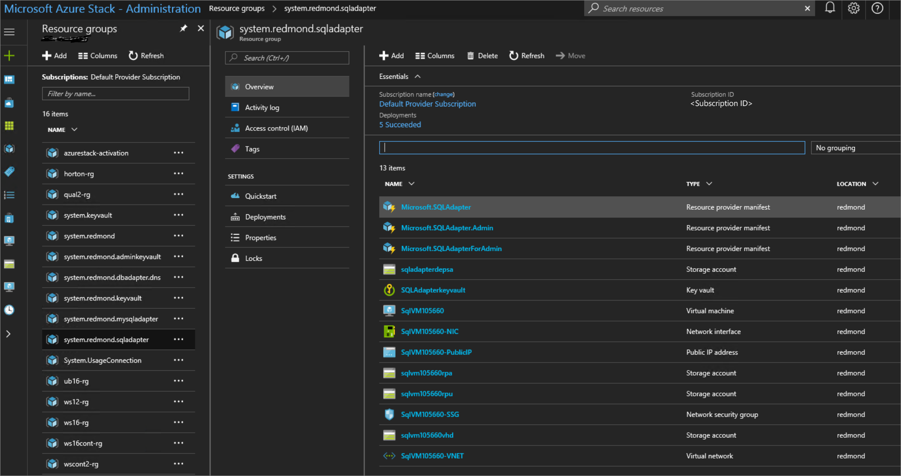

# Deploy the SQL Server resource provider on Azure Stack

Use the Azure Stack SQL Server resource provider to expose SQL databases as an Azure Stack service. The SQL resource provider runs as a service on a Windows Server 2016 Server Core virtual machine (VM).

> [!IMPORTANT]
> Only the resource provider is supported to create items on servers that host SQL or MySQL. Items created on a host server that are not created by the resource provider might result in a mismatched state.

## Prerequisites

There are several prerequisites that need to be in place before you can deploy the Azure Stack SQL resource provider. To meet these requirements, complete the following steps on a computer that can access the privileged endpoint VM:

- If you haven't already done so, [register Azure Stack](azure-stack-registration.md) with Azure so you can download Azure marketplace items.
- You must install the Azure and Azure Stack PowerShell modules on the system where you  will run this installation. That system must be a Windows 10 or Windows Server 2016 image with the latest version of the .NET runtime. See [Install PowerShell for Azure Stack](.\azure-stack-powershell-install.md).
- Add the required Windows Server core VM to the Azure Stack marketplace by downloading the **Windows Server 2016 Datacenter - Server Core** image.
- Download the SQL resource provider binary and then run the self-extractor to extract the contents to a temporary directory. The resource provider has a minimum corresponding Azure Stack build.

    |Minimum Azure Stack version|SQL RP version|
    |-----|-----|
    |Version 1804 (1.0.180513.1)|[SQL RP version 1.1.24.0](https://aka.ms/azurestacksqlrp)
    |     |     |

- Ensure datacenter integration prerequisites are met:

    |Prerequisite|Reference|
    |-----|-----|
    |Conditional DNS forwarding is set correctly.|[Azure Stack datacenter integration - DNS](azure-stack-integrate-dns.md)|
    |Inbound ports for resource providers are open.|[Azure Stack datacenter integration - Publish endpoints](azure-stack-integrate-endpoints.md#ports-and-protocols-inbound)|
    |PKI certificate subject and SAN are set correctly.|[Azure Stack deployment mandatory PKI prerequisites](azure-stack-pki-certs.md#mandatory-certificates)[Azure Stack deployment PaaS certificate prerequisites](azure-stack-pki-certs.md#optional-paas-certificates)|
    |     |     |

### Certificates

_For integrated systems installations only_. You must provide the SQL PaaS PKI certificate described in the optional PaaS certificates section of [Azure Stack deployment PKI requirements](.\azure-stack-pki-certs.md#optional-paas-certificates). Place the .pfx file in the location specified by the **DependencyFilesLocalPath** parameter. Do not provide a certificate for ASDK systems.

## Deploy the SQL resource provider

After you've got all the prerequisites installed, run the **DeploySqlProvider.ps1** script to deploy the SQL resource provider. The DeploySqlProvider.ps1 script is extracted as part of the SQL resource provider binary that you downloaded for your version of Azure Stack.

To deploy the SQL resource provider, open a **new** elevated PowerShell window (not PowerShell ISE) and change to the directory where you extracted the SQL resource provider binary files. We recommend using a new PowerShell window to avoid potential problems caused by PowerShell modules that are already loaded.

Run the DeploySqlProvider.ps1 script, which completes the following tasks:

- Uploads the certificates and other artifacts to a storage account on Azure Stack.
- Publishes gallery packages so you can deploy SQL databases using the gallery.
- Publishes a gallery package for deploying hosting servers.
- Deploys a VM using the Windows Server 2016 core image you downloaded, and then installs the SQL resource provider.
- Registers a local DNS record that maps to your resource provider VM.
- Registers your resource provider with the local Azure Resource Manager for the operator account.

> [!NOTE]
> When the SQL resource provider deployment starts, the **system.local.sqladapter** resource group is created. It may take up to 75 minutes to finish the required deployments to this resource group.

### DeploySqlProvider.ps1 parameters

You can specify the following parameters from the command line. If you don't, or if any parameter validation fails, you're prompted to provide the required parameters.

| Parameter name | Description | Comment or default value |
| --- | --- | --- |
| **CloudAdminCredential** | The credential for the cloud administrator, necessary for accessing the privileged endpoint. | _Required_ |
| **AzCredential** | The credentials for the Azure Stack service admin account. Use the same credentials that you used for deploying Azure Stack. | _Required_ |
| **VMLocalCredential** | The credentials for the local administrator account of the SQL resource provider VM. | _Required_ |
| **PrivilegedEndpoint** | The IP address or DNS name of the privileged endpoint. |  _Required_ |
| **AzureEnvironment** | The Azure environment of the service admin account which you used for deploying Azure Stack. Required only for Azure AD deployments. Supported environment names are **AzureCloud**, **AzureUSGovernment**, or if using a China Azure Active Directory, **AzureChinaCloud**. | AzureCloud |
| **DependencyFilesLocalPath** | For integrated systems only, your certificate .pfx file must be placed in this directory. You can optionally copy one Windows Update MSU package here. | _Optional_ (_mandatory_ for integrated systems) |
| **DefaultSSLCertificatePassword** | The password for the .pfx certificate. | _Required_ |
| **MaxRetryCount** | The number of times you want to retry each operation if there's a failure.| 2 |
| **RetryDuration** | The timeout interval between retries, in seconds. | 120 |
| **Uninstall** | Removes the resource provider and all associated resources (see the following notes). | No |
| **DebugMode** | Prevents automatic cleanup on failure. | No |

## Deploy the SQL resource provider using a custom script

To eliminate any manual configuration when deploying the resource provider, you can customize the following script.  

Change the default account information and passwords as needed for your Azure Stack deployment.


```powershell
# Install the AzureRM.Bootstrapper module, set the profile and install the AzureStack module
Install-Module -Name AzureRm.BootStrapper -Force
Use-AzureRmProfile -Profile 2017-03-09-profile
Install-Module  -Name AzureStack -RequiredVersion 1.4.0

# Use the NetBIOS name for the Azure Stack domain. On the Azure Stack SDK, the default is AzureStack but could have been changed at install time.
$domain = "AzureStack"

# For integrated systems, use the IP address of one of the ERCS virtual machines
$privilegedEndpoint = "AzS-ERCS01"

# Provide the Azure environment used for deploying Azure Stack. Required only for Azure AD deployments. Supported environment names are AzureCloud, AzureUSGovernment, or AzureChinaCloud. 
$AzureEnvironment = "<EnvironmentName>"

# Point to the directory where the resource provider installation files were extracted.
$tempDir = 'C:\TEMP\SQLRP'

# The service admin account can be Azure Active Directory or Active Directory Federation Services.
$serviceAdmin = "admin@mydomain.onmicrosoft.com"
$AdminPass = ConvertTo-SecureString "P@ssw0rd1" -AsPlainText -Force
$AdminCreds = New-Object System.Management.Automation.PSCredential ($serviceAdmin, $AdminPass)

# Set credentials for the new resource provider VM local administrator account.
$vmLocalAdminPass = ConvertTo-SecureString "P@ssw0rd1" -AsPlainText -Force
$vmLocalAdminCreds = New-Object System.Management.Automation.PSCredential ("sqlrpadmin", $vmLocalAdminPass)

# Add the cloudadmin credential that's required for privileged endpoint access.
$CloudAdminPass = ConvertTo-SecureString "P@ssw0rd1" -AsPlainText -Force
$CloudAdminCreds = New-Object System.Management.Automation.PSCredential ("$domain\cloudadmin", $CloudAdminPass)

# Change the following as appropriate.
$PfxPass = ConvertTo-SecureString "P@ssw0rd1" -AsPlainText -Force

# Change to the directory folder where you extracted the installation files. Do not provide a certificate on ASDK!
. $tempDir\DeploySQLProvider.ps1 `
    -AzCredential $AdminCreds `
    -VMLocalCredential $vmLocalAdminCreds `
    -CloudAdminCredential $cloudAdminCreds `
    -PrivilegedEndpoint $privilegedEndpoint `
    -AzureEnvironment $AzureEnvironment `
    -DefaultSSLCertificatePassword $PfxPass `
    -DependencyFilesLocalPath $tempDir\cert

 ```

When the resource provider installation script finishes, refresh your browser to make sure you can see the latest updates.

## Verify the deployment using the Azure Stack portal

You can use the following steps verify that the SQL resource provider is successfully deployed.

1. Sign in to the admin portal as the service administrator.
2. Select **Resource Groups**.
3. Select the **system.\<location\>.sqladapter** resource group.
4. On the summary page for Resource group Overview, there should be no failed deployments.
      
5. Finally, select **Virtual machines** in the admin portal to verify that the SQL resource provider VM was successfully created and is running.

## Next steps

[Add hosting servers](azure-stack-sql-resource-provider-hosting-servers.md)
